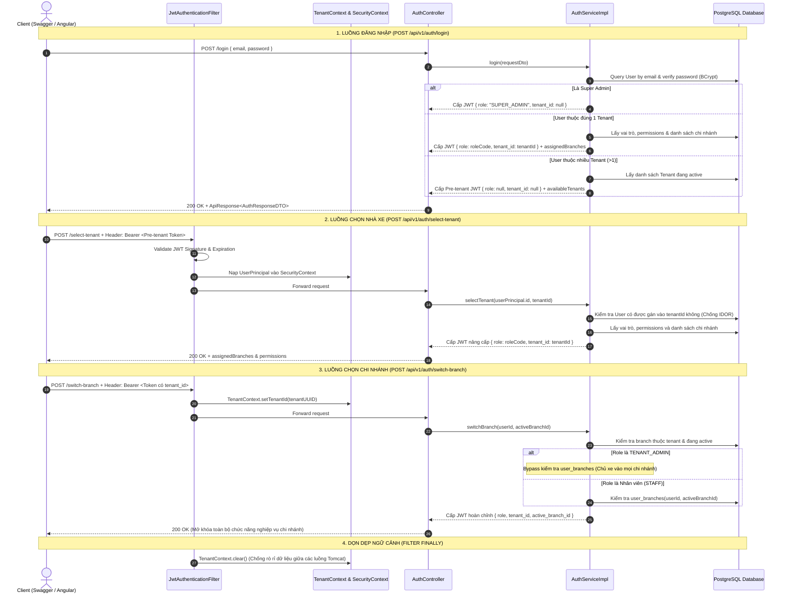

# Architecture Diagram - Car Rental SaaS

## Mục lục
1. [High-Level Architecture](#1-high-level-architecture)
2. [Core Feature Flows](#2-core-feature-flows)
3. [Backend Architecture](#3-backend-architecture)
4. [Frontend Architecture](#4-frontend-architecture)
5. [Database Architecture Reference](#5-database-architecture-reference)
6. [Security & Multi-Tenant Architecture](#6-security--multi-tenant-architecture)
7. [Deployment Architecture](#7-deployment-architecture)

---

## 1. High-Level Architecture

```
┌───────────────────────────────────────────────────────────────────────────────────────┐
│                                       CLIENTS                                         │
│  ┌─────────────────────────────────┐           ┌───────────────────────────────────┐  │
│  │   SaaS Admin Portal (Super)     │           │   Tenant Admin / Staff Mobile     │  │
│  └────────────────┬────────────────┘           └─────────────────┬─────────────────┘  │
└───────────────────┼──────────────────────────────────────────────┼────────────────────┘
                    │                                              │
                    └──────────────────────┬───────────────────────┘
                                           │
                                           ▼
┌───────────────────────────────────────────────────────────────────────────────────────┐
│                                  NGINX GATEWAY LAYER                                  │
│  ┌─────────────────────────────────────────────────────────────────────────────────┐  │
│  │                              Nginx Web & Reverse Proxy                          │  │
│  │  - Phục vụ tệp tĩnh Frontend (/var/www/html)                                       │  │
│  │  - Bọc và giải mã SSL/HTTPS (SSL Termination)                                   │  │
│  │  - Chuyển tiếp yêu cầu API /api/* sang Backend (localhost:8080)                 │  │
│  │  - Chống spam (Rate Limiting) & Cấu hình CORS                                   │  │
│  └─────────────────────────────────────────────────────────────────────────────────┘  │
└──────────────────────────────────────────┬────────────────────────────────────────────┘
                                           │
                                           ▼
┌───────────────────────────────────────────────────────────────────────────────────────┐
│                                   BACKEND SERVICES                                    │
│                            (Spring Boot Monolith Application)                         │
│                                                                                       │
│  ┌──────────────┐  ┌──────────────┐  ┌──────────────┐  ┌──────────────┐            │
│  │    Auth      │  │   Tenant     │  │   Branch     │  │   Vehicle    │            │
│  │   Service    │  │   Service    │  │   Service    │  │   Service    │            │
│  └──────────────┘  └──────────────┘  └──────────────┘  └──────────────┘            │
│                                                                                       │
│  ┌──────────────┐  ┌──────────────┐  ┌──────────────┐            │
│  │  Customer    │  │   Booking    │  │ Notification │            │
│  │ (OCR Module) │  │(Hold Engine) │  │   (Email)    │            │
│  └──────────────┘  └──────────────┘  └──────────────┘            │
│                                                                                       │
└────────┬──────────────────────────────────┬───────────────────────────────────┬───────┘
         │                                  │                                   │
         │ (Đọc/Ghi DB & Lưu file)          │ (Gọi REST API nội bộ)             │ (Tích hợp SDK / SMTP)
         ▼                                  ▼                                   ▼
┌─────────────────────────┐    ┌─────────────────────────┐    ┌─────────────────────────┐
│  DATA & STORAGE LAYER   │    │   SELF-HOSTED ENGINE    │    │ EXTERNAL THIRD-PARTY    │
│                         │    │                         │    │                         │
│ ┌─────────────────────┐ │    │ ┌─────────────────────┐ │    │ ┌─────────────────────┐ │
│ │ PostgreSQL DB       │ │    │ │  PaddleOCR Engine   │ │    │ │ Mail Provider / SDK │ │
│ │ (Multi-tenant RLS)  │ │    │ │  (FastAPI Python)   │ │    │ │ (SendGrid/Gmail/SES)│ │
│ ├─────────────────────┤ │    │ └─────────────────────┘ │    │ └─────────────────────┘ │
│ │ S3 / MinIO Storage  │ │    │                         │    │                         │
│ │ (Ảnh xe & CCCD)     │ │    │                         │    │                         │
│ └─────────────────────┘ │    │                         │    │                         │
└─────────────────────────┘    └─────────────────────────┘    └─────────────────────────┘
```

---

## 2. Core Feature Flows

### 2.1 Luồng quét OCR Giấy tờ khách hàng (CCCD / GPLX)

```
┌──────────────┐          ┌──────────────┐          ┌──────────────┐          ┌──────────────┐
│ Front-end UI │          │ Customer API │          │ OCR Service  │          │  PaddleOCR   │
│ (Mobile/Web) │          │ (Spring Boot)│          │ (Integration)│          │ (Self-Hosted)│
└──────┬───────┘          └──────┬───────┘          └──────┬───────┘          └──────┬───────┘
       │                         │                         │                         │
       │ 1. Upload ảnh CCCD/GPLX │                         │                         │
       ├────────────────────────►│                         │                         │
       │                         │ 2. Forward ảnh scan     │                         │
       │                         ├────────────────────────►│                         │
       │                         │                         │ 3. Gọi PaddleOCR Engine │
       │                         │                         ├────────────────────────►│
       │                         │                         │                         │ (OpenCV Crop & Warping)
       │                         │                         │ 4. Kết quả bóc tách JSON│ (Text Recognition)
       │                         │                         │◄────────────────────────┤
       │                         │ 5. Parse dữ liệu        │                         │
       │                         │◄────────────────────────┤                         │
       │ 6. Dữ liệu Autofill     │                         │                         │
       │◄────────────────────────┤                         │                         │
       │ (NV xác nhận & Lưu)     │                         │                         │
       │                         │                         │                         │
       │ 7. Tạo Hồ sơ Khách      │                         │                         │
       ├────────────────────────►│ 8. Lưu DB & Upload S3   │                         │
       │                         ├─────────────────────────┼────────────────────────► S3 Storage
```

### 2.2 Luồng Hold & Tạo đơn xe (Booking & Hold Engine - DB-Backed)

```
┌──────────────┐          ┌──────────────┐          ┌──────────────┐          ┌──────────────┐
│ Front-end UI │          │ Booking API  │          │  PostgreSQL  │          │  Scheduled   │
│ (Tạo đơn)    │          │ (Spring Boot)│          │  (Database)  │          │ Task (Spring)│
└──────┬───────┘          └──────┬───────┘          └──────┬───────┘          └──────┬───────┘
       │                         │                         │                         │
       │ 1. Chọn xe + khung giờ  │                         │                         │
       ├────────────────────────►│                         │                         │
       │                         │ 2. Check trùng lịch xe  │                         │
       │                         ├────────────────────────►│                         │
       │                         │    (SELECT FOR UPDATE)  │                         │
       │                         │ 3. Kết quả khả dụng     │                         │
       │                         │◄────────────────────────┤                         │
       │                         │                         │                         │
       │                         │ 4. INSERT Booking       │                         │
       │                         │    status = 'HOLD'      │                         │
       │                         │    hold_expires_at =    │                         │
       │                         │    NOW() + 15 mins      │                         │
       │                         ├────────────────────────►│                         │
       │ 5. Trả về Đơn Tạm (HOLD)│                         │                         │
       │◄────────────────────────┤                         │                         │
       │                         │                         │                         │
       │ ── TRƯỜNG HỢP A: NV Hoàn tất đơn / Nhận cọc ───────┤                         │
       │ 6. Xác nhận nhận cọc    │                         │                         │
       ├────────────────────────►│ 7. UPDATE Booking       │                         │
       │                         │    status = 'CONFIRMED' │                         │
       │                         ├────────────────────────►│                         │
       │                         │                         │                         │
       │ ── TRƯỜNG HỢP B: Quá 15 phút không nhận cọc ──────┼─────────────────────────┤
       │                         │                         │                         │ 8. Quét mỗi 1 phút
       │                         │                         │◄────────────────────────┤ (@Scheduled)
       │                         │                         │ 9. UPDATE Booking       │
       │                         │                         │    status = 'CANCELLED' │
       │                         │                         │    WHERE status='HOLD'  │
       │                         │                         │    AND hold_expires_at  │
       │                         │                         │        < NOW()          │
```

---

## 3. Backend Architecture

```
┌─────────────────────────────────────────────────────────────────────────────┐
│                           Spring Boot Application                            │
│                                                                              │
│  ┌─────────────────────────────────────────────────────────────────────┐    │
│  │                     API Layer (Controllers)                         │    │
│  │  ┌─────────┐ ┌─────────┐ ┌─────────┐ ┌─────────┐ ┌─────────┐        │    │
│  │  │  Auth   │ │ Tenant  │ │ Branch  │ │Vehicle  │ │Customer │  ...   │    │
│  │  │Controller│ │Controller│ │Controller│ │Controller│ │Controller│        │    │
│  │  └────┬────┘ └────┬────┘ └────┬────┘ └────┬────┘ └────┬────┘        │    │
│  └───────┼───────────┼───────────┼───────────┼───────────┼──────────────┘    │
│          │           │           │           │           │                   │
│          └───────────┴───────────┴───────────┴───────────┘                   │
│                              │                                               │
│                              ▼                                               │
│  ┌─────────────────────────────────────────────────────────────────────┐    │
│  │                     Service Layer                                    │    │
│  │  ┌─────────┐ ┌─────────┐ ┌─────────┐ ┌─────────┐ ┌─────────┐        │    │
│  │  │  Auth   │ │ Tenant  │ │ Branch  │ │Vehicle  │ │Customer │  ...   │    │
│  │  │ Service │ │ Service │ │ Service │ │ Service │ │(OCR Engine)│       │    │
│  │  └────┬────┘ └────┬────┘ └────┬────┘ └────┬────┘ └────┬────┘        │    │
│  └───────┼───────────┼───────────┼───────────┼───────────┼──────────────┘    │
│          │           │           │           │           │                   │
│          └───────────┴───────────┴───────────┴───────────┘                   │
│                              │                                               │
│                              ▼                                               │
│  ┌─────────────────────────────────────────────────────────────────────┐    │
│  │                   Repository Layer (Spring Data JPA)                │    │
│  │  ┌─────────┐ ┌─────────┐ ┌─────────┐ ┌─────────┐ ┌─────────┐        │    │
│  │  │  Auth   │ │ Tenant  │ │ Branch  │ │Vehicle  │ │Customer │  ...   │    │
│  │  │Repository│ │Repository│ │Repository│ │Repository│ │Repository│        │    │
│  │  └────┬────┘ └────┬────┘ └────┬────┘ └────┬────┘ └────┬────┘        │    │
│  └───────┼───────────┼───────────┼───────────┼───────────┼──────────────┘    │
│          │           │           │           │           │                   │
│          └───────────┴───────────┴───────────┴───────────┘                   │
│                              │                                               │
│                              ▼                                               │
│  ┌─────────────────────────────────────────────────────────────────────┐    │
│  │                   Background Scheduled Tasks                        │    │
│  │  ┌─────────────────────────────────────────────────────────────┐    │    │
│  │  │  HoldReleaseTask (@Scheduled(cron = "0 */1 * * * *"))       │    │    │
│  │  │  - Quét giải phóng các Booking status = 'HOLD' quá hạn       │    │    │
│  │  └─────────────────────────────────────────────────────────────┘    │    │
│  └─────────────────────────────────────────────────────────────────────┘    │
└─────────────────────────────────────────────────────────────────────────────┘
```

---

## 4. Frontend Architecture

Hệ thống Frontend giao diện được xây dựng bằng **Angular SPA (Single Page Application)**, phục vụ 2 nhóm người dùng qua cùng 1 nền tảng phân quyền:

1. **SaaS Super Admin**: Quản lý Tenants, Gói cước, Cấu hình hệ thống.
2. **Tenant Staff / Branch Manager**: Quản lý đơn hàng xe, quét OCR khách hàng, quản lý fleet xe tại chi nhánh.

Frontend được build thành các tập tin tĩnh HTML/JS/CSS và do **Nginx** trực tiếp phục vụ, **không dùng CDN**.

---

## 5. Database Architecture Reference

> [!NOTE]
> Để tránh trùng lặp dữ liệu và đảm bảo một nguồn sự thật duy nhất (Single Source of Truth), chi tiết sơ đồ ERD, định nghĩa bảng, kiểu dữ liệu và index chiến lược đã được thiết kế đầy đủ tại tài liệu riêng:
> 
> 👉 **[Database-Schema.md](file:///f:/backend-training/car-rental-saas/docs/overviews/Database-Schema.md)**

Các bảng cốt lõi phục vụ luồng nghiệp vụ chính bao gồm:
- `tenants`, `branches`, `users`, `user_tenants`, `user_branches` (N-N phân quyền chi nhánh)
- `vehicle_types`, `vehicles` (định giá trực tiếp theo xe qua `price_per_day`)
- `customers` (Lưu thông tin OCR mã hóa: `id_card`, `driver_license`, ảnh đính kèm)
- `bookings` (Quản lý trạng thái `HOLD`, `CONFIRMED`, `HANDED_OVER`, `RETURNED`, `CANCELLED`, snapshot `daily_rate`, tiền cọc `deposit_amount`, tài sản thế chấp `collateral_type`, tách biệt `created_by` (Sale/CTV) với `handover_by`/`returned_by` (Staff) và `commission_amount`)

---

## 6. Security & Multi-Tenant Architecture

### 6.1 Sơ đồ Tuần tự Luồng Xác thực Phân tầng (Authentication & Context Lifecycle)



### 6.2 Cấu trúc Tầng Lọc Bảo mật (Spring Security Filter Chain)

```
Incoming Request
       │
       ▼
┌─────────────────────────────────────────────────────────────┐
│                 JwtAuthenticationFilter                     │
│  - Trích xuất "Authorization: Bearer <token>"                │
│  - Kiểm tra tính hợp lệ qua JwtProvider                     │
│  - Bóc tách claims: tenant_id, active_branch_id, role       │
│  - Nạp TenantContext (ThreadLocal)                          │
│  - Nạp Authentication vào SecurityContextHolder             │
└──────────────────────────────┬──────────────────────────────┘
                               │
            ┌──────────────────┴──────────────────┐
            ▼                                     ▼
   (Token không hợp lệ)                   (Token hợp lệ)
┌──────────────────────────────┐       ┌──────────────────────────────┐
│  JwtAuthenticationEntryPoint │       │    Controller Layer          │
│  - Trả về 401 Unauthorized   │       │  - @PreAuthorize, @Valid     │
│  - Bọc JSON ApiResponse      │       │  - @AuthenticationPrincipal  │
└──────────────────────────────┘       └──────────────┬───────────────┘
                                                      │
                                                      ▼
                                       ┌──────────────────────────────┐
                                       │  CustomAccessDeniedHandler   │
                                       │  - Trả về 403 Forbidden      │
                                       │  - Khi sai quyền (Role/Scope)│
                                       └──────────────────────────────┘
```


---

## 7. Deployment Architecture

Hệ thống được triển khai theo mô hình **Bare-metal / VPS Direct Deployment** đơn giản, dễ bảo trì, chi phí tối ưu:

```
┌─────────────────────────────────────────────────────────────────────────────┐
│                            Single Linux Server (VPS)                         │
│                                                                              │
│  ┌───────────────────────────────────────────────────────────────────────┐  │
│  │                            Nginx Web Server                           │  │
│  │  - SSL Certificate (Certbot / Let's Encrypt)                          │  │
│  │  - Static Asset Hosting: /var/www/html (Angular Build Dist)           │  │
│  │  - Reverse Proxy: /api/* -> 127.0.0.1:8080                            │  │
│  └──────────────────────────────────┬────────────────────────────────────┘  │
│                                     │                                       │
│                                     ▼                                       │
│  ┌───────────────────────────────────────────────────────────────────────┐  │
│  │                       Backend Service (systemd)                       │  │
│  │  - Executable JAR: java -jar car-rental-backend.jar                   │  │
│  │  - Service name: car-rental.service (Auto restart on failure)         │  │
│  └──────────────────────────────────┬────────────────────────────────────┘  │
│                                     │                                       │
│                                     ▼                                       │
│  ┌──────────────────────────┐               ┌────────────────────────────┐  │
│  │      PostgreSQL DB       │               │    PaddleOCR Service       │  │
│  │  (Localhost / Cloud DB)  │               │   (Python FastAPI systemd) │  │
│  └──────────────────────────┘               └────────────────────────────┘  │
└─────────────────────────────────────────────────────────────────────────────┘
```

### Quy trình Deploy qua SSH / Script:
1. **Local Build**:
   - Backend: `mvn clean package -DskipTests` -> Tạo `car-rental-backend.jar`.
   - Frontend: `ng build --configuration production` -> Tạo thư mục `dist/`.
2. **Upload & Restart (SSH/SCP)**:
   - SCP đẩy file `.jar` lên server `/opt/car-rental/`.
   - SCP đẩy thư mục `dist/` lên server `/var/www/html/`.
   - SSH Command: `sudo systemctl restart car-rental` & `sudo systemctl reload nginx`.
