# Database Schema - Car Rental SaaS

**Cập nhật:** 15/08/2026 — Tối ưu hóa Database Schema & Hoàn thiện Nghiệp vụ Booking Thực tế:
- **Bổ sung Cấu hình động Nhà xe (`tenant_configs`)**: Quản lý các tham số linh hoạt theo từng tenant: `hold_timeout_minutes` (thời gian giữ chỗ), `late_hourly_price` (phí phạt trễ giờ), `default_commission_rate` (tỷ lệ hoa hồng CTV).
- **Gộp Thời gian Đặt xe (`pickup_time`, `return_time`)**: Gộp 4 trường ngày/giờ riêng lẻ thành 2 trường `TIMESTAMPTZ` chuẩn ISO-8601 (chứa đầy đủ Ngày + Giờ), tối ưu hóa tính toán số giờ thuê, tính phụ phí trễ giờ và xử lý kiểm tra trùng lịch xe (Overlapping check / GiST range).
- **Loại bỏ Phạt nguội, Quá KM & Vạch xăng**: Hệ thống không quản lý phạt nguội (`traffic_fines`), không theo dõi số km và mức nhiên liệu để tinh gọn tối đa cho việc học Backend và tập trung vào luồng Booking.
- **Chuẩn hóa Phụ phí Trễ giờ (`late_fee`)**: Quản lý trả trễ tính theo block giờ thực tế (1 – 4 tiếng tính lũy tiến theo `late_hourly_price` từ 80.000đ – 150.000đ/giờ), không áp dụng ân hạn, không làm tròn ngày.
- **Chuẩn hóa Mã hợp đồng (`booking_code`)**: Định dạng chuẩn `[PREFIX]_[TENANT_CODE]_[YYMMDD]_[RANDOM_4_CHAR]` (VD: `BK_ANR_260815_8F2D`), ràng buộc `UNIQUE(tenant_id, booking_code)`.
- **Ràng buộc Toàn vẹn cấp DB & Xử lý Mã lỗi Java**: Sử dụng Composite Foreign Key `(branch_id, tenant_id)` để PostgreSQL tự động validate tính hợp lệ của chi nhánh thuộc tenant; dùng `@RestControllerAdvice` ở Spring Boot để map mã lỗi DB thành JSON response an toàn, không lộ stacktrace.
- **Bảo mật Dữ liệu Khách hàng (Nghị định 13/2023/NĐ-CP)**: Mã hóa đối xứng AES-256-GCM cho CCCD (`id_card`) và GPLX (`driver_license`), che mờ (masking) trên Hóa đơn/Giao diện và thiết lập Data Retention tự động xóa ảnh scan sau thời hạn bảo lưu.

---

## Mục lục
1. [ER Diagram](#1-er-diagram)
2. [Tables & Column Comments](#2-tables--column-comments)
3. [Indexes Summary](#3-indexes-summary)
4. [Multi-tenant Strategy, DB Validation & Compliance](#4-multi-tenant-strategy-db-validation--compliance)

---

## 1. ER Diagram

```mermaid
erDiagram
    tenants ||--|| tenant_configs : "has_config"
    tenants ||--o{ branches : "owns"
    tenants ||--o{ roles : "defines"
    roles ||--o{ role_permissions : "includes"
    permissions ||--o{ role_permissions : "granted_in"
    tenants ||--o{ user_tenants : "has_members"
    users ||--o{ user_tenants : "belongs_to"
    roles ||--o{ user_tenants : "assigned_role"
    user_tenants ||--o{ user_branches : "assigned_branch"
    branches ||--o{ user_branches : "has_staff"
    tenants ||--o{ vehicles : "owns_fleet"
    branches ||--o{ vehicles : "manages_vehicle"
    vehicle_types ||--o{ vehicles : "categorizes"
    tenants ||--o{ customers : "manages_customers"
    tenants ||--o{ bookings : "has_bookings"
    branches ||--o{ bookings : "handles_booking"
    customers ||--o{ bookings : "places_booking"
    vehicles ||--o{ bookings : "booked_vehicle"

    tenants {
        uuid id PK "Ma ID nha xe"
        string name "Ten nha xe"
        string domain UK "Domain truy cap"
        smallint plan_tier "Goi dich vu (1:FREE, 2:BASIC, 3:PRO, 4:ENTERPRISE)"
        string logo_url "URL logo nha xe"
        string contact_email "Email lien he"
        string contact_phone "So dien thoai"
        jsonb settings "Cau hinh rieng (JSONB)"
        boolean is_active "Trang thai hoat dong / khoa nha xe"
        timestamptz created_at "Thoi diem tao"
        timestamptz updated_at "Thoi diem cap nhat"
    }

    tenant_configs {
        uuid tenant_id PK,FK "Ma ID nha xe"
        int hold_timeout_minutes "Thoi gian giu xe cho coc (phut)"
        decimal late_hourly_price "Phi tre gio (VND/gio)"
        decimal default_commission_rate "Ty le hoa hong CTV (%)"
        timestamptz created_at "Thoi diem tao"
        timestamptz updated_at "Thoi diem cap nhat"
    }

    branches {
        uuid id PK "Ma ID chi nhanh"
        uuid tenant_id FK "Ma ID nha xe"
        string name "Ten chi nhanh"
        text address "Dia chi chi tiet"
        string phone "SDT chi nhanh"
        string email "Email chi nhanh"
        decimal latitude "Toa do vi do"
        decimal longitude "Toa do kinh do"
        boolean is_active "Trang thai hoat dong"
        timestamptz created_at "Thoi diem tao"
        timestamptz updated_at "Thoi diem cap nhat"
    }

    roles {
        uuid id PK "Ma ID nhom quyen"
        uuid tenant_id FK "Ma ID nha xe"
        string name "Ten nhom quyen"
        string code "Ma nhom quyen (TENANT_ADMIN...)"
        text description "Mo ta quyen"
        boolean is_system_default "Co mac dinh he thong"
        timestamptz created_at "Thoi diem tao"
        timestamptz updated_at "Thoi diem cap nhat"
    }

    permissions {
        uuid id PK "Ma ID quyen"
        string code UK "Ma dinh danh quyen (vehicle:create...)"
        string name "Ten hien thi quyen"
        string category "Nhom chuc nang"
        text description "Mo ta quyen"
    }

    role_permissions {
        uuid role_id PK,FK "Ma ID nhom quyen"
        uuid permission_id PK,FK "Ma ID quyen nguyen tu"
    }

    users {
        uuid id PK "Ma ID nguoi dung"
        string email UK "Email dang nhap"
        string password_hash "Mat khau ma hoa BCrypt"
        string full_name "Ho va ten"
        string phone "So dien thoai"
        string avatar_url "URL anh dai dien"
        boolean is_active "Trang thai kich hoat"
        boolean is_super_admin "Co Super Admin SaaS"
        timestamptz last_login_at "Dang nhap gan nhat"
        timestamptz created_at "Thoi diem tao"
        timestamptz updated_at "Thoi diem cap nhat"
    }

    user_tenants {
        uuid user_id PK,FK "Ma ID nguoi dung"
        uuid tenant_id PK,FK "Ma ID nha xe"
        uuid role_id FK "Ma ID nhom quyen dong"
        timestamptz joined_at "Thoi diem gia nhap"
    }

    user_branches {
        uuid user_id PK,FK "Ma ID nguoi dung"
        uuid tenant_id FK "Ma ID nha xe"
        uuid branch_id PK,FK "Ma ID chi nhanh"
        smallint status "Trang thai (1:ACTIVE, 2:SUSPENDED, 3:RESIGNED)"
        timestamptz started_at "Ngay bat dau lam"
        timestamptz ended_at "Ngay ket thuc lam"
        uuid updated_by FK "ID Admin cap nhat"
    }

    vehicle_types {
        uuid id PK "Ma ID loai xe System-wide"
        string name UK "Ten loai xe (Sedan 4 cho, SUV 7 cho...)"
        text description "Mo ta loai xe"
        boolean is_active "Trang thai hoat dong"
        timestamptz created_at "Thoi diem tao"
        timestamptz updated_at "Thoi diem cap nhat"
    }

    vehicles {
        uuid id PK "Ma ID chiec xe"
        uuid tenant_id FK "Ma ID nha xe"
        uuid branch_id FK "Ma ID chi nhanh chu quan"
        uuid vehicle_type_id FK "Ma ID loai xe"
        string license_plate "Bien so xe"
        string model "Dong xe / Mau xe"
        string color "Mau son xe"
        int year "Nam san xuat / Doi xe"
        decimal price_per_day "Gia thue ngay thuong"
        decimal weekend_price_per_day "Gia thue cuoi tuan"
        text parking_location "Vi tri do thuc te (kho, bai ngoai)"
        date inspection_expiry_date "Han dang kiem"
        date insurance_expiry_date "Han bao hiem"
        text description "Mo ta tinh trang"
        smallint status "Trang thai xe (1:AVAILABLE, 2:RENTED, 3:MAINTENANCE, 4:TRANSFERRED, 5:INACTIVE)"
        timestamptz created_at "Thoi diem tao"
        timestamptz updated_at "Thoi diem cap nhat"
    }

    customers {
        uuid id PK "Ma ID khach hang"
        uuid tenant_id FK "Ma ID nha xe"
        string name "Ho va ten khach"
        string phone "So dien thoai"
        string email "Email khach"
        text address "Dia chi thuong tru"
        string id_card "So CCCD (Ma hoa AES-256)"
        string driver_license "So GPLX (Ma hoa AES-256)"
        jsonb id_card_images "Mang URL anh CCCD"
        jsonb driver_license_images "Mang URL anh GPLX"
        boolean is_risk "Co rui ro / Canh bao"
        text risk_reason "Ly do rui ro / canh bao"
        text notes "Ghi chu thoi quen"
        timestamptz created_at "Thoi diem tao"
        timestamptz updated_at "Thoi diem cap nhat"
    }

    bookings {
        uuid id PK "Ma ID don hang"
        uuid tenant_id FK "Ma ID nha xe"
        uuid branch_id FK "Ma ID chi nhanh"
        uuid customer_id FK "Ma ID khach hang"
        uuid vehicle_id FK "Ma ID xe duoc thue"
        string booking_code "Ma hop dong [PREFIX]_[TENANT]_[YYMMDD]_[RANDOM]"
        timestamptz pickup_time "Thoi diem du kien nhan xe"
        timestamptz return_time "Thoi diem du kien tra xe"
        timestamptz actual_handover_at "Thoi diem giao xe thuc te"
        timestamptz actual_return_at "Thoi diem nhan xe thuc te"
        smallint status "Trang thai (1:HOLD, 2:CONFIRMED, 3:HANDED_OVER, 4:RETURNED, 5:CANCELLED)"
        timestamptz hold_expires_at "Het han giu xe tam"
        decimal daily_rate "Don gia thue/ngay chot"
        decimal total_amount "Tong gia tri hop dong"
        decimal deposit_amount "So tien coc giu xe"
        boolean is_deposit_paid "Co da nhan coc"
        smallint payment_method "Phuong thuc TT (1:CASH, 2:BANK_TRANSFER)"
        string bank_name "Ten ngan hang nhan"
        string bank_account_number "So tai khoan nhan"
        string sender_bank_name "Ten ngan hang gui (Cua khach)"
        string sender_account_number "So tai khoan gui (Cua khach)"
        string sender_account_name "Ten chu tai khoan gui (Cua khach)"
        string transfer_reference "Ma giao dich chuyen khoan"
        smallint payment_status "Trang thai TT (1:UNPAID, 2:DEPOSIT_PAID, 3:FULLY_PAID)"
        smallint collateral_type "Tai san the chap (1:XE_MAY, 2:TIEN_MAT, 3:KHAC)"
        text collateral_notes "Ghi chu tai san the chap"
        jsonb handover_images "Anh hien trang giao xe"
        jsonb return_images "Anh hien trang nhan xe"
        decimal late_fee "Phi tre gio (tinh theo late_hourly_price)"
        text notes "Ghi chu"
        text cancellation_reason "Ly do huy don"
        uuid created_by FK "ID Sale/CTV chot don"
        uuid handover_by FK "ID Nhan vien giao xe"
        uuid returned_by FK "ID Nhan vien nhan xe"
        decimal commission_amount "Hoa hong Sale/CTV"
        timestamptz created_at "Thoi diem tao"
        timestamptz updated_at "Thoi diem cap nhat"
    }
```



---

## 2. Tables & Column Comments

### 2.1 tenants (Nhà xe / Doanh nghiệp cho thuê xe)

```sql
CREATE TABLE tenants (
    id UUID PRIMARY KEY DEFAULT gen_random_uuid(),               -- Mã ID định danh nhà xe (UUID PK)
    name VARCHAR(255) NOT NULL,                                  -- Tên nhà xe / doanh nghiệp cho thuê xe
    domain VARCHAR(255) UNIQUE NOT NULL,                         -- Tên miền / Subdomain truy cập riêng của nhà xe
    plan_tier SMALLINT NOT NULL DEFAULT 1                        -- Gói dịch vụ: 1: FREE, 2: BASIC, 3: PRO, 4: ENTERPRISE
        CHECK (plan_tier IN (1, 2, 3, 4)),
    logo_url VARCHAR(500),                                       -- Đường dẫn ảnh logo của nhà xe
    contact_email VARCHAR(255),                                  -- Email liên hệ chính của nhà xe
    contact_phone VARCHAR(20),                                   -- Số điện thoại liên hệ chính của nhà xe
    settings JSONB DEFAULT '{}',                                 -- Cấu hình hệ thống mở rộng (JSONB)
    is_active BOOLEAN DEFAULT TRUE,                              -- Trạng thái hoạt động (TRUE: Active, FALSE: Khóa / Tạm dừng dịch vụ)
    created_at TIMESTAMP WITH TIME ZONE DEFAULT CURRENT_TIMESTAMP, -- Thời điểm khởi tạo tài khoản tenant
    updated_at TIMESTAMP WITH TIME ZONE DEFAULT CURRENT_TIMESTAMP  -- Thời điểm cập nhật thông tin tenant gần nhất
);

CREATE UNIQUE INDEX idx_tenants_domain ON tenants(domain);
```

### 2.2 tenant_configs (Cấu hình Động theo Nhà xe - Quan hệ 1-1 với tenants)

```sql
CREATE TABLE tenant_configs (
    tenant_id UUID PRIMARY KEY REFERENCES tenants(id) ON DELETE CASCADE, -- Mã ID nhà xe chủ quản (PK, FK tenants - 1-1)
    hold_timeout_minutes INTEGER NOT NULL DEFAULT 30,             -- Thời gian hold giữ chỗ chờ cọc (mặc định: 30 phút)
    late_hourly_price DECIMAL(12, 2) NOT NULL DEFAULT 100000,     -- Đơn giá phạt trễ giờ (mặc định: 100.000 VNĐ/giờ)
    default_commission_rate DECIMAL(5, 2) NOT NULL DEFAULT 5.00,  -- Tỷ lệ hoa hồng mặc định cho Sale/CTV (mặc định: 5.00%)
    created_at TIMESTAMP WITH TIME ZONE DEFAULT CURRENT_TIMESTAMP, -- Thời điểm tạo bản ghi cấu hình
    updated_at TIMESTAMP WITH TIME ZONE DEFAULT CURRENT_TIMESTAMP  -- Thời điểm cập nhật cấu hình gần nhất
);
```

### 2.3 branches (Chi nhánh / Bãi xe)

```sql
CREATE TABLE branches (
    id UUID PRIMARY KEY DEFAULT gen_random_uuid(),               -- Mã ID định danh chi nhánh (UUID PK)
    tenant_id UUID NOT NULL REFERENCES tenants(id) ON DELETE CASCADE, -- Mã ID nhà xe chủ quản (FK tenants)
    name VARCHAR(255) NOT NULL,                                  -- Tên chi nhánh / bãi xe
    address TEXT,                                                -- Địa chỉ chi tiết của chi nhánh
    phone VARCHAR(20),                                           -- Số điện thoại liên hệ chi nhánh
    email VARCHAR(255),                                          -- Email liên hệ chi nhánh
    latitude DECIMAL(10, 8),                                     -- Tọa độ vĩ độ (GPS Latitude)
    longitude DECIMAL(11, 8),                                    -- Tọa độ kinh độ (GPS Longitude)
    is_active BOOLEAN DEFAULT TRUE,                              -- Trạng thái hoạt động (TRUE: Active, FALSE: Inactive)
    created_at TIMESTAMP WITH TIME ZONE DEFAULT CURRENT_TIMESTAMP, -- Thời điểm tạo chi nhánh
    updated_at TIMESTAMP WITH TIME ZONE DEFAULT CURRENT_TIMESTAMP, -- Thời điểm cập nhật chi nhánh gần nhất
    CONSTRAINT unique_branch_tenant UNIQUE (id, tenant_id)
);

CREATE INDEX idx_branches_tenant_id ON branches(tenant_id);
```

### 2.4 roles (Danh mục Nhóm quyền trong Tenant)

```sql
CREATE TABLE roles (
    id UUID PRIMARY KEY DEFAULT gen_random_uuid(),               -- Mã ID nhóm quyền (UUID PK)
    tenant_id UUID REFERENCES tenants(id) ON DELETE CASCADE,     -- Mã ID nhà xe chủ quản (NULL nếu là role mặc định hệ thống)
    name VARCHAR(100) NOT NULL,                                  -- Tên hiển thị nhóm quyền (VD: Chủ bãi, Quản lý chi nhánh, Sale)
    code VARCHAR(50) NOT NULL,                                   -- Mã định danh nhóm quyền (VD: TENANT_ADMIN, BRANCH_MANAGER, STAFF, SALE)
    description TEXT,                                            -- Mô tả chi tiết phạm vi trách nhiệm của nhóm quyền
    is_system_default BOOLEAN DEFAULT FALSE,                     -- Cờ đánh dấu nhóm quyền mặc định hệ thống (không cho xóa)
    created_at TIMESTAMP WITH TIME ZONE DEFAULT CURRENT_TIMESTAMP, -- Thời điểm tạo nhóm quyền
    updated_at TIMESTAMP WITH TIME ZONE DEFAULT CURRENT_TIMESTAMP  -- Thời điểm cập nhật nhóm quyền gần nhất
);

CREATE INDEX idx_roles_tenant_id ON roles(tenant_id);
CREATE UNIQUE INDEX idx_roles_tenant_code ON roles(tenant_id, code);
```

### 2.5 permissions (Danh mục Quyền nguyên tử toàn hệ thống)

```sql
CREATE TABLE permissions (
    id UUID PRIMARY KEY DEFAULT gen_random_uuid(),               -- Mã ID quyền nguyên tử (UUID PK)
    code VARCHAR(100) UNIQUE NOT NULL,                           -- Mã định danh quyền (VD: vehicle:create, booking:handover)
    name VARCHAR(255) NOT NULL,                                  -- Tên hiển thị của quyền
    category VARCHAR(50) NOT NULL,                               -- Nhóm chức năng (VD: VEHICLE, BOOKING, REPORT, SYSTEM)
    description TEXT                                             -- Mô tả chi tiết hành động được phép thực hiện
);

CREATE UNIQUE INDEX idx_permissions_code ON permissions(code);
```

### 2.6 role_permissions (Bảng liên kết N-N Nhóm quyền & Quyền)

```sql
CREATE TABLE role_permissions (
    role_id UUID NOT NULL REFERENCES roles(id) ON DELETE CASCADE, -- Mã ID nhóm quyền (FK roles - Xóa role tự dọn bảng N-N)
    permission_id UUID NOT NULL REFERENCES permissions(id) ON DELETE CASCADE, -- Mã ID quyền (FK permissions - Xóa permission tự dọn bảng N-N)
    PRIMARY KEY (role_id, permission_id)
);

CREATE INDEX idx_role_permissions_permission_id ON role_permissions(permission_id);
```

### 2.7 users (Tài khoản người dùng trung tâm)

```sql
CREATE TABLE users (
    id UUID PRIMARY KEY DEFAULT gen_random_uuid(),               -- Mã ID người dùng (UUID PK)
    email VARCHAR(255) UNIQUE NOT NULL,                          -- Địa chỉ email đăng nhập tập trung (UNIQUE)
    password_hash VARCHAR(255) NOT NULL,                         -- Mật khẩu mã hóa BCrypt
    full_name VARCHAR(255),                                      -- Họ và tên người dùng
    phone VARCHAR(20),                                           -- Số điện thoại liên hệ
    avatar_url VARCHAR(500),                                     -- Đường dẫn ảnh đại diện
    is_active BOOLEAN DEFAULT TRUE,                              -- Trạng thái kích hoạt tài khoản
    is_super_admin BOOLEAN DEFAULT FALSE,                        -- Cờ đánh dấu Super Admin toàn hệ thống SaaS (Bypasses RLS)
    last_login_at TIMESTAMP WITH TIME ZONE,                      -- Thời điểm đăng nhập thành công gần nhất
    created_at TIMESTAMP WITH TIME ZONE DEFAULT CURRENT_TIMESTAMP, -- Thời điểm tạo tài khoản
    updated_at TIMESTAMP WITH TIME ZONE DEFAULT CURRENT_TIMESTAMP  -- Thời điểm cập nhật thông tin gần nhất
);

CREATE INDEX idx_users_email ON users(email);
```

### 2.8 user_tenants (N-N: Người dùng thuộc Tenant nào, Role nào)

```sql
CREATE TABLE user_tenants (
    user_id UUID NOT NULL REFERENCES users(id) ON DELETE CASCADE, -- Mã ID người dùng (FK users)
    tenant_id UUID NOT NULL REFERENCES tenants(id) ON DELETE CASCADE, -- Mã ID nhà xe (FK tenants)
    role_id UUID NOT NULL REFERENCES roles(id),                   -- Mã ID nhóm quyền động (FK roles)
    joined_at TIMESTAMP WITH TIME ZONE DEFAULT CURRENT_TIMESTAMP, -- Thời điểm người dùng gia nhập tenant
    PRIMARY KEY (user_id, tenant_id),
    CONSTRAINT unique_user_tenant_role UNIQUE (user_id, tenant_id, role_id)
);

CREATE INDEX idx_user_tenants_tenant_id ON user_tenants(tenant_id);
CREATE INDEX idx_user_tenants_role_id ON user_tenants(role_id);
```

### 2.9 user_branches (N-N: Người dùng gán vào Chi nhánh nào trong Tenant)

```sql
CREATE TABLE user_branches (
    user_id UUID NOT NULL,                                       -- Mã ID người dùng (FK user_tenants)
    tenant_id UUID NOT NULL,                                     -- Mã ID nhà xe (FK user_tenants)
    branch_id UUID NOT NULL,                                     -- Mã ID chi nhánh được gán (FK branches)
    status SMALLINT NOT NULL DEFAULT 1                           -- Trạng thái làm việc: 1: ACTIVE (Đang làm), 2: SUSPENDED (Tạm dừng), 3: RESIGNED (Nghỉ việc)
        CHECK (status IN (1, 2, 3)),
    started_at TIMESTAMP WITH TIME ZONE DEFAULT CURRENT_TIMESTAMP, -- Ngày bắt đầu làm việc tại chi nhánh này
    ended_at TIMESTAMP WITH TIME ZONE,                           -- Ngày kết thúc làm việc tại chi nhánh (NULL nếu đang làm)
    updated_by UUID REFERENCES users(id) ON DELETE SET NULL,     -- ID Admin thực hiện cập nhật trạng thái/gán chi nhánh
    PRIMARY KEY (user_id, branch_id),
    CONSTRAINT fk_user_branch_user_tenant FOREIGN KEY (user_id, tenant_id)
        REFERENCES user_tenants(user_id, tenant_id) ON DELETE CASCADE,
    CONSTRAINT fk_user_branch_branch_tenant FOREIGN KEY (branch_id, tenant_id)
        REFERENCES branches(id, tenant_id) ON DELETE CASCADE
);

CREATE INDEX idx_user_branches_branch_id ON user_branches(branch_id);
CREATE INDEX idx_user_branches_tenant_id ON user_branches(tenant_id);
CREATE INDEX idx_user_branches_updated_by ON user_branches(updated_by);
```

### 2.10 vehicle_types (Danh mục Loại xe System-wide — Super Admin quản lý)

```sql
CREATE TABLE vehicle_types (
    id UUID PRIMARY KEY DEFAULT gen_random_uuid(),               -- Mã ID loại xe (UUID PK)
    name VARCHAR(50) NOT NULL UNIQUE,                            -- Tên loại xe (VD: SEDAN 4 chỗ, SUV 7 chỗ, MPV 7 chỗ, Bán tải, Xe điện...)
    description TEXT,                                            -- Mô tả chi tiết phân loại xe
    is_active BOOLEAN DEFAULT TRUE,                              -- Trạng thái cho phép chọn (TRUE: Active, FALSE: Inactive)
    created_at TIMESTAMP WITH TIME ZONE DEFAULT CURRENT_TIMESTAMP, -- Thời điểm tạo loại xe
    updated_at TIMESTAMP WITH TIME ZONE DEFAULT CURRENT_TIMESTAMP  -- Thời điểm cập nhật loại xe
);

CREATE INDEX idx_vehicle_types_name ON vehicle_types(name);
```

### 2.11 vehicles (Thông tin Xe cho thuê)

```sql
CREATE TABLE vehicles (
    id UUID PRIMARY KEY DEFAULT gen_random_uuid(),               -- Mã ID chiếc xe (UUID PK)
    tenant_id UUID NOT NULL REFERENCES tenants(id) ON DELETE CASCADE, -- Mã ID nhà xe chủ quản (FK tenants)
    branch_id UUID,                                              -- Mã ID chi nhánh chịu trách nhiệm quản lý xe (FK branches)
    vehicle_type_id UUID NOT NULL REFERENCES vehicle_types(id),  -- Mã ID loại xe hệ thống (FK vehicle_types)
    license_plate VARCHAR(20) NOT NULL,                          -- Biển số xe (VD: 30F-123.45)
    model VARCHAR(100),                                          -- Dòng xe / Tên mẫu xe chi tiết (VD: Mazda 3, VF8)
    color VARCHAR(30),                                           -- Màu sơn xe
    year INTEGER,                                                -- Năm sản xuất / Đời xe
    price_per_day DECIMAL(12, 2) NOT NULL DEFAULT 0,             -- Giá thuê ngày thường niêm yết (VNĐ/ngày)
    weekend_price_per_day DECIMAL(12, 2),                        -- Giá thuê cuối tuần niêm yết (tùy chọn, VNĐ/ngày)
    parking_location TEXT,                                       -- Ghi chú vị trí đỗ thực tế (bãi ngoài, gửi nhà anh A/B/C, kho phụ)
    inspection_expiry_date DATE,                                 -- Ngày hết hạn đăng kiểm xe
    insurance_expiry_date DATE,                                  -- Ngày hết hạn bảo hiểm TNDS / Thân vỏ
    description TEXT,                                            -- Mô tả thêm về tình trạng xe
    status SMALLINT NOT NULL DEFAULT 1                           -- Trạng thái xe: 1: Sẵn sàng (AVAILABLE), 2: Đang thuê (RENTED), 3: Bảo dưỡng (MAINTENANCE), 4: Điều phối (TRANSFERRED), 5: Tạm ngưng (INACTIVE)
        CHECK (status IN (1, 2, 3, 4, 5)),
    images JSONB DEFAULT '[]',                                   -- Danh sách ảnh thực tế của xe (JSONB)
    created_at TIMESTAMP WITH TIME ZONE DEFAULT CURRENT_TIMESTAMP, -- Thời điểm thêm xe vào hệ thống
    updated_at TIMESTAMP WITH TIME ZONE DEFAULT CURRENT_TIMESTAMP, -- Thời điểm cập nhật thông tin xe gần nhất
    CONSTRAINT fk_vehicle_branch_tenant FOREIGN KEY (branch_id, tenant_id)
        REFERENCES branches(id, tenant_id) ON DELETE SET NULL (branch_id),
    CONSTRAINT unique_vehicle_tenant UNIQUE (id, tenant_id)
);

CREATE INDEX idx_vehicles_tenant_id ON vehicles(tenant_id);
CREATE INDEX idx_vehicles_branch_id ON vehicles(branch_id);
CREATE INDEX idx_vehicles_status ON vehicles(tenant_id, status);
CREATE INDEX idx_vehicles_license_plate ON vehicles(tenant_id, license_plate);
CREATE UNIQUE INDEX idx_vehicles_tenant_license ON vehicles(tenant_id, license_plate);
```

### 2.12 customers (Khách hàng thuê xe & Quản lý rủi ro)

```sql
CREATE TABLE customers (
    id UUID PRIMARY KEY DEFAULT gen_random_uuid(),               -- Mã ID khách hàng (UUID PK)
    tenant_id UUID NOT NULL REFERENCES tenants(id) ON DELETE CASCADE, -- Mã ID nhà xe chủ quản (FK tenants)
    name VARCHAR(255) NOT NULL,                                  -- Họ và tên khách hàng
    phone VARCHAR(20),                                           -- Số điện thoại liên hệ
    email VARCHAR(255),                                          -- Email khách hàng
    address TEXT,                                                -- Địa chỉ hộ khẩu / thường trú
    id_card VARCHAR(255),                                        -- Số CCCD / CMND (Mã hóa đối xứng AES-256-GCM)
    driver_license VARCHAR(255),                                 -- Số Giấy phép lái xe (Mã hóa đối xứng AES-256-GCM)
    id_card_images JSONB DEFAULT '[]',                           -- Mảng URL ảnh CCCD lưu trên S3/MinIO (JSONB)
    driver_license_images JSONB DEFAULT '[]',                    -- Mảng URL ảnh GPLX lưu trên S3/MinIO (JSONB)
    is_risk BOOLEAN NOT NULL DEFAULT FALSE,                      -- Cờ đánh dấu khách hàng có rủi ro (TRUE: Có rủi ro/Cảnh báo, FALSE: An toàn)
    risk_reason TEXT,                                            -- Mô tả chi tiết lý do rủi ro / cảnh báo (nợ tiền, làm hỏng xe, chậm trả...)
    notes TEXT,                                                  -- Ghi chú thói quen/lịch sử thuê của khách
    created_at TIMESTAMP WITH TIME ZONE DEFAULT CURRENT_TIMESTAMP, -- Thời điểm khởi tạo hồ sơ
    updated_at TIMESTAMP WITH TIME ZONE DEFAULT CURRENT_TIMESTAMP, -- Thời điểm cập nhật hồ sơ gần nhất
    CONSTRAINT unique_customer_tenant UNIQUE (id, tenant_id)
);

CREATE INDEX idx_customers_tenant_id ON customers(tenant_id);
CREATE INDEX idx_customers_phone ON customers(tenant_id, phone);
CREATE INDEX idx_customers_email ON customers(tenant_id, email);
CREATE INDEX idx_customers_is_risk ON customers(tenant_id, is_risk);
```

### 2.13 bookings (Đơn hàng thuê xe & Thanh toán)

```sql
CREATE TABLE bookings (
    id UUID PRIMARY KEY DEFAULT gen_random_uuid(),               -- Mã ID đơn hàng (UUID PK)
    tenant_id UUID NOT NULL REFERENCES tenants(id) ON DELETE CASCADE, -- Mã ID nhà xe chủ quản (FK tenants)
    branch_id UUID NOT NULL,                                     -- Mã ID chi nhánh tiếp nhận đơn hàng (FK branches)
    customer_id UUID NOT NULL,                                   -- Mã ID khách hàng thuê xe (FK customers)
    vehicle_id UUID,                                             -- Mã ID xe được thuê (FK vehicles)
    
    -- Mã hợp đồng: [PREFIX]_[TENANT_CODE]_[YYMMDD]_[RANDOM_4_CHAR] (VD: BK_ANR_260815_8F2D)
    booking_code VARCHAR(50) NOT NULL,                           -- Mã hợp đồng thuê xe duy nhất trong phạm vi tenant
    
    -- Khung thời gian thuê xe dự kiến (chứa cả Ngày + Giờ, chuẩn TIMESTAMPTZ)
    pickup_time TIMESTAMP WITH TIME ZONE NOT NULL,               -- Thời điểm dự kiến nhận xe
    return_time TIMESTAMP WITH TIME ZONE NOT NULL,               -- Thời điểm dự kiến trả xe
    
    actual_handover_at TIMESTAMP WITH TIME ZONE,                 -- Thời điểm thực tế giao chìa khóa cho khách
    actual_return_at TIMESTAMP WITH TIME ZONE,                   -- Thời điểm thực tế nhận lại xe (tính trễ giờ thực tế)
    status SMALLINT NOT NULL DEFAULT 1                           -- Trạng thái đơn: 1: HOLD, 2: CONFIRMED, 3: HANDED_OVER, 4: RETURNED, 5: CANCELLED
        CHECK (status IN (1, 2, 3, 4, 5)),
    hold_expires_at TIMESTAMP WITH TIME ZONE,                    -- Thời điểm hết hạn giữ xe tạm (lấy từ tenant_configs.hold_timeout_minutes)
    daily_rate DECIMAL(12, 2) NOT NULL DEFAULT 0,                -- Đơn giá thuê/ngày chốt tại thời điểm đặt xe (VNĐ/ngày)
    total_amount DECIMAL(12, 2) DEFAULT 0,                       -- Tổng giá trị hợp đồng thuê xe (VNĐ)
    deposit_amount DECIMAL(12, 2) DEFAULT 0,                     -- Số tiền cọc giữ xe (VNĐ)
    is_deposit_paid BOOLEAN DEFAULT FALSE,                       -- Cờ xác nhận đã nhận tiền cọc giữ xe
    payment_method SMALLINT DEFAULT 1                            -- Phương thức thanh toán: 1: CASH (Tiền mặt), 2: BANK_TRANSFER (Chuyển khoản)
        CHECK (payment_method IN (1, 2)),
    bank_name VARCHAR(100),                                      -- Tên ngân hàng nhận chuyển khoản của nhà xe (VD: MBBank, VCB)
    bank_account_number VARCHAR(50),                             -- Số tài khoản ngân hàng nhận tiền của nhà xe
    sender_bank_name VARCHAR(100),                               -- Tên ngân hàng chuyển đi của khách hàng (VD: Techcombank, VPBank)
    sender_account_number VARCHAR(50),                          -- Số tài khoản ngân hàng chuyển đi của khách hàng
    sender_account_name VARCHAR(255),                            -- Tên chủ tài khoản chuyển đi của khách hàng
    transfer_reference VARCHAR(100),                             -- Mã giao dịch / Nội dung chuyển khoản (VD: FT240807xxxx)
    payment_status SMALLINT DEFAULT 1                            -- Trạng thái thanh toán: 1: UNPAID, 2: DEPOSIT_PAID, 3: FULLY_PAID
        CHECK (payment_status IN (1, 2, 3)),
    collateral_type SMALLINT DEFAULT 1                           -- Tài sản thế chấp: 1: XE_MAY (Xe + Cavet gốc), 2: TIEN_MAT, 3: KHAC
        CHECK (collateral_type IN (1, 2, 3)),
    collateral_notes TEXT,                                       -- Ghi chú tài sản thế chấp (VD: Xe Wave BKS 29X1-12345 + Cavet chính chủ)
    handover_images JSONB DEFAULT '[]',                          -- Ảnh hiện trạng xe lúc bàn giao (vết xước, ngoại quan) dạng JSONB
    return_images JSONB DEFAULT '[]',                            -- Ảnh hiện trạng xe lúc nhận lại (vết xước mới, ngoại quan) dạng JSONB
    
    -- Phụ phí trễ giờ: Trễ từ 1 - 4 tiếng tính phí theo từng giờ (theo tenant_configs.late_hourly_price), không ân hạn, không làm tròn ngày
    late_fee DECIMAL(12, 2) DEFAULT 0,                           -- Phí trễ giờ trả xe thực tế (VNĐ)
    notes TEXT,                                                  -- Ghi chú bổ sung đơn hàng
    cancellation_reason TEXT,                                    -- Lý do hủy đơn (nếu status = CANCELLED)
    created_by UUID,                                             -- ID người tạo đơn (Sale / CTV / Admin) - Dùng tính hoa hồng
    handover_by UUID,                                            -- ID nhân viên bãi làm thủ tục giao xe
    returned_by UUID,                                            -- ID nhân viên bãi nhận lại xe
    commission_amount DECIMAL(12, 2) DEFAULT 0,               -- Số tiền hoa hồng chi trả cho Sale/CTV chốt đơn (VNĐ)
    created_at TIMESTAMP WITH TIME ZONE DEFAULT CURRENT_TIMESTAMP, -- Thời điểm tạo đơn hàng
    updated_at TIMESTAMP WITH TIME ZONE DEFAULT CURRENT_TIMESTAMP, -- Thời điểm cập nhật đơn hàng gần nhất
    
    -- RÀNG BUỘC TOÀN VẸN CẤP DB (Composite FK & Unique Constraints)
    CONSTRAINT fk_booking_branch_tenant FOREIGN KEY (branch_id, tenant_id)
        REFERENCES branches(id, tenant_id),
    CONSTRAINT fk_booking_customer_tenant FOREIGN KEY (customer_id, tenant_id)
        REFERENCES customers(id, tenant_id),
    CONSTRAINT fk_booking_vehicle_tenant FOREIGN KEY (vehicle_id, tenant_id)
        REFERENCES vehicles(id, tenant_id) ON DELETE SET NULL (vehicle_id),
    CONSTRAINT fk_booking_created_by_tenant FOREIGN KEY (created_by, tenant_id)
        REFERENCES user_tenants(user_id, tenant_id) ON DELETE SET NULL (created_by),
    CONSTRAINT fk_booking_handover_by_tenant FOREIGN KEY (handover_by, tenant_id)
        REFERENCES user_tenants(user_id, tenant_id) ON DELETE SET NULL (handover_by),
    CONSTRAINT fk_booking_returned_by_tenant FOREIGN KEY (returned_by, tenant_id)
        REFERENCES user_tenants(user_id, tenant_id) ON DELETE SET NULL (returned_by),
    CONSTRAINT unique_booking_tenant_code UNIQUE (tenant_id, booking_code),
    CONSTRAINT unique_booking_tenant UNIQUE (id, tenant_id)
);

CREATE INDEX idx_bookings_tenant_id ON bookings(tenant_id);
CREATE INDEX idx_bookings_branch_id ON bookings(branch_id);
CREATE INDEX idx_bookings_customer_id ON bookings(customer_id);
CREATE INDEX idx_bookings_vehicle_id ON bookings(vehicle_id);
CREATE INDEX idx_bookings_status ON bookings(tenant_id, status);
CREATE INDEX idx_bookings_times ON bookings(tenant_id, pickup_time, return_time);
CREATE INDEX idx_bookings_tenant_code ON bookings(tenant_id, booking_code);
CREATE INDEX idx_bookings_payment_status ON bookings(tenant_id, payment_status);
```

---

## 3. Indexes Summary

| Bảng | Tên Index | Các cột | Loại Index | Mục đích |
|------|-----------|---------|------------|----------|
| tenants | idx_tenants_domain | domain | UNIQUE | Tra cứu nhanh định danh domain/subdomain tenant |
| tenant_configs | (Primary Key) | tenant_id | PRIMARY KEY | Quan hệ 1-1 với tenants, lấy tham số cấu hình nhanh |
| branches | idx_branches_tenant_id | tenant_id | Normal | Lọc chi nhánh theo nhà xe |
| roles | idx_roles_tenant_id | tenant_id | Normal | Lọc danh sách nhóm quyền theo tenant |
| roles | idx_roles_tenant_code | tenant_id, code | UNIQUE | Đảm bảo mã role không trùng trong 1 tenant |
| permissions | idx_permissions_code | code | UNIQUE | Tra cứu quyền nguyên tử theo mã định danh |
| role_permissions | idx_role_permissions_permission_id | permission_id | Normal | Tối ưu kiểm tra quan hệ quyền |
| users | idx_users_email | email | UNIQUE | Đăng nhập tập trung hệ thống |
| user_tenants | idx_user_tenants_tenant_id | tenant_id | Normal | Quét thành viên thuộc tenant |
| user_tenants | idx_user_tenants_role_id | role_id | Normal | Quét người dùng theo role |
| user_branches | idx_user_branches_branch_id | branch_id | Normal | Quét nhân viên trực tại chi nhánh |
| user_branches | idx_user_branches_tenant_id | tenant_id | Normal | Lọc gán chi nhánh trong phạm vi tenant |
| user_branches | idx_user_branches_updated_by | updated_by | Normal | Lịch sử cập nhật nhân sự chi nhánh |
| vehicle_types | idx_vehicle_types_name | name | UNIQUE | Tra cứu loại xe system-wide |
| vehicles | idx_vehicles_tenant_id | tenant_id | Normal | Lọc danh sách xe theo nhà xe |
| vehicles | idx_vehicles_branch_id | branch_id | Normal | Lọc danh sách xe theo bãi |
| vehicles | idx_vehicles_status | tenant_id, status | Normal | Tìm xe sẵn sàng cho thuê (`AVAILABLE`) |
| vehicles | idx_vehicles_license_plate | tenant_id, license_plate | Normal | Tra cứu nhanh biển số xe |
| vehicles | idx_vehicles_tenant_license | tenant_id, license_plate | UNIQUE | Đảm bảo biển số xe không trùng trong cùng 1 nhà xe |
| customers | idx_customers_tenant_id | tenant_id | Normal | Lọc khách hàng của tenant |
| customers | idx_customers_phone | tenant_id, phone | Normal | Tra cứu lịch sử khách qua SĐT |
| customers | idx_customers_email | tenant_id, email | Normal | Tra cứu khách qua Email |
| customers | idx_customers_is_risk | tenant_id, is_risk | Normal | Lọc/Cảnh báo khách hàng có rủi ro |
| bookings | idx_bookings_tenant_id | tenant_id | Normal | Quét toàn bộ đơn hàng của nhà xe |
| bookings | idx_bookings_branch_id | branch_id | Normal | Quét đơn hàng tiếp nhận tại chi nhánh |
| bookings | idx_bookings_customer_id | customer_id | Normal | Lịch sử thuê xe của khách hàng |
| bookings | idx_bookings_vehicle_id | vehicle_id | Normal | Lịch sử lăn bánh của từng xe |
| bookings | idx_bookings_status | tenant_id, status | Normal | Lọc đơn theo trạng thái (HOLD/CONFIRMED...) |
| bookings | idx_bookings_times | tenant_id, pickup_time, return_time | Normal | Kiểm tra xung đột lịch xe (Overlapping check) |
| bookings | idx_bookings_tenant_code | tenant_id, booking_code | UNIQUE | Tra cứu mã hợp đồng duy nhất trong tenant |
| bookings | idx_bookings_payment_status | tenant_id, payment_status | Normal | Báo cáo doanh thu & đối soát thanh toán |

---

## 4. Multi-tenant Strategy, DB Validation & Compliance

### 4.1 Row-Level Security (RLS) Policy
Trong môi trường Shared Database, PostgreSQL RLS tự động chèn bộ lọc `tenant_id` vào mọi truy vấn SQL:

```sql
-- Kích hoạt RLS cho các bảng tenant-scoped
ALTER TABLE tenant_configs ENABLE ROW LEVEL SECURITY;
ALTER TABLE branches ENABLE ROW LEVEL SECURITY;
ALTER TABLE vehicles ENABLE ROW LEVEL SECURITY;
ALTER TABLE bookings ENABLE ROW LEVEL SECURITY;
ALTER TABLE customers ENABLE ROW LEVEL SECURITY;
ALTER TABLE roles ENABLE ROW LEVEL SECURITY;

-- Policy cô lập dữ liệu theo Tenant
CREATE POLICY tenant_isolation ON vehicles
    USING (
        (current_setting('app.current_user_role', true) = 'SUPER_ADMIN') OR
        (tenant_id = current_setting('app.current_tenant', true)::uuid)
    );
```

---

### 4.2 Validate cấp DB & Xử lý Mã lỗi ở Java Backend

#### 1. Ràng buộc toàn vẹn tầng Database (Composite Foreign Key)
Để đảm bảo **không bao giờ có lỗi logic** (ví dụ: Đơn booking thuộc Tenant A nhưng lại gắn `branch_id` của Tenant B):
- Tất cả các bảng con đều có ràng buộc Composite FK `(branch_id, tenant_id) REFERENCES branches(id, tenant_id)`.
- Cơ chế này được PostgreSQL kiểm tra và bảo đảm 100% tại cấp Database mà không phụ thuộc hoàn toàn vào code Java.

#### 2. Xử lý Exception sạch sẽ trong Java Spring Boot
Khi Database ném lỗi vi phạm ràng buộc (Unique Violation `23505`, Foreign Key Violation `23503`), hệ thống tuyệt đối **không quăng nguyên stacktrace SQL hay lỗi thô ra client** để tránh rủi ro lộ cấu trúc cơ sở dữ liệu.

Sử dụng `@RestControllerAdvice` để bắt `DataIntegrityViolationException` và chuyển đổi thành ApiResponse chuẩn:

```java
@RestControllerAdvice
@Slf4j
public class GlobalExceptionHandler {

    @ExceptionHandler(DataIntegrityViolationException.class)
    public ResponseEntity<ApiResponse<Void>> handleDataIntegrity(DataIntegrityViolationException ex) {
        // Log chi tiết nội bộ cho Developer tra cứu vết
        log.error("Database constraint violation detected: ", ex);
        
        // Trả về JSON sạch sẽ, chuẩn bảo mật cho Client
        return ResponseEntity.status(HttpStatus.CONFLICT).body(
            ApiResponse.error(
                "DATA_INTEGRITY_CONFLICT", 
                "Dữ liệu gửi lên không hợp lệ hoặc xảy ra xung đột dữ liệu (thời gian đặt xe bị trùng, chi nhánh không khớp)."
            )
        );
    }
}
```

---

### 4.3 Bảo mật CCCD, GPLX (Nghị định 13/2023/NĐ-CP) & Invoicing

Nhằm tuân thủ **Nghị định 13/2023/NĐ-CP về Bảo vệ Dữ liệu Cá nhân** tại Việt Nam:

1. **Mục đích lưu trữ hợp pháp**:
   - Nhà xe lưu giữ bản chụp CCCD/GPLX nhằm bảo vệ tài sản (phòng ngừa rủi ro trộm cắp xe, tai nạn bỏ trốn) $\rightarrow$ Phục vụ hợp đồng kinh tế và cung cấp chứng cứ cho Cơ quan Điều tra khi có sự cố.
2. **Mã hóa Dữ liệu (Database Encryption)**:
   - Các cột nhạy cảm `id_card` và `driver_license` trong bảng `customers` được mã hóa đối xứng bằng thuật toán **AES-256-GCM** (sử dụng JPA `@Convert` / `AttributeConverter` trong Spring Boot hoặc extension `pgcrypto` trong PostgreSQL).
   - Khóa bí mật (Secret Key) được lưu trong biến môi trường / Vault, không hardcode trong mã nguồn.
3. **Che mờ Dữ liệu (Data Masking) trên Hóa đơn & Màn hình**:
   - Trên Hóa đơn (Invoice), màn hình Dashboard và danh sách: Chỉ hiển thị định dạng che mờ: `001099******` hoặc `****4567`.
   - Chỉ người dùng có thẩm quyền (`TENANT_ADMIN` khi xuất biên bản giao xe chính thức hoặc làm việc với công an) mới được cấp quyền xem dữ liệu giải mã đầy đủ.
4. **Chính sách Tự động Dọn dẹp (Data Retention)**:
   - File ảnh chụp CCCD/GPLX gốc (`id_card_images`, `driver_license_images`): Hệ thống thiết lập Background Cronjob tự động xóa tệp nhị phân trên S3/MinIO sau **60 – 90 ngày** kể từ khi hợp đồng kết thúc thành công (`status = RETURNED`) và đã hoàn tất thanh toán cọc.
