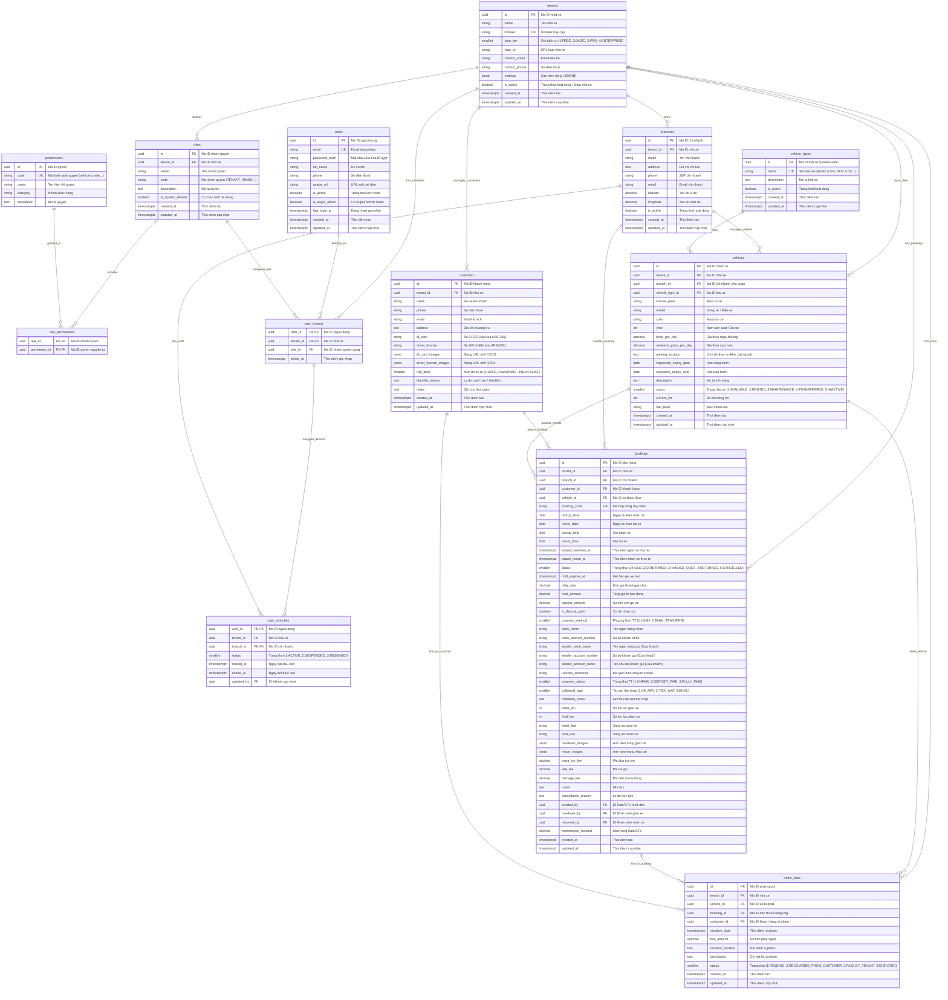

# Database Schema - Car Rental SaaS

**Cập nhật:** 07/08/2026 — Tối ưu hóa toàn diện Database Schema sát thực tế nghiệp vụ Việt Nam:
- **Phân quyền động (Dynamic RBAC)**: Thêm 3 bảng `roles`, `permissions`, `role_permissions` (khóa ngoại `ON DELETE CASCADE`), thay thế cột `role` cố định bằng `role_id` ở `user_tenants`.
- **Nâng cấp `user_branches`**: Thêm `status` (1: ACTIVE, 2: SUSPENDED, 3: RESIGNED), ngày bắt đầu/kết thúc (`started_at`, `ended_at`) và người cập nhật (`updated_by`).
- **Chuẩn hóa `vehicle_types` System-wide**: Bỏ `tenant_id`, chuyển thành danh mục toàn hệ thống do `SUPER_ADMIN` định nghĩa.
- **Tối ưu vị trí đỗ & Cảnh báo xe (`vehicles`)**: Thêm `parking_location` (kết hợp `branch_id` chủ quản để lưu vết đỗ kho/bãi ngoài/nhà riêng), hạn đăng kiểm (`inspection_expiry_date`) và hạn bảo hiểm (`insurance_expiry_date`).
- **Quản lý rủi ro khách hàng (`customers`)**: Thêm phân loại rủi ro (`risk_level`: SAFE, WARNING, BLACKLIST) và lý do cảnh báo (`blacklist_reason`).
- **Bổ sung Thanh toán ngân hàng (`bookings`) & Quản lý Phạt nguội (`traffic_fines`)**: Bổ sung hình thức chuyển khoản/tiền mặt, mã giao dịch, số tài khoản nhận tiền và theo dõi truy thu phạt nguội giao thông.

---

## Mục lục
1. [ER Diagram](#1-er-diagram)
2. [Tables & Column Comments](#2-tables--column-comments)
3. [Indexes Summary](#3-indexes-summary)
4. [Multi-tenant Strategy & RLS Policy](#4-multi-tenant-strategy--rls-policy)

---

## 1. ER Diagram



---

## 2. Tables & Column Comments

### 2.1 tenants (Nhà xe / Doanh nghiệp cho thuê xe)

```sql
CREATE TABLE tenants (
    id UUID PRIMARY KEY DEFAULT gen_random_uuid(),               -- Mã ID định danh nhà xe (UUID PK)
    name VARCHAR(255) NOT NULL,                                  -- Tên nhà xe / doanh nghiệp cho thuê xe
    domain VARCHAR(255) UNIQUE NOT NULL,                         -- Tên miền / Subdomain truy cập riêng của nhà xe
    plan_tier SMALLINT NOT NULL DEFAULT 1                        -- Gói dịch vụ: 1: FREE, 2: BASIC, 3: PRO, 4: ENTERPRISE
        CHECK (plan_tier IN (1, 2, 3, 4)),
    logo_url VARCHAR(500),                                       -- Đường dẫn ảnh logo của nhà xe
    contact_email VARCHAR(255),                                  -- Email liên hệ chính của nhà xe
    contact_phone VARCHAR(20),                                   -- Số điện thoại liên hệ chính của nhà xe
    settings JSONB DEFAULT '{}',                                 -- Cấu hình hệ thống riêng của tenant (JSONB)
    is_active BOOLEAN DEFAULT TRUE,                              -- Trạng thái hoạt động (TRUE: Active, FALSE: Khóa / Tạm dừng dịch vụ)
    created_at TIMESTAMP WITH TIME ZONE DEFAULT CURRENT_TIMESTAMP, -- Thời điểm khởi tạo tài khoản tenant
    updated_at TIMESTAMP WITH TIME ZONE DEFAULT CURRENT_TIMESTAMP  -- Thời điểm cập nhật thông tin tenant gần nhất
);

CREATE UNIQUE INDEX idx_tenants_domain ON tenants(domain);
```

### 2.2 branches (Chi nhánh / Bãi xe)

```sql
CREATE TABLE branches (
    id UUID PRIMARY KEY DEFAULT gen_random_uuid(),               -- Mã ID định danh chi nhánh (UUID PK)
    tenant_id UUID NOT NULL REFERENCES tenants(id) ON DELETE CASCADE, -- Mã ID nhà xe chủ quản (FK tenants)
    name VARCHAR(255) NOT NULL,                                  -- Tên chi nhánh / bãi xe
    address TEXT,                                                -- Địa chỉ chi tiết của chi nhánh
    phone VARCHAR(20),                                           -- Số điện thoại liên hệ chi nhánh
    email VARCHAR(255),                                          -- Email liên hệ chi nhánh
    latitude DECIMAL(10, 8),                                     -- Tọa độ vĩ độ (GPS Latitude)
    longitude DECIMAL(11, 8),                                    -- Tọa độ kinh độ (GPS Longitude)
    is_active BOOLEAN DEFAULT TRUE,                              -- Trạng thái hoạt động (TRUE: Active, FALSE: Inactive)
    created_at TIMESTAMP WITH TIME ZONE DEFAULT CURRENT_TIMESTAMP, -- Thời điểm tạo chi nhánh
    updated_at TIMESTAMP WITH TIME ZONE DEFAULT CURRENT_TIMESTAMP, -- Thời điểm cập nhật chi nhánh gần nhất
    CONSTRAINT unique_branch_tenant UNIQUE (id, tenant_id)
);

CREATE INDEX idx_branches_tenant_id ON branches(tenant_id);
```

### 2.3 roles (Danh mục Nhóm quyền trong Tenant)

```sql
CREATE TABLE roles (
    id UUID PRIMARY KEY DEFAULT gen_random_uuid(),               -- Mã ID nhóm quyền (UUID PK)
    tenant_id UUID REFERENCES tenants(id) ON DELETE CASCADE,     -- Mã ID nhà xe chủ quản (NULL nếu là role mặc định hệ thống)
    name VARCHAR(100) NOT NULL,                                  -- Tên hiển thị nhóm quyền (VD: Chủ bãi, Quản lý chi nhánh, Sale)
    code VARCHAR(50) NOT NULL,                                   -- Mã định danh nhóm quyền (VD: TENANT_ADMIN, BRANCH_MANAGER, STAFF, SALE)
    description TEXT,                                            -- Mô tả chi tiết phạm vi trách nhiệm của nhóm quyền
    is_system_default BOOLEAN DEFAULT FALSE,                     -- Cờ đánh dấu nhóm quyền mặc định hệ thống (không cho xóa)
    created_at TIMESTAMP WITH TIME ZONE DEFAULT CURRENT_TIMESTAMP, -- Thời điểm tạo nhóm quyền
    updated_at TIMESTAMP WITH TIME ZONE DEFAULT CURRENT_TIMESTAMP  -- Thời điểm cập nhật nhóm quyền gần nhất
);

CREATE INDEX idx_roles_tenant_id ON roles(tenant_id);
CREATE UNIQUE INDEX idx_roles_tenant_code ON roles(tenant_id, code);
```

### 2.4 permissions (Danh mục Quyền nguyên tử toàn hệ thống)

```sql
CREATE TABLE permissions (
    id UUID PRIMARY KEY DEFAULT gen_random_uuid(),               -- Mã ID quyền nguyên tử (UUID PK)
    code VARCHAR(100) UNIQUE NOT NULL,                           -- Mã định danh quyền (VD: vehicle:create, booking:handover)
    name VARCHAR(255) NOT NULL,                                  -- Tên hiển thị của quyền
    category VARCHAR(50) NOT NULL,                               -- Nhóm chức năng (VD: VEHICLE, BOOKING, REPORT, SYSTEM)
    description TEXT                                             -- Mô tả chi tiết hành động được phép thực hiện
);

CREATE UNIQUE INDEX idx_permissions_code ON permissions(code);
```

### 2.5 role_permissions (Bảng liên kết N-N Nhóm quyền & Quyền)

```sql
CREATE TABLE role_permissions (
    role_id UUID NOT NULL REFERENCES roles(id) ON DELETE CASCADE, -- Mã ID nhóm quyền (FK roles - Xóa role tự dọn bảng N-N)
    permission_id UUID NOT NULL REFERENCES permissions(id) ON DELETE CASCADE, -- Mã ID quyền (FK permissions - Xóa permission tự dọn bảng N-N)
    PRIMARY KEY (role_id, permission_id)
);

CREATE INDEX idx_role_permissions_permission_id ON role_permissions(permission_id);
```

### 2.6 users (Tài khoản người dùng trung tâm)

```sql
CREATE TABLE users (
    id UUID PRIMARY KEY DEFAULT gen_random_uuid(),               -- Mã ID người dùng (UUID PK)
    email VARCHAR(255) UNIQUE NOT NULL,                          -- Địa chỉ email đăng nhập tập trung (UNIQUE)
    password_hash VARCHAR(255) NOT NULL,                         -- Mật khẩu mã hóa BCrypt
    full_name VARCHAR(255),                                      -- Họ và tên người dùng
    phone VARCHAR(20),                                           -- Số điện thoại liên hệ
    avatar_url VARCHAR(500),                                     -- Đường dẫn ảnh đại diện
    is_active BOOLEAN DEFAULT TRUE,                              -- Trạng thái kích hoạt tài khoản
    is_super_admin BOOLEAN DEFAULT FALSE,                        -- Cờ đánh dấu Super Admin toàn hệ thống SaaS (Bypasses RLS)
    last_login_at TIMESTAMP WITH TIME ZONE,                      -- Thời điểm đăng nhập thành công gần nhất
    created_at TIMESTAMP WITH TIME ZONE DEFAULT CURRENT_TIMESTAMP, -- Thời điểm tạo tài khoản
    updated_at TIMESTAMP WITH TIME ZONE DEFAULT CURRENT_TIMESTAMP  -- Thời điểm cập nhật thông tin gần nhất
);

CREATE INDEX idx_users_email ON users(email);
```

### 2.7 user_tenants (N-N: Người dùng thuộc Tenant nào, Role nào)

```sql
CREATE TABLE user_tenants (
    user_id UUID NOT NULL REFERENCES users(id) ON DELETE CASCADE, -- Mã ID người dùng (FK users)
    tenant_id UUID NOT NULL REFERENCES tenants(id) ON DELETE CASCADE, -- Mã ID nhà xe (FK tenants)
    role_id UUID NOT NULL REFERENCES roles(id),                   -- Mã ID nhóm quyền động (FK roles)
    joined_at TIMESTAMP WITH TIME ZONE DEFAULT CURRENT_TIMESTAMP, -- Thời điểm người dùng gia nhập tenant
    PRIMARY KEY (user_id, tenant_id),
    CONSTRAINT unique_user_tenant_role UNIQUE (user_id, tenant_id, role_id)
);

CREATE INDEX idx_user_tenants_tenant_id ON user_tenants(tenant_id);
CREATE INDEX idx_user_tenants_role_id ON user_tenants(role_id);
```

### 2.8 user_branches (N-N: Người dùng gán vào Chi nhánh nào trong Tenant)

```sql
CREATE TABLE user_branches (
    user_id UUID NOT NULL,                                       -- Mã ID người dùng (FK user_tenants)
    tenant_id UUID NOT NULL,                                     -- Mã ID nhà xe (FK user_tenants)
    branch_id UUID NOT NULL,                                     -- Mã ID chi nhánh được gán (FK branches)
    status SMALLINT NOT NULL DEFAULT 1                           -- Trạng thái làm việc: 1: ACTIVE (Đang làm), 2: SUSPENDED (Tạm dừng), 3: RESIGNED (Nghỉ việc)
        CHECK (status IN (1, 2, 3)),
    started_at TIMESTAMP WITH TIME ZONE DEFAULT CURRENT_TIMESTAMP, -- Ngày bắt đầu làm việc tại chi nhánh này
    ended_at TIMESTAMP WITH TIME ZONE,                           -- Ngày kết thúc làm việc tại chi nhánh (NULL nếu đang làm)
    updated_by UUID REFERENCES users(id) ON DELETE SET NULL,     -- ID Admin thực hiện cập nhật trạng thái/gán chi nhánh
    PRIMARY KEY (user_id, branch_id),
    CONSTRAINT fk_user_branch_user_tenant FOREIGN KEY (user_id, tenant_id)
        REFERENCES user_tenants(user_id, tenant_id) ON DELETE CASCADE,
    CONSTRAINT fk_user_branch_branch_tenant FOREIGN KEY (branch_id, tenant_id)
        REFERENCES branches(id, tenant_id) ON DELETE CASCADE
);

CREATE INDEX idx_user_branches_branch_id ON user_branches(branch_id);
CREATE INDEX idx_user_branches_tenant_id ON user_branches(tenant_id);
CREATE INDEX idx_user_branches_updated_by ON user_branches(updated_by);
```

### 2.9 vehicle_types (Danh mục Loại xe System-wide — Super Admin quản lý)

```sql
CREATE TABLE vehicle_types (
    id UUID PRIMARY KEY DEFAULT gen_random_uuid(),               -- Mã ID loại xe (UUID PK)
    name VARCHAR(50) NOT NULL UNIQUE,                            -- Tên loại xe (VD: SEDAN 4 chỗ, SUV 7 chỗ, MPV 7 chỗ, Bán tải, Xe điện...)
    description TEXT,                                            -- Mô tả chi tiết phân loại xe
    is_active BOOLEAN DEFAULT TRUE,                              -- Trạng thái cho phép chọn (TRUE: Active, FALSE: Inactive)
    created_at TIMESTAMP WITH TIME ZONE DEFAULT CURRENT_TIMESTAMP, -- Thời điểm tạo loại xe
    updated_at TIMESTAMP WITH TIME ZONE DEFAULT CURRENT_TIMESTAMP  -- Thời điểm cập nhật loại xe
);

CREATE INDEX idx_vehicle_types_name ON vehicle_types(name);
```

### 2.10 vehicles (Thông tin Xe cho thuê)

```sql
CREATE TABLE vehicles (
    id UUID PRIMARY KEY DEFAULT gen_random_uuid(),               -- Mã ID chiếc xe (UUID PK)
    tenant_id UUID NOT NULL REFERENCES tenants(id) ON DELETE CASCADE, -- Mã ID nhà xe chủ quản (FK tenants)
    branch_id UUID,                                              -- Mã ID chi nhánh chịu trách nhiệm quản lý xe (FK branches)
    vehicle_type_id UUID NOT NULL REFERENCES vehicle_types(id),  -- Mã ID loại xe hệ thống (FK vehicle_types)
    license_plate VARCHAR(20) NOT NULL,                          -- Biển số xe (VD: 30F-123.45)
    model VARCHAR(100),                                          -- Dòng xe / Tên mẫu xe chi tiết (VD: Mazda 3, VF8)
    color VARCHAR(30),                                           -- Màu sơn xe
    year INTEGER,                                                -- Năm sản xuất / Đời xe
    price_per_day DECIMAL(12, 2) NOT NULL DEFAULT 0,             -- Giá thuê ngày thường niêm yết (VNĐ/ngày)
    weekend_price_per_day DECIMAL(12, 2),                        -- Giá thuê cuối tuần niêm yết (tùy chọn, VNĐ/ngày)
    parking_location TEXT,                                       -- Ghi chú vị trí đỗ thực tế (bãi ngoài, gửi nhà anh A/B/C, kho phụ)
    inspection_expiry_date DATE,                                 -- Ngày hết hạn đăng kiểm xe
    insurance_expiry_date DATE,                                  -- Ngày hết hạn bảo hiểm TNDS / Thân vỏ
    description TEXT,                                            -- Mô tả thêm về tình trạng xe
    status SMALLINT NOT NULL DEFAULT 1                           -- Trạng thái xe: 1: Sẵn sàng (AVAILABLE), 2: Đang thuê (RENTED), 3: Bảo dưỡng (MAINTENANCE), 4: Điều phối (TRANSFERRED), 5: Tạm ngưng (INACTIVE)
        CHECK (status IN (1, 2, 3, 4, 5)),
    current_km INTEGER DEFAULT 0,                                -- Số km đồng hồ hiện tại
    fuel_level VARCHAR(20) DEFAULT 'full',                       -- Mức nhiên liệu hiện tại (full, 3/4, 1/2...)
    images JSONB DEFAULT '[]',                                   -- Danh sách ảnh thực tế của xe (JSONB)
    created_at TIMESTAMP WITH TIME ZONE DEFAULT CURRENT_TIMESTAMP, -- Thời điểm thêm xe vào hệ thống
    updated_at TIMESTAMP WITH TIME ZONE DEFAULT CURRENT_TIMESTAMP, -- Thời điểm cập nhật thông tin xe gần nhất
    CONSTRAINT fk_vehicle_branch_tenant FOREIGN KEY (branch_id, tenant_id)
        REFERENCES branches(id, tenant_id) ON DELETE SET NULL (branch_id),
    CONSTRAINT unique_vehicle_tenant UNIQUE (id, tenant_id)
);

CREATE INDEX idx_vehicles_tenant_id ON vehicles(tenant_id);
CREATE INDEX idx_vehicles_branch_id ON vehicles(branch_id);
CREATE INDEX idx_vehicles_status ON vehicles(tenant_id, status);
CREATE INDEX idx_vehicles_license_plate ON vehicles(tenant_id, license_plate);
CREATE UNIQUE INDEX idx_vehicles_tenant_license ON vehicles(tenant_id, license_plate);
```

### 2.11 customers (Khách hàng thuê xe & Quản lý rủi ro)

```sql
CREATE TABLE customers (
    id UUID PRIMARY KEY DEFAULT gen_random_uuid(),               -- Mã ID khách hàng (UUID PK)
    tenant_id UUID NOT NULL REFERENCES tenants(id) ON DELETE CASCADE, -- Mã ID nhà xe chủ quản (FK tenants)
    name VARCHAR(255) NOT NULL,                                  -- Họ và tên khách hàng
    phone VARCHAR(20),                                           -- Số điện thoại liên hệ
    email VARCHAR(255),                                          -- Email khách hàng
    address TEXT,                                                -- Địa chỉ hộ khẩu / thường trú
    id_card VARCHAR(20),                                         -- Số CCCD / CMND (Mã hóa AES-256)
    driver_license VARCHAR(20),                                  -- Số Giấy phép lái xe (Mã hóa AES-256)
    id_card_images JSONB DEFAULT '[]',                           -- Mảng URL ảnh CCCD lưu trên S3 (JSONB)
    driver_license_images JSONB DEFAULT '[]',                    -- Mảng URL ảnh GPLX lưu trên S3 (JSONB)
    risk_level SMALLINT NOT NULL DEFAULT 1                       -- Mức độ rủi ro: 1: SAFE (An toàn), 2: WARNING (Cảnh báo), 3: BLACKLIST (Danh sách đen)
        CHECK (risk_level IN (1, 2, 3)),
    blacklist_reason TEXT,                                       -- Mô tả chi tiết lý do đưa vào danh sách đen/cảnh báo
    notes TEXT,                                                  -- Ghi chú thói quen/lịch sử thuê của khách
    created_at TIMESTAMP WITH TIME ZONE DEFAULT CURRENT_TIMESTAMP, -- Thời điểm khởi tạo hồ sơ
    updated_at TIMESTAMP WITH TIME ZONE DEFAULT CURRENT_TIMESTAMP, -- Thời điểm cập nhật hồ sơ gần nhất
    CONSTRAINT unique_customer_tenant UNIQUE (id, tenant_id)
);

CREATE INDEX idx_customers_tenant_id ON customers(tenant_id);
CREATE INDEX idx_customers_phone ON customers(tenant_id, phone);
CREATE INDEX idx_customers_email ON customers(tenant_id, email);
CREATE INDEX idx_customers_risk_level ON customers(tenant_id, risk_level);
```

### 2.12 bookings (Đơn hàng thuê xe & Thanh toán)

```sql
CREATE TABLE bookings (
    id UUID PRIMARY KEY DEFAULT gen_random_uuid(),               -- Mã ID đơn hàng (UUID PK)
    tenant_id UUID NOT NULL REFERENCES tenants(id) ON DELETE CASCADE, -- Mã ID nhà xe chủ quản (FK tenants)
    branch_id UUID NOT NULL,                                     -- Mã ID chi nhánh tiếp nhận đơn hàng (FK branches)
    customer_id UUID NOT NULL,                                   -- Mã ID khách hàng thuê xe (FK customers)
    vehicle_id UUID,                                             -- Mã ID xe được thuê (FK vehicles)
    booking_code VARCHAR(20) UNIQUE NOT NULL,                    -- Mã hợp đồng thuê xe duy nhất (VD: BK-20260807-001)
    pickup_date DATE NOT NULL,                                   -- Ngày dự kiến bắt đầu nhận xe
    return_date DATE NOT NULL,                                   -- Ngày dự kiến hoàn trả xe
    pickup_time TIME,                                            -- Giờ dự kiến nhận xe
    return_time TIME,                                            -- Giờ dự kiến trả xe
    actual_handover_at TIMESTAMP WITH TIME ZONE,                 -- Thời điểm thực tế giao chìa khóa cho khách
    actual_return_at TIMESTAMP WITH TIME ZONE,                   -- Thời điểm thực tế nhận lại xe (tự động tính trễ giờ)
    status SMALLINT NOT NULL DEFAULT 1                           -- Trạng thái đơn: 1: HOLD, 2: CONFIRMED, 3: HANDED_OVER, 4: RETURNED, 5: CANCELLED
        CHECK (status IN (1, 2, 3, 4, 5)),
    hold_expires_at TIMESTAMP WITH TIME ZONE,                    -- Thời điểm hết hạn giữ xe tạm nếu chưa cọc
    daily_rate DECIMAL(12, 2) NOT NULL DEFAULT 0,                -- Đơn giá thuê/ngày chốt tại thời điểm đặt xe (VNĐ/ngày)
    total_amount DECIMAL(12, 2) DEFAULT 0,                       -- Tổng giá trị hợp đồng thuê xe (VNĐ)
    deposit_amount DECIMAL(12, 2) DEFAULT 0,                     -- Số tiền cọc giữ xe (VNĐ)
    is_deposit_paid BOOLEAN DEFAULT FALSE,                       -- Cờ xác nhận đã nhận tiền cọc giữ xe
    payment_method SMALLINT DEFAULT 1                            -- Phương thức thanh toán: 1: CASH (Tiền mặt), 2: BANK_TRANSFER (Chuyển khoản)
        CHECK (payment_method IN (1, 2)),
    bank_name VARCHAR(100),                                      -- Tên ngân hàng nhận chuyển khoản của nhà xe (VD: MBBank, VCB)
    bank_account_number VARCHAR(50),                             -- Số tài khoản ngân hàng nhận tiền của nhà xe
    sender_bank_name VARCHAR(100),                               -- Tên ngân hàng chuyển đi của khách hàng (VD: Techcombank, VPBank)
    sender_account_number VARCHAR(50),                          -- Số tài khoản ngân hàng chuyển đi của khách hàng
    sender_account_name VARCHAR(255),                            -- Tên chủ tài khoản chuyển đi của khách hàng
    transfer_reference VARCHAR(100),                             -- Mã giao dịch / Nội dung chuyển khoản (VD: FT240807xxxx)
    payment_status SMALLINT DEFAULT 1                            -- Trạng thái thanh toán: 1: UNPAID, 2: DEPOSIT_PAID, 3: FULLY_PAID
        CHECK (payment_status IN (1, 2, 3)),
    collateral_type SMALLINT DEFAULT 1                           -- Tài sản thế chấp: 1: XE_MAY (Xe + Cavet gốc), 2: TIEN_MAT, 3: KHAC
        CHECK (collateral_type IN (1, 2, 3)),
    collateral_notes TEXT,                                       -- Ghi chú tài sản thế chấp (VD: Xe Wave BKS 29X1-12345 + Cavet chính chủ)
    initial_km INTEGER,                                          -- Số km đồng hồ lúc bàn giao xe
    final_km INTEGER,                                            -- Số km đồng hồ lúc nhận lại xe
    initial_fuel VARCHAR(20),                                    -- Mức nhiên liệu ban đầu lúc bàn giao
    final_fuel VARCHAR(20),                                      -- Mức nhiên liệu khi khách trả xe
    handover_images JSONB DEFAULT '[]',                          -- Ảnh hiện trạng xe lúc bàn giao (vết xước, km, xăng) dạng JSONB
    return_images JSONB DEFAULT '[]',                            -- Ảnh hiện trạng xe lúc nhận lại (vết xước mới, km, xăng) dạng JSONB
    extra_km_fee DECIMAL(12, 2) DEFAULT 0,                       -- Phí phụ trội số km vượt giới hạn (VNĐ)
    late_fee DECIMAL(12, 2) DEFAULT 0,                           -- Phí trễ giờ trả xe (VNĐ)
    damage_fee DECIMAL(12, 2) DEFAULT 0,                         -- Phí đền bù hư hỏng (VNĐ)
    notes TEXT,                                                  -- Ghi chú bổ sung đơn hàng
    cancellation_reason TEXT,                                    -- Lý do hủy đơn (nếu status = CANCELLED)
    created_by UUID,                                             -- ID người tạo đơn (Sale / CTV / Admin) - Dùng tính hoa hồng
    handover_by UUID,                                            -- ID nhân viên bãi làm thủ tục giao xe
    returned_by UUID,                                            -- ID nhân viên bãi nhận lại xe
    commission_amount DECIMAL(12, 2) DEFAULT 0,               -- Số tiền hoa hồng chi trả cho Sale/CTV chốt đơn (VNĐ)
    created_at TIMESTAMP WITH TIME ZONE DEFAULT CURRENT_TIMESTAMP, -- Thời điểm tạo đơn hàng
    updated_at TIMESTAMP WITH TIME ZONE DEFAULT CURRENT_TIMESTAMP, -- Thời điểm cập nhật đơn hàng gần nhất
    CONSTRAINT fk_booking_branch_tenant FOREIGN KEY (branch_id, tenant_id)
        REFERENCES branches(id, tenant_id),
    CONSTRAINT fk_booking_customer_tenant FOREIGN KEY (customer_id, tenant_id)
        REFERENCES customers(id, tenant_id),
    CONSTRAINT fk_booking_vehicle_tenant FOREIGN KEY (vehicle_id, tenant_id)
        REFERENCES vehicles(id, tenant_id) ON DELETE SET NULL (vehicle_id),
    CONSTRAINT fk_booking_created_by_tenant FOREIGN KEY (created_by, tenant_id)
        REFERENCES user_tenants(user_id, tenant_id) ON DELETE SET NULL (created_by),
    CONSTRAINT fk_booking_handover_by_tenant FOREIGN KEY (handover_by, tenant_id)
        REFERENCES user_tenants(user_id, tenant_id) ON DELETE SET NULL (handover_by),
    CONSTRAINT fk_booking_returned_by_tenant FOREIGN KEY (returned_by, tenant_id)
        REFERENCES user_tenants(user_id, tenant_id) ON DELETE SET NULL (returned_by),
    CONSTRAINT unique_booking_tenant UNIQUE (id, tenant_id)
);

CREATE INDEX idx_bookings_tenant_id ON bookings(tenant_id);
CREATE INDEX idx_bookings_branch_id ON bookings(branch_id);
CREATE INDEX idx_bookings_customer_id ON bookings(customer_id);
CREATE INDEX idx_bookings_vehicle_id ON bookings(vehicle_id);
CREATE INDEX idx_bookings_status ON bookings(tenant_id, status);
CREATE INDEX idx_bookings_dates ON bookings(tenant_id, pickup_date, return_date);
CREATE INDEX idx_bookings_code ON bookings(booking_code);
CREATE INDEX idx_bookings_payment_status ON bookings(tenant_id, payment_status);
```

### 2.13 traffic_fines (Theo dõi & Truy thu Phạt nguội Giao thông)

```sql
CREATE TABLE traffic_fines (
    id UUID PRIMARY KEY DEFAULT gen_random_uuid(),               -- Mã ID bản ghi phạt nguội (UUID PK)
    tenant_id UUID NOT NULL REFERENCES tenants(id) ON DELETE CASCADE, -- Mã ID nhà xe chủ quản (FK tenants)
    vehicle_id UUID NOT NULL REFERENCES vehicles(id) ON DELETE CASCADE, -- Mã ID xe bị phạt nguội (FK vehicles)
    booking_id UUID REFERENCES bookings(id) ON DELETE SET NULL,   -- Mã ID đơn thuê tương ứng với thời gian vi phạm (FK bookings)
    customer_id UUID REFERENCES customers(id) ON DELETE SET NULL, -- Mã ID khách hàng cầm lái thời điểm vi phạm (FK customers)
    violation_date TIMESTAMP WITH TIME ZONE NOT NULL,            -- Thời điểm thực tế phát sinh vi phạm giao thông
    fine_amount DECIMAL(12, 2) NOT NULL DEFAULT 0,               -- Số tiền phạt nguội theo thông báo CSGT (VNĐ)
    violation_location TEXT,                                     -- Địa điểm phát sinh vi phạm giao thông
    description TEXT,                                            -- Chi tiết lỗi vi phạm (vượt đèn đỏ, chạy quá tốc độ...)
    status SMALLINT NOT NULL DEFAULT 1                           -- Trạng thái: 1: PENDING (Chờ xử lý), 2: RECOVERED_FROM_CUSTOMER (Đã thu tiền khách), 3: PAID_BY_TENANT (Nhà xe đã nộp), 4: DISPUTED (Đang khiếu nại)
        CHECK (status IN (1, 2, 3, 4)),
    created_at TIMESTAMP WITH TIME ZONE DEFAULT CURRENT_TIMESTAMP, -- Thời điểm nhập thông tin phạt nguội
    updated_at TIMESTAMP WITH TIME ZONE DEFAULT CURRENT_TIMESTAMP  -- Thời điểm cập nhật phạt nguội gần nhất
);

CREATE INDEX idx_traffic_fines_tenant_id ON traffic_fines(tenant_id);
CREATE INDEX idx_traffic_fines_vehicle_id ON traffic_fines(vehicle_id);
CREATE INDEX idx_traffic_fines_booking_id ON traffic_fines(booking_id);
CREATE INDEX idx_traffic_fines_customer_id ON traffic_fines(customer_id);
CREATE INDEX idx_traffic_fines_status ON traffic_fines(tenant_id, status);
```

---

## 3. Indexes Summary

| Bảng | Tên Index | Các cột | Loại Index |
|------|-----------|---------|------------|
| tenants | idx_tenants_domain | domain | UNIQUE |
| branches | idx_branches_tenant_id | tenant_id | Normal |
| roles | idx_roles_tenant_id | tenant_id | Normal |
| roles | idx_roles_tenant_code | tenant_id, code | UNIQUE |
| permissions | idx_permissions_code | code | UNIQUE |
| role_permissions | idx_role_permissions_permission_id | permission_id | Normal |
| users | idx_users_email | email | UNIQUE |
| user_tenants | idx_user_tenants_tenant_id | tenant_id | Normal |
| user_tenants | idx_user_tenants_role_id | role_id | Normal |
| user_branches | idx_user_branches_branch_id | branch_id | Normal |
| user_branches | idx_user_branches_tenant_id | tenant_id | Normal |
| user_branches | idx_user_branches_updated_by | updated_by | Normal |
| vehicle_types | idx_vehicle_types_name | name | UNIQUE |
| vehicles | idx_vehicles_tenant_id | tenant_id | Normal |
| vehicles | idx_vehicles_branch_id | branch_id | Normal |
| vehicles | idx_vehicles_status | tenant_id, status | Normal |
| vehicles | idx_vehicles_license_plate | tenant_id, license_plate | Normal |
| vehicles | idx_vehicles_tenant_license | tenant_id, license_plate | UNIQUE |
| customers | idx_customers_tenant_id | tenant_id | Normal |
| customers | idx_customers_phone | tenant_id, phone | Normal |
| customers | idx_customers_email | tenant_id, email | Normal |
| customers | idx_customers_risk_level | tenant_id, risk_level | Normal |
| bookings | idx_bookings_tenant_id | tenant_id | Normal |
| bookings | idx_bookings_branch_id | branch_id | Normal |
| bookings | idx_bookings_customer_id | customer_id | Normal |
| bookings | idx_bookings_vehicle_id | vehicle_id | Normal |
| bookings | idx_bookings_status | tenant_id, status | Normal |
| bookings | idx_bookings_dates | tenant_id, pickup_date, return_date | Normal |
| bookings | idx_bookings_code | booking_code | UNIQUE |
| bookings | idx_bookings_payment_status | tenant_id, payment_status | Normal |
| traffic_fines | idx_traffic_fines_tenant_id | tenant_id | Normal |
| traffic_fines | idx_traffic_fines_vehicle_id | vehicle_id | Normal |
| traffic_fines | idx_traffic_fines_booking_id | booking_id | Normal |
| traffic_fines | idx_traffic_fines_customer_id | customer_id | Normal |
| traffic_fines | idx_traffic_fines_status | tenant_id, status | Normal |

---

## 4. Multi-tenant Strategy & RLS Policy

### 4.1 Row-Level Security (RLS) Policy
Trong môi trường Shared Database, PostgreSQL RLS tự động chèn bộ lọc `tenant_id` vào mọi truy vấn SQL:

```sql
-- Kích hoạt RLS cho các bảng tenant-scoped
ALTER TABLE vehicles ENABLE ROW LEVEL SECURITY;
ALTER TABLE bookings ENABLE ROW LEVEL SECURITY;
ALTER TABLE customers ENABLE ROW LEVEL SECURITY;
ALTER TABLE traffic_fines ENABLE ROW LEVEL SECURITY;
ALTER TABLE roles ENABLE ROW LEVEL SECURITY;

-- Policy cô lập dữ liệu theo Tenant
CREATE POLICY tenant_isolation ON vehicles
    USING (
        (current_setting('app.current_user_role', true) = 'SUPER_ADMIN') OR
        (tenant_id = current_setting('app.current_tenant', true)::uuid)
    );
```
