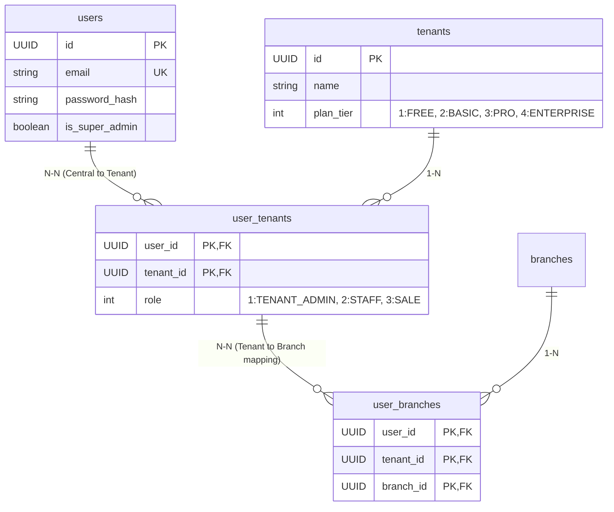

# TÀI LIỆU HƯỚNG DẪN GIA NHẬP DỰ ÁN (ONBOARDING DOCUMENT)
## Dự án: Car Rental SaaS (Hệ thống Quản lý & Cho thuê xe tự lái)

---

## 1. Tổng Quan Dự Án

**Car Rental SaaS** là nền tảng phần mềm dưới dạng dịch vụ (SaaS) chuyên biệt phục vụ các đơn vị cho thuê xe tự lái quy mô vừa và nhỏ. Hệ thống được xây dựng trên mô hình đơn khối tối giản nhưng mạnh mẽ, hỗ trợ nhiều nhà xe (tenant) dùng chung một cơ sở dữ liệu vật lý với khả năng cô lập tuyệt đối dữ liệu ở tầng cơ sở dữ liệu.

### 1.1 Nguyên lý Vận hành
*   **Single Domain (Tên miền tập trung):** Toàn bộ nền tảng hoạt động dưới một domain duy nhất (ví dụ: `app.carrental-saas.com`). Không sử dụng mô hình subdomain (ví dụ: `tenant.carrental-saas.com`) để tối giản hóa việc triển khai SSL và quản trị hạ tầng mạng.
*   **Đăng nhập tập trung & Tenant Picker:** Người dùng (nhân viên/chủ nhà xe) đăng nhập tập trung bằng Email/Password. Sau khi xác thực thành công:
    *   Nếu tài khoản chỉ thuộc **1 Tenant**: Hệ thống tự động chuyển hướng trực tiếp vào Dashboard của nhà xe đó.
    *   Nếu tài khoản thuộc **nhiều Tenant** (ví dụ: cộng tác viên hoặc quản lý chuỗi): Hệ thống hiển thị **Tenant Picker** để người dùng lựa chọn môi trường làm việc. Họ có thể chuyển đổi nhanh Tenant (Switch Tenant) mà không cần đăng nhập lại nhờ cơ chế cấp lại JWT token mới.

---

## 2. Hệ Thống Vai Trò & Phân Quyền (RBAC & ABAC)

Kiến trúc phân quyền của dự án là sự kết hợp giữa **RBAC (Role-Based Access Control)** để phân biệt quyền hạn theo chức danh, và **ABAC (Attribute-Based Access Control)** để giới hạn phạm vi truy cập dữ liệu dựa trên thuộc tính Tenant và Chi nhánh (`branch`).

### 2.1 Các Vai Trò Trong Hệ Thống

| Vai trò | Phạm vi | Mô tả |
| :--- | :--- | :--- |
| **SUPER_ADMIN** | Toàn hệ thống | Tài khoản điều hành của đội ngũ phát triển SaaS. Dùng để cấu hình hệ thống, tạo Tenant mới, quản lý Subscription và duyệt thanh toán dịch vụ. Vai trò này lưu trực tiếp bằng cờ `is_super_admin = true` trong bảng trung tâm `users` và bypass toàn bộ cơ chế bảo mật Postgres RLS. |
| **TENANT_ADMIN** | 1 Tenant | Chủ nhà xe (quy định `role = 1` trong bảng `user_tenants`). Có toàn quyền quản lý nhân sự, cấu hình bảng giá, CRUD chi nhánh (`branches`), xe và xem báo cáo doanh thu toàn hệ thống. Mặc định có quyền truy cập tất cả các chi nhánh thuộc tenant. Đây là **vai trò duy nhất** có quyền Thêm/Sửa/Tạm ngưng/Xóa Chi nhánh (triển khai theo mô hình Hybrid SaaS Quota kiểm soát `max_branches` và `max_vehicles`). |
| **STAFF** | 1+ Chi nhánh | Nhân viên nghiệp vụ (quy định `role = 2` trong bảng `user_tenants`). Thực hiện tạo Booking, thực hiện thủ tục bàn giao xe (Check-in), nhận lại xe (Check-out) và thu tiền. Bắt buộc phải được gán vào ít nhất một chi nhánh trong bảng `user_branches` và chỉ thao tác được trên xe/booking thuộc chi nhánh đó. Read-only đối với danh mục Chi nhánh. |
| **SALE** | 1+ Chi nhánh | Cộng tác viên/Nhân viên kinh doanh (quy định `role = 3` trong bảng `user_tenants`). Có quyền tạo booking cho khách hàng, xem trạng thái xe trống để tư vấn, nhưng **không được phép** thực hiện bàn giao hoặc nhận lại xe. Read-only đối với danh mục Chi nhánh (chỉ xem được các chi nhánh được phân công). |

### 2.2 Sơ đồ Quan Hệ Phân Quyền (User-Tenant-Branch)



---

## 3. Quy Trình Thu Thập, Mã Hóa & Tự Động Tiêu Hủy Dữ Liệu Khách Hàng
*(Thiết kế tuân thủ quy định về bảo vệ dữ liệu cá nhân - Nghị định 13/2023/NĐ-CP)*

### 3.1 Phạm vi Nghiệp vụ (Scope)
*   **In-Scope (Trong hệ thống):** Lưu trữ thông tin định danh (CCCD, Bằng lái, Họ tên, SĐT) phục vụ việc quản lý rủi ro khi cho thuê tài sản trị giá lớn. Hỗ trợ tính năng Tự động điền (Autofill) cho khách hàng cũ. Thực hiện mã hóa dữ liệu dạng văn bản nhạy cảm (Encryption at rest) và lưu trữ hình ảnh giấy tờ trên S3 Cloud Storage.
*   **Out-of-Scope (Nằm ngoài hệ thống):** Phần mềm **KHÔNG** tham gia vào việc tạo mẫu, quản lý hoặc in ấn hợp đồng giấy. Các nhà xe tự thực hiện việc lập và ký kết hợp đồng thuê xe một cách thủ công (offline) bên ngoài phần mềm.

### 3.2 Quy trình Xử lý Thông tin Khách hàng

#### A. Đối với Khách Hàng Mới (Chưa có trên hệ thống)
1.  **Nhập liệu & Quét OCR:** Nhân viên chụp ảnh CCCD hoặc Giấy phép lái xe thông qua Camera trên Mobile Web. Hệ thống gọi API OCR để tự động bóc tách các trường: Họ tên, Số định danh, Ngày sinh, Hạng bằng lái và điền trực tiếp vào form (Xem chi tiết mục 3.3).
2.  **Mã hóa dữ liệu tại chỗ (Encryption at rest):** Trước khi lưu trữ vào bảng `customers` trong Database, hệ thống sử dụng thuật toán mã hóa (AES-256) trên Backend để mã hóa các trường thông tin nhạy cảm: `id_card` (Số CCCD) và `driver_license` (Số Bằng lái).
3.  **Tải ảnh tài liệu:** File ảnh chụp mặt trước/sau của giấy tờ được đẩy trực tiếp lên Shared S3 Bucket của hệ thống, Database chỉ lưu lại đường dẫn URL ảnh.
    *   **Cấu trúc thư mục lưu trữ trên S3:**
        $$\text{s3://[bucket-name]/[tenant\_id]/[customer\_id]/[booking\_id]/}$$
    *   **Loại file được phép lưu trữ:** Chỉ chứa các ảnh giấy tờ pháp lý (`cccd_front.jpg`, `cccd_back.jpg`, `driver_license.jpg`).

#### B. Đối với Khách Hàng Cũ (Đã có thông tin)
1.  **Autofill (Tự động điền):** Nhân viên chỉ cần nhập Số điện thoại hoặc Số CCCD của khách. Backend sẽ tìm kiếm thông tin cũ, thực hiện giải mã và trả về đầy đủ các trường thông tin Họ tên, Địa chỉ để điền nhanh vào form Booking.
2.  **Xác minh offline:** Tại thời điểm bàn giao xe, nhân viên chỉ cần đối chiếu trực tiếp giấy tờ gốc của khách với thông tin trên hệ thống. Nếu thông tin không thay đổi, **không cần chụp hay tải lại ảnh mới**, nhằm tiết kiệm tài nguyên lưu trữ và hạn chế thu thập dữ liệu trùng lặp.

#### C. Tuân thủ Tiêu hủy Dữ liệu (Auto-delete S3)
*   **Dữ liệu văn bản (Text):** Dữ liệu chữ (sau khi đã được mã hóa) được lưu trữ lâu dài trong Database để phục vụ nghiệp vụ Autofill khi khách hàng quay lại thuê xe lần sau.
*   **Dữ liệu hình ảnh (Images):** Ảnh chụp giấy tờ là dữ liệu có độ nhạy cảm pháp lý cao. Hệ thống cấu hình **S3 Lifecycle Rules** tự động quét và xóa vĩnh viễn (Hard Delete) toàn bộ file ảnh giấy tờ của khách hàng trên S3 sau **180 ngày (6 tháng)** kể từ ngày tải lên. 
    *   *Ý nghĩa:* Giải phóng dung lượng đĩa cứng lưu trữ của hệ thống SaaS, đồng thời loại bỏ hoàn toàn rủi ro pháp lý về việc lưu trữ ảnh tài sản cá nhân quá thời hạn nghiệp vụ cần thiết.

#### D. Tra cứu Xử lý Sự cố (Phạt nguội / Yêu cầu của Cơ quan Chức năng)
Khi có sự cố xảy ra (ví dụ: phạt nguội giao thông, tai nạn, xe bị chiếm đoạt):
1.  Nhà xe truy cập Dashboard quản trị, nhập Biển số xe và Thời điểm vi phạm.
2.  Hệ thống truy xuất Booking tương ứng, tiến hành giải mã dữ liệu text và hiển thị thông tin người lái xe lúc đó: Họ tên, Số CCCD, SĐT, Số Bằng lái.
3.  Tải ảnh giấy tờ đối chiếu (nếu sự cố xảy ra trong vòng 180 ngày). Nếu quá 180 ngày, ảnh giấy tờ đã bị xóa tự động trên S3, nhà xe sử dụng thông tin dạng văn bản kết hợp với Hợp đồng ký kết offline bên ngoài để làm việc với Công an.

### 3.3 Chi Tiết Tích Hợp OCR Tự Động Nhập Liệu
Để tối ưu hóa trải nghiệm trên di động, hệ thống tích hợp API nhận diện ký tự quang học qua cổng Gateway nội bộ:

1.  **Luồng API gọi dịch vụ OCR:**
    *   Frontend sử dụng Web Camera API để capture ảnh hoặc mở trình tải file chọn ảnh bản cứng.
    *   Gửi yêu cầu tới Backend qua endpoint: `POST /api/v1/customers/ocr` (multipart/form-data).
    *   Backend nhận file, kiểm tra định dạng và gọi REST API của bên thứ 3 (Ví dụ: FPT AI OCR) kèm mã xác thực được lưu trong biến cấu hình môi trường.
    *   Backend nhận kết quả thô từ nhà cung cấp, xử lý định dạng chuẩn (chuẩn hóa tên viết hoa, ngày sinh dạng ISO `yyyy-MM-dd`) và trả về JSON chuẩn cho client.
2.  **Thông số kỹ thuật Endpoint `/ocr`:**
    *   **Request Body:**
        *   `file` (Binary): Ảnh chụp giấy tờ.
        *   `documentType` (String): Loại giấy tờ (`CCCD` hoặc `DRIVER_LICENSE`).
    *   **Response Body:**
        ```json
        {
          "success": true,
          "data": {
            "documentType": "CCCD",
            "idCardNumber": "037198001234",
            "fullName": "NGUYỄN VĂN A",
            "dateOfBirth": "1998-05-15",
            "address": "12 Lũy Bán Bích, Tân Thới Hòa, Tân Phú, TP. HCM",
            "gender": "Nam",
            "expiryDate": "2038-05-15"
          },
          "message": "OCR processed successfully"
        }
        ```
    *   **Xử lý Ngoại lệ:**
        *   Nếu ảnh mờ không đọc được -> Trả về mã lỗi HTTP `422 Unprocessable Entity` kèm thông báo `OCR_READ_FAILED` để client gợi ý nhân viên chụp lại ảnh rõ nét hơn hoặc nhập tay.

---

## 4. Kiến Trúc Kỹ Thuật & Giải Pháp Concurrency (Hold Engine)

Dự án sử dụng kiến trúc Spring Boot Monolith gọn nhẹ nhằm tối ưu hóa thời gian phát triển và chi phí hạ tầng trong giai đoạn MVP.

### 4.1 Tech Stack Thực Tế (MVP Scope)
*   **Backend Framework:** Java 17 + Spring Boot 3.3.x (Spring Data JPA, Spring Security).
*   **Database:** PostgreSQL 15+ (Single instance, shared schema, phân tách dữ liệu qua `tenant_id`).
*   **Hạ tầng:** Docker Compose (single instance để chạy BE + DB).
*   **File Storage:** AWS S3 / MinIO (Lưu ảnh xe, ảnh giấy tờ khách hàng).
*   **Lược bỏ hoàn toàn:** Redis (caching), Kafka (message queue), Load Balancer và cơ chế Scale ngang bằng Docker để tối giản hóa hệ thống.

### 4.2 Cơ Chế Giữ Chỗ Tạm Thời (Hold Engine) Chống Double-Booking
Thay vì sử dụng Redis Distributed Lock, hệ thống sử dụng giải pháp **Hold Engine** trực tiếp trên cơ sở dữ liệu PostgreSQL thông qua cơ chế khóa bi quan (Pessimistic Locking):

```
                     [Nhân viên tạo Booking từ BO]
                                   │
                                   ▼
          [Bắt đầu Transaction: SELECT FOR UPDATE trên xe]
                                   │
      ┌────────────────────────────┴────────────────────────────┐
      ▼                                                         ▼
[Xe đang rảnh trong khoảng ngày]                     [Xe đã bị giữ/đã thuê]
      │                                                         │
      ▼                                                         ▼
[Tạo bản ghi Booking ở trạng thái PENDING_HANDOVER]     [Trả về lỗi: VEHICLE_NOT_AVAILABLE]
[Kích hoạt Hold Timer trên Memory (5 phút)]
      │
      ├────────────────────────────┐
      ▼ (Ghi nhận cọc thành công)   ▼ (Hết 5 phút không cọc)
[Hủy Hold Timer, chốt giữ xe]      [Hệ thống tự động hủy booking]
[Booking tiếp tục ở trạng thái      [Giải phóng trạng thái xe]
 PENDING_HANDOVER (Chờ giao xe)]
```

1.  **SELECT FOR UPDATE:** Khi có yêu cầu kiểm tra và tạo giữ chỗ cho một xe từ ngày A đến ngày B, hệ thống thực hiện truy vấn khóa dòng dữ liệu của xe đó trong Database để đảm bảo tại một thời điểm chỉ có duy nhất một tiến trình được quyền xử lý nghiệp vụ đặt xe cho chiếc xe này.
2.  **Hold Timer (Giữ chỗ tạm):** Bản ghi booking được tạo ra ở trạng thái chờ bàn giao/chờ cọc (`PENDING_HANDOVER`) với thời gian giữ chỗ mặc định là 5 phút. 
3.  **Xác nhận/Hủy tự động:** Nếu trong vòng 5 phút nhà xe ghi nhận khách đã đóng tiền cọc thành công, hệ thống sẽ hủy Timer tự động hủy và chốt giữ xe cố định ở trạng thái `PENDING_HANDOVER`. Nếu quá 5 phút mà không có thông tin cọc được ghi nhận, hệ thống tự động hủy booking, giải phóng xe về trạng thái `AVAILABLE`.

---

## 5. Thiết Kế Cơ Sở Dữ Liệu & Cô Lập Dữ Liệu Multi-Tenant

### 5.1 Kiểu Dữ Liệu Gói Dịch Vụ (`plan_tier`)
Trường `plan_tier` của bảng `tenants` được lưu trữ dưới dạng số nguyên `SMALLINT` trong Database để tối ưu hóa hiệu năng truy vấn và lập chỉ mục. Cấu hình mapping tương ứng ở Backend thông qua một Enum:
*   `1`: `FREE` (Gói miễn phí - Giới hạn dung lượng S3 và số lượng xe).
*   `2`: `BASIC` (Gói cơ bản).
*   `3`: `PRO` (Gói chuyên nghiệp).
*   `4`: `ENTERPRISE` (Gói doanh nghiệp lớn).

### 5.2 Cơ Chế Cô Lập Dữ Liệu (Postgres Row-Level Security)
Để ngăn ngừa hoàn toàn nguy cơ rò rỉ chéo dữ liệu giữa các nhà xe đối thủ (IDOR, SQL Injection bypass), dự án áp dụng chính sách bảo mật **Row-Level Security (RLS)** ở tầng cơ sở dữ liệu trên tất cả các bảng có chứa cột `tenant_id`.

1.  **Tầng Application:** `JwtAuthenticationFilter` giải mã access token của người dùng, lấy ra `tenant_id` và lưu trữ vào ThreadLocal thông qua class `TenantContext`.
2.  **Tầng Database Connection:** Trước khi thực thi bất kỳ câu lệnh SQL nào, Hibernate/Spring Data JPA sẽ thiết lập biến cấu hình phiên kết nối (session configuration variable) của PostgreSQL:
    ```sql
    SET LOCAL app.current_tenant = 'uuid-của-tenant-hiện-tại';
    SET LOCAL app.current_user_role = 'ROLE-của-user';
    ```
3.  **Chính sách RLS tại Database:**
    ```sql
    ALTER TABLE vehicles ENABLE ROW LEVEL SECURITY;
    
    CREATE POLICY tenant_isolation ON vehicles
        USING (
            (current_setting('app.current_user_role', true) = 'SUPER_ADMIN') OR
            (tenant_id = current_setting('app.current_tenant', true)::uuid)
        );
    ```
    *Lưu ý:* Khi chính sách này được áp dụng, mọi câu lệnh `SELECT`, `UPDATE`, `DELETE` từ ứng dụng nếu không có quyền `SUPER_ADMIN` sẽ tự động bị PostgreSQL lọc thêm điều kiện `WHERE tenant_id = ...` ngầm định ở tầng nhân DB.

---

## 6. Lộ Trình Phát Triển Dự Án Thực Tế (Revised Roadmap)
*(Rút ngắn còn 3 Phase tập trung vào Back Office, loại bỏ hoàn toàn module Public Website Next.js)*

```
  PHASE 1 (Tuần 1-5)         PHASE 2 (Tuần 6-12)         PHASE 3 (Tuần 13-16)
┌───────────────────────┐  ┌────────────────────────┐  ┌─────────────────────────┐
│       NỀN MÓNG        │  │    BACK OFFICE CORE    │  │    POLISH & GO-LIVE     │
│                       │  │                        │  │                         │
│ • Định hình Base BE   │  │ • CRUD Branch, Vehicle │  │ • Full Flow Integration │
│ • Thiết kế DB & RLS   │  │ • CRUD Customer (Enc)  │  │ • Security Audit        │
│ • Auth & Tenant Picker│  │ • Hold Engine + Book   │  │ • Load test 100 tenants │
│ • Docker Compose base │  │ • CRUD Payment         │  │ • Deploy Prod (Cloud)   │
└───────────────────────┘  └────────────────────────┘  └─────────────────────────┘
        5 tuần                       7 tuần                       4 tuần
```

### 6.1 Chi Tiết Các Phase Phát Triển

#### Phase 1: Thiết Lập Nền Móng (Weeks 1 - 5)
*   **Mục tiêu:** Xây dựng xong bộ khung kỹ thuật vững chắc cho việc bảo mật và tách biệt dữ liệu đa chi nhánh, đa khách hàng.
*   **Nhiệm vụ trọng tâm:**
    *   Setup Boilerplate backend (Spring Boot 3.3, Flyway migration, Exception handler, Swagger).
    *   Thiết kế DB Schema cơ bản, kích hoạt Postgres RLS trên toàn bộ các bảng nghiệp vụ.
    *   Xây dựng hệ thống Đăng nhập tập trung bằng JWT (AccessToken 15 phút, RefreshToken 7 ngày đặt trong HttpOnly Cookie).
    *   Xây dựng tính năng Tenant Picker cho người dùng có nhiều doanh nghiệp.
    *   Setup Docker Compose một lệnh chạy ngay toàn bộ môi trường DEV cho cả team.

#### Phase 2: Back Office Core - Nghiệp Vụ Nhà Xe (Weeks 6 - 12)
*   **Mục tiêu:** Cung cấp đầy đủ các tính năng để một nhà xe có thể vứt bỏ sổ tay/Excel và vận hành trọn vẹn nghiệp vụ nội bộ của họ trên hệ thống.
*   **Nhiệm vụ trọng tâm:**
    *   **Module Fleet:** CRUD Chi nhánh (`branches`), CRUD Loại xe (`vehicle_types`), CRUD Xe (`vehicles`) kèm quy trình chuyển đổi trạng thái xe.
    *   **Module Khách hàng:** CRUD thông tin khách hàng, tích hợp tính năng tự động mã hóa AES-256 các trường nhạy cảm (`id_card`, `driver_license`). Setup SDK S3 lưu trữ ảnh giấy tờ.
    *   **Module Booking:** Xây dựng công cụ đặt xe trực quan (Calendar/Table) cho nhân viên Back Office.
    *   **Hold Engine:** Hiện thực hóa cơ chế lock DB giữ xe trong 5 phút chờ cọc.
    *   **Module Giao/Nhận xe:** Form 3 bước ghi nhận km, mức nhiên liệu, ghi chú hư hại lúc giao xe và nhận xe.
    *   **Module Thanh toán:** Ghi nhận thông tin thanh toán (Số tiền, Phương thức: Tiền mặt/Chuyển khoản, Mã tham chiếu, Ngày thanh toán) được nhân viên nhập thủ công sau khi khách thanh toán ngoại tuyến bên ngoài.
    *   **Module Báo cáo:** 3 báo cáo thiết yếu gồm doanh thu ngày, hiệu suất khai thác đội xe, và danh sách booking cần xử lý trong ngày.

#### Phase 3: Hoàn Thiện & Go-Live (Weeks 13 - 16)
*   **Mục tiêu:** Đảm bảo hệ thống đạt độ bảo mật tối đa, hiệu năng cao dưới tải lớn và sẵn sàng onboard khách hàng thật.
*   **Nhiệm vụ trọng tâm:**
    *   **Tích hợp & Kiểm thử:** Viết Unit Test cho Backend (mục tiêu coverage > 60%). Thực hiện viết kịch bản Integration Test giả lập toàn bộ luồng nghiệp vụ tự động từ lúc đặt xe đến khi trả xe.
    *   **Lifecycle Rules:** Cấu hình tự động quét tiêu hủy ảnh giấy tờ sau 180 ngày trên S3 Bucket của AWS/MinIO.
    *   **Bảo mật:** Thực hiện kiểm tra lỗi bảo mật IDOR (do dữ liệu multi-tenant rất nhạy cảm) và SQL Injection.
    *   **Hiệu năng:** Thực hiện Load Test giả lập tải của 100 tenant chạy song song với 1000 đầu xe hoạt động liên tục. Đảm bảo thời gian phản hồi API trung bình < 500ms.
    *   **Triển khai:** Setup hạ tầng VPS Cloud Production, trỏ Domain hệ thống, cấu hình SSL/TLS tự động cho toàn bộ Tenant.

---

## 7. Hướng Dẫn Thiết Kế Giao Diện UI/UX (Dành Cho AI Code Generator)

Tất cả giao diện của hệ thống được tối ưu hóa cho **Mobile Web (Responsive Web Page)** chạy trên các trình duyệt di động (Chrome, Safari). Giao diện tối giản, tập trung vào thao tác nhanh ngoài trời, nút bấm lớn và hạn chế tối đa việc nhập liệu bằng tay.

### 7.1 Quy chuẩn Design System Tokens
*   **Màu sắc chính (Primary):** `Indigo/Electric Blue` (`#3B82F6`) - Màu thể hiện công nghệ, tin cậy.
*   **Màu cảnh báo/nhấn mạnh (Secondary/Accent):** `Amber/Orange` (`#F59E0B`) - Dành cho tiền cọc, cảnh báo vi phạm.
*   **Màu nền (Background):** `Slate Gray` nhẹ (`#F8FAFC`), các thẻ Card nội dung dùng màu trắng tinh khiết (`#FFFFFF`). Bo góc chuẩn là `12px` (`0.75rem`).
*   **Font chữ:** `Inter` hoặc `Outfit` mang lại sự hiện đại, hiển thị sắc nét trên cả iOS và Android.

### 7.2 Chi tiết 5 Màn hình Core Nghiệp vụ

#### MÀN HÌNH 1: Đăng Nhập & Chọn Doanh Nghiệp (Login & Tenant Selector)
*   **Mô tả:** Đăng nhập tập trung trước. Nếu tài khoản liên kết với nhiều nhà xe, hiển thị màn hình chọn nhà xe làm việc (Tenant Picker) chứa danh sách các Card (mỗi Card gồm logo công ty, tên nhà xe, vai trò của người dùng).
*   **Prompt mẫu cho AI:**
    > *"Create a mobile-first, responsive web page for a modern Login and Tenant Selection screen of a Car Rental SaaS. The first state is a clean email/password web login form with Indigo accents. The second state is a Tenant Picker showing cards of different car rental companies the user belongs to (each card displays company logo, name, and user role like 'Tenant Admin', 'Staff', or 'Sale'). Use Inter font, smooth transition animations, and a sleek slate background. Ensure all inputs are standard web controls."*

#### MÀN HÌNH 2: Tạo Đơn Đặt Xe (Create Booking với OCR Autofill)
*   **Mô tả:** Nằm ở trên cùng là khung tải ảnh giấy tờ (Dashed-border Upload Block) hỗ trợ bật camera/upload file để quét OCR. Khi đang quét, hiển thị loading skeleton. Thông tin trích xuất (Họ tên, SĐT, CCCD, GPLX) sẽ tự điền vào Form dưới dạng "Autofilled style" để nhân viên soát lỗi. Phần dưới là bộ chọn Chi nhánh, bộ chọn xe (chỉ hiển thị xe trống có tag xanh `Available`), chọn ngày/giờ thuê, nhập tiền đặt cọc và phương thức thanh toán.
*   **Prompt mẫu cho AI:**
    > *"Design a responsive, mobile-first web page containing a 'Create Booking' form for a car rental SaaS application. At the top, place a prominent dashed-border upload area with a camera icon labeled 'Scan ID/Driver License to Autofill'. Below this, show input fields for Customer Name, Phone, ID Card Number, and Driver License (styled as autofilled fields). Next, add selectors for Branch, Select Vehicle (with small green 'Available' tags), and Datetime Pickers for pickup/return. At the bottom, display a summary card showing 'Total Amount' and a numeric input for 'Deposit Amount' with a payment method toggle. Clean Tailwind CSS, optimized for one-hand mobile input."*

#### MÀN HÌNH 3: Chi Tiết Đơn Hàng & Giao Nhận Xe (Booking Detail & Handover Checklist)
*   **Mô tả:** Đầu màn hình hiển thị thanh tiến trình 3 bước (`Pending Handover` -> `In Progress` -> `Completed`). Có nút gọi điện nhanh cho khách (`tel:`). Phần cốt lõi là checklist bàn giao vật lý: Nhập số Km hiện tại, chọn vạch xăng trực quan (1/4, 1/2, 3/4, Full), và upload tối đa 4 ảnh chụp hiện trạng xe. Nút hành động chính đổi động: `Deliver Vehicle` (khi trạng thái là PENDING_HANDOVER - Chờ giao xe) và `Receive Vehicle` (khi trạng thái là IN_PROGRESS - Đang thuê / Đã bàn giao).
*   **Prompt mẫu cho AI:**
    > *"Create a mobile-first, responsive web page for a 'Booking Detail & Handover' screen of a SaaS car rental platform. Display a status progress bar at the top (Pending Handover -> In Progress -> Completed) with appropriate status badges. Show customer details with a quick-call link (tel:), and booking details. Include a 'Vehicle Handover Checklist' section where staff can input current Kilometers, Fuel Level (visual progress bar selector), and upload 4 photos of the vehicle's current state. The primary action button at the bottom should change dynamically based on status: 'Deliver Vehicle' (when pending_handover) and 'Receive Vehicle' (when in_progress). Use a clean card layout with high contrast."*

#### MÀN HÌNH 4: Quản Lý Đội Xe & Phân Khúc (Fleet Management - Mobile-First)
*   **Mô tả:** Màn hình quản lý toàn bộ phương tiện và loại xe.
    *   *App Header:* Nút Hamburger `☰` (trái) mở Sidebar Menu, Tiêu đề đầy đủ **Quản lý fleet** (giữa), Avatar cá nhân (phải). Sub-header hiển thị Quota xe `Xe (12/15)` và Badge `Gói Starter`.
    *   *Cấu trúc 2 Tabs:*
        *   **Tab 1: Danh sách xe (Vehicles):** Ô tìm kiếm biển số/model, bộ lọc Chips Trạng thái (`Tất cả`, `🟢 Sẵn sàng`, `🔵 Đang thuê`, `🔴 Bảo dưỡng`), dropdown Lọc theo Chi nhánh. Danh sách Card xe bo góc hiển thị ảnh 16:9, biển số nổi bật, model, loại xe, chi nhánh đỗ, odo (`45,200 km`), mức xăng. Icon `⋮` mở Bottom Sheet thao tác (xem lịch xe, cập nhật odo/bảo dưỡng nhanh trong 3 giây, đổi chi nhánh, xóa xe).
        *   **Tab 2: Loại xe & Giá sàn (Vehicle Types):** Danh sách Card phân khúc xe (Sedan 4 chỗ, SUV 7 chỗ...), mô tả và **Giá thuê cơ bản/ngày (`1,200,000 VNĐ`)**.
    *   *FAB Button (`+`) nổi tự động chuyển ngữ cảnh:* Ở Tab 1 bấm `+` mở Form Thêm chiếc xe mới (3 khung); ở Tab 2 bấm `+` mở Form Tạo loại xe mới.
*   **Prompt mẫu cho AI:**
    > *"Design a mobile-first, responsive web interface for 'Fleet Management' of a SaaS car rental platform. Top app bar features a hamburger menu, title 'Quản lý fleet', and user avatar. Sub-header displays vehicle quota 'Xe (12/15)' and package badge. Provide two tabs: 'Vehicles' and 'Vehicle Types'. Under 'Vehicles' tab, display search bar, status filter chips (Available, Rented, Maintenance), branch filter dropdown, and a list of vehicle cards (photo thumbnail, license plate badge, model, branch, odo, fuel, action menu button). Include a bottom sheet for 'Quick Odo & Maintenance Update'. Under 'Vehicle Types' tab, list categories with daily rental rates. Place a floating action button '+' that dynamically opens 'Add Vehicle' form on Tab 1 and 'Add Vehicle Type' form on Tab 2. Modern Tailwind CSS styling."*


#### MÀN HÌNH 5: Quản Lý Tài Khoản & Phân Bổ Nhân Viên (Staff & Workplace Allocation)
*   **Mô tả:** Quản lý danh sách nhân sự. Có ô tìm kiếm **"Tìm tài khoản nhân viên bằng Email"**. 
    *   *Logic quan trọng:* Nếu email đã tồn tại trên cơ sở dữ liệu hệ thống (do đã làm cho Tenant khác), hiển thị thông báo: *"Tài khoản đã tồn tại trong hệ thống. Bạn đang gán người dùng này vào nhà xe của mình."*. Cho phép Tenant Admin phân công vai trò tại Tenant hiện tại và tích chọn danh sách chi nhánh được gán mà không bắt người dùng phải tạo lại tài khoản hoặc đổi mật khẩu.
*   **Prompt mẫu cho AI:**
    > *"Design a responsive, mobile-first web page for a 'Staff Management' dashboard. It has a list of active staff members with their avatars, names, roles (styled with colorful pills), and badges of assigned branches. It also includes an active/inactive toggle switch for each person. Add an 'Add/Assign Staff' form. In the form, have a search input for 'User Email'. Below the input, show a conditional info banner: 'User already exists in the system. You are assigning them to your organization.' Next, add a Role Selection dropdown (Tenant Admin, Staff, Sale) and a Multi-select checkbox group for branch assignments."*

### 7.3 Thiết kế Trạng thái Giao diện Phụ (Secondary UI States)
*   **Trạng thái Trống (Empty State):** Khi danh sách không có dữ liệu -> Hiển thị hình minh họa nhẹ kèm text hướng dẫn thân thiện và nút hành động (Ví dụ: *"Chưa có xe nào được đăng ký. [Thêm xe ngay]"*).
*   **Trạng thái Đang tải (Loading State):** Sử dụng các hiệu ứng **Skeleton** (khung xương xám chuyển động nhẹ) thay vì vòng xoay spinner truyền thống để tăng trải nghiệm mượt mà.
*   **Phản hồi lỗi (Error Validation State):** Cảnh báo lỗi nhập liệu bằng màu đỏ (`Destructive Red` - `#EF4444`) kèm text mô tả chi tiết ngay dưới trường thông tin bị lỗi.

---

## 8. Tài Liệu Nghiệp Vụ Rút Gọn Hướng Dẫn Dev Mới

### 8.1 Quy tắc đặt mã lỗi API (Error Codes)
Khi API trả về thất bại (`success: false`), client cần dựa vào `error.code` để hiển thị thông báo thân thiện cho người dùng:
*   `AUTH_FAILED`: Đăng nhập thất bại (sai email hoặc mật khẩu).
*   `TENANT_ACCESS_DENIED`: Người dùng không có quyền truy cập vào Tenant được chọn hoặc một chi nhánh không thuộc Tenant của họ.
*   `VEHICLE_NOT_AVAILABLE`: Xe đã có lịch đặt hoặc đang được giữ chỗ tạm thời trong khoảng thời gian yêu cầu.
*   `BOOKING_EXPIRED`: Hết hạn giữ xe (quá 5 phút giữ chỗ tạm mà chưa đóng cọc).
*   `CUSTOMER_ALREADY_EXISTS`: Khách hàng đã được đăng ký trong hệ thống của nhà xe (trùng SĐT hoặc CCCD).
*   `INVALID_OPERATION`: Thao tác sai quy trình nghiệp vụ (ví dụ: Nhân viên Sales cố tình thực hiện handover xe, hoặc cố tình promoted nhân viên thường lên Tenant Admin).

### 8.2 Quy trình Code & Commit (TDD Rule)
1.  **TDD (Test-Driven Development):** Bắt buộc đối với các tính năng nghiệp vụ. Dev cần viết Unit Test lỗi trước (RED), sau đó viết code để pass test (GREEN), cuối cùng thực hiện Refactor.
2.  **Không Hardcode bí mật:** Tuyệt đối không lưu mật khẩu DB, khóa bí mật JWT, hay S3 Access Key trong file code hoặc file `.yml` cấu hình. Toàn bộ thông tin nhạy cảm phải được truyền qua biến môi trường (Environment Variables).
3.  **Nguyên tắc Cô lập DB RLS:** Khi viết các câu lệnh SQL thuần (Native Query) hoặc JPA Query tùy biến, tuyệt đối không được viết tắt bỏ qua trường `tenant_id` trừ khi câu lệnh đó được chạy dưới quyền hạn của `SUPER_ADMIN`.

---

## 9. Chi Tiết Các Feature Specs & Nghiệp Vụ Triển Khai (Self-Contained Feature Specs)

Tài liệu dưới đây chứa **đầy đủ thông tin kỹ thuật, DTOs, Validation Rules, API Contracts, Database Schema, Luồng xử lý nghiệp vụ và Danh mục Mã lỗi** của các tính năng trong hệ thống. File `onboarding.md` này đóng vai trò là **Nguồn Chân Lý Dữ Liệu Duy Nhất (Single Source of Truth)**. Khi tiếp nhận dự án, phát triển tính năng mới hoặc fix bug, AI/Dev **không cần tìm các file spec lẻ mà đọc trực tiếp tại đây**.

---

### 9.1 Module Đăng Nhập & Xác Thực Tập Trung (`auth-login`)

#### A. Tổng quan & Trạng thái
* **Trạng thái**: **ĐÃ HOÀN THÀNH (Done)**
* **Mục tiêu**: Khởi tạo base project Spring Boot 3.3.x (Java 17, Spring Security, Spring Data JPA, Flyway, PostgreSQL) và xây dựng hệ thống đăng nhập tập trung, cấp JWT token (Access + Refresh) hỗ trợ người dùng thuộc 1 hoặc nhiều Tenant.

#### B. Phân quyền & Vai trò trong hệ thống
* `SUPER_ADMIN`: Quản trị viên toàn hệ thống SaaS (`is_super_admin = true` trong bảng `users`).
* `TENANT_ADMIN` (Role ID = 1): Chủ nhà xe.
* `STAFF` (Role ID = 2): Nhân viên nghiệp vụ.
* `SALE` (Role ID = 3): Cộng tác viên kinh doanh.

#### C. Luồng xử lý Đăng nhập & Tenant Selection (`AuthService`)
1. **Đăng nhập tập trung (`POST /api/v1/auth/login`)**:
   * Request Body: `{ "email": "user@example.com", "password": "Password123!" }`
   * Backend kiểm tra Email -> nếu không tìm thấy, ném lỗi `BadCredentialsException`.
   * Kiểm tra Password bằng `BCryptPasswordEncoder` -> nếu sai, ném lỗi `BadCredentialsException`.
   * Kiểm tra cờ `is_active` -> nếu false, ném lỗi `DisabledException`.
2. **Xử lý theo vai trò**:
   * **Nếu `is_super_admin == true`**:
     * Cấp Access JWT (15 phút) với claims: `tenant_id = null`, `role = SUPER_ADMIN`.
     * Cấp Refresh JWT (7 ngày) trong HTTP-only Cookie `refresh_token`.
     * Trả về `LoginResponse` kèm `requiresTenantSelection = false`.
   * **Nếu `is_super_admin == false`**: Query bảng `user_tenants` lấy danh sách Tenant đang hoạt động của người dùng.
     * *Trường hợp 0 Tenant*: Ném lỗi `AccessDeniedException` (Người dùng chưa được gắn vào nhà xe nào).
     * *Trường hợp 1 Tenant*: Tự động chọn Tenant đó. Lấy role trong `user_tenants` và danh sách branchIds trong `user_branches`. Cấp Access JWT (`tenant_id`, `role`, `branch_ids`) + Refresh JWT. Trả về `requiresTenantSelection = false`.
     * *Trường hợp 2+ Tenant*: Trả về `LoginResponse` chứa `requiresTenantSelection = true`, kèm danh sách `tenants` (gồm `tenantId`, `tenantName`, `role`) và chưa cấp Access JWT chính thức.
3. **Chọn Tenant (`POST /api/v1/auth/select-tenant`)**:
   * Request Body: `{ "tenantId": "uuid-tenant-selected" }`
   * Backend xác minh user thực sự thuộc `tenantId` yêu cầu trong `user_tenants`.
   * Lấy role & branchIds tương ứng, cấp Access JWT chính thức và Refresh Token.

#### D. Cấu trúc Token & TenantContext
* **Access JWT Payload (15 phút)**:
  ```json
  {
    "sub": "user-uuid",
    "email": "user@example.com",
    "role": "TENANT_ADMIN | STAFF | SALE | SUPER_ADMIN",
    "tenant_id": "tenant-uuid-or-null",
    "branch_ids": ["branch-uuid-1", "branch-uuid-2"]
  }
  ```
* **Refresh JWT (7 ngày)**: Lưu trong Cookie `HttpOnly; Secure; SameSite=Strict`, path `/api/v1/auth/refresh`.
* **TenantContext Layer**: `JwtAuthenticationFilter` giải mã token trên mỗi request, nạp `tenant_id` và `branch_ids` vào `TenantContext` (ThreadLocal), sau đó gọi `SET LOCAL app.current_tenant = '...'` trên Postgres để kích hoạt RLS. Dọn dẹp `TenantContext.clear()` trong khối `finally`.

---

### 9.2 Module Quản Lý Tài Khoản & Phân Công Nhân Sự (`account-management`)

#### A. Tổng quan & Trạng thái
* **Trạng thái**: **ĐÃ TRIỂN KHAI & VERIFIED (Implemented & Tested)**
* **Mục tiêu**: Cho phép Chủ nhà xe (`TENANT_ADMIN`) tạo và quản lý tài khoản nhân viên (`STAFF` hoặc `SALE`) trong Tenant của mình, thiết lập ràng buộc phân công chi nhánh và hỗ trợ gán tài khoản đã tồn tại trên hệ thống vào nhà xe mà không làm đè mật khẩu.

#### B. Quy tắc Nghiệp vụ & Validation
1. **Quyền gọi API**: RESTRICTED - Chỉ tài khoản có vai trò `TENANT_ADMIN` (Role ID = 1) trong Tenant hiện tại mới được gọi endpoint `POST /api/v1/accounts`.
2. **Quy tắc Vai trò được tạo**: Chỉ cho phép tạo tài khoản có `role = 2` (`STAFF`) hoặc `role = 3` (`SALE`). **Nghiêm cấm** tạo tài khoản `TENANT_ADMIN` (role = 1) qua API này.
3. **Quy tắc Kiểm tra Email trùng (Cross-Tenant Account Assignment)**:
   * Kiểm tra email trong bảng `users`:
     * Nếu email **đã tồn tại** VÀ **đã liên kết với Tenant hiện tại** trong `user_tenants` -> Ném lỗi `BadRequestException` (*"Account with this email already exists in your organization"*).
     * Nếu email **đã tồn tại** nhưng **chưa thuộc Tenant hiện tại** -> KHÔNG tạo bản ghi `User` mới, KHÔNG mã hóa hay cập nhật lại `password_hash`. Tiến hành tạo liên kết `user_tenants` mới với `tenant_id` hiện tại và vai trò được chọn, sau đó gán chi nhánh tương ứng.
     * Nếu email **chưa tồn tại** trên hệ thống -> Tạo mới bản ghi `User` (bật `is_active = true`, mã hóa password qua `BCryptPasswordEncoder`), tạo liên kết `user_tenants` và `user_branches`.
4. **Quy tắc Ràng buộc Chi nhánh (`branchIds`)**:
   * **Loại bỏ trùng lặp**: Danh sách `branchIds` được tự động de-duplicate trước khi xử lý (`distinct()`).
   * **Đối với vai trò `STAFF` (role = 2)**: Bắt buộc phải gán vào **ít nhất 1 chi nhánh** (`distinctBranchIds` không được rỗng).
   * **Đối với vai trò `SALE` (role = 3)**: **Bắt buộc `branchIds` phải rỗng/null**. Nếu người dùng gửi `branchIds` cho tài khoản Sale, hệ thống reject ngay với lỗi `BadRequestException` (*"Sale account must not be assigned to any branch"*).
   * **Xác minh chính chủ**: Tất cả các `branchIds` được truyền lên phải thực sự thuộc sở hữu của Tenant hiện tại (`findAllByTenantId(tenantId)`). Nếu chứa chi nhánh của Tenant khác, ném lỗi `TenantAccessDeniedException`.

```java
public class CreateAccountRequestDTO {
    @NotBlank(message = "Email must not be blank")
    @Email(message = "Invalid email format")
    private String email;

    @NotBlank(message = "Password must not be blank")
    @Pattern(
        regexp = "^(?=.*[a-zA-Z])(?=.*\\d).{8,}$",
        message = "Password must be at least 8 characters and contain both letters and numbers"
    )
    private String password;

    @NotBlank(message = "Full name must not be blank")
    private String fullName;

    @NotBlank(message = "Phone number must not be blank")
    @Pattern(
        regexp = "^0\\d{9,10}$",
        message = "Phone number must start with 0, contain only digits, and be 10 or 11 characters long"
    )
    private String phone;

    @NotNull(message = "Role must not be null")
    @Min(value = 2, message = "Role must be 2 (STAFF) or 3 (SALE)")
    @Max(value = 3, message = "Role must be 2 (STAFF) or 3 (SALE)")
    private Integer role;

    private List<UUID> branchIds;
}
```

#### D. Thiết Kế Giao Diện Frontend (Mobile-First UI/UX Specification)

Được thiết kế theo định hướng **Mobile-First**, tối ưu thao tác cho Chủ nhà xe (`TENANT_ADMIN`) trên điện thoại di động và các thiết bị cảm ứng:

1. **Cấu trúc Navigation & App Header (Mobile)**:
   * **Header chính (Top App Bar)**:
     * *Bên trái*: Icon Hamburger Menu `☰` -> Mở Navigation Sidebar (Off-canvas Drawer).
     * *Ở giữa*: Tiêu đề màn hình đầy đủ: **Quản lý nhân viên**.
     * *Bên phải*: **Avatar Người dùng / Admin** -> Bấm mở Menu thông tin cá nhân & Đăng xuất.
   * **Sub-Header Bar**:
     * *Bên trái*: Text số lượng: `Nhân viên (8)`.
     * *Bên phải*: Badge thông tin gói cước: `Gói Growth`.
   * **Khu vực Tìm kiếm & Lọc**:
     * Ô Input tìm kiếm: `[🔍 Tìm theo tên, email, SĐT...  [X]]`
     * Filter Chips cuộn ngang: `[Tất cả (8)]` `[Staff (6)]` `[Sale (2)]`
   * **Gợi ý Tìm kiếm Email Động (Empty Search State)**:
     * Khi tìm kiếm bằng Email chưa có trong danh sách, hệ thống hiển thị banner gợi ý:
       > 🔍 *"Không tìm thấy nhân viên với email **nguyenvana@gmail.com**. Bạn có muốn tạo mới tài khoản cho email này?"* ➔ Nút **[+ Tạo tài khoản ngay]** (Tự động điền email vừa tìm vào Form Thêm mới).
   * **Floating Action Button (FAB)**: Nút tròn `+` nổi bay ở góc dưới bên phải màn hình cố định khi cuộn.

2. **Danh sách Card Nhân viên (Employee Card List)**:
   * Mỗi nhân viên hiển thị dạng Card bo góc gồm:
     * *Header Card*: Avatar tròn (chữ cái đầu) | Họ & Tên (in đậm) | Badge Vai trò:
       * 👷 `[Staff - CN Q.1, Q.3]` (Badge màu xanh dương)
       * 💼 `[Sale - Toàn hệ thống]` (Badge màu tím)
     * *Body Card*: Email, SĐT (Clickable tự động gọi điện/zalo), Badge Trạng thái (`🟢 Hoạt động` / `🔴 Đã khóa`).
     * *Action Button*: Icon `⋮` ở góc phải card -> Bấm mở **Bottom Sheet** thao tác.

3. **Form Thêm mới / Cập nhật Nhân viên (Dynamic 2-Section Form)**:
   * Mở dạng Fullscreen Slide-up Modal:
     * *Header Form*: Nút `< Hủy` | Tiêu đề *"Thêm nhân viên mới"* | Nút **[Lưu]** nổi bật.
     * *Phân đoạn 1: Thông tin tài khoản (Logic kiểm tra Email Động)*:
       * Nhập **Email** `*` -> Xử lý kiểm tra tồn tại trên hệ thống SaaS:
         * 🔴 **Nếu Email MỚI**: Hiện các ô nhập *Mật khẩu `*` (có icon 👁️)*, *Họ và tên `*`*, *Số điện thoại `*`*.
         * 🔵 **Nếu Email ĐÃ TỒN TẠI**: Hiện Banner thông báo *"Email đã có tài khoản trên hệ thống SaaS. Giữ nguyên Họ tên, SĐT và Mật khẩu"*, đồng thời **Tự động ẨN** các ô Mật khẩu, Họ tên, SĐT.
     * *Phân đoạn 2: Vai trò & Phân công Chi nhánh*:
       * **Chọn Vai trò** `*`: `[👷 STAFF (Nhân viên)]` | `[💼 SALE (Kinh doanh)]`
       * ➔ **Khi chọn STAFF**: Hiện danh sách Checkbox chọn **Chi nhánh được phân công** `*` (Bắt buộc chọn ít nhất 1 chi nhánh).
       * ➔ **Khi chọn SALE**: **Tự động ẨN** phần chọn Chi nhánh (kèm ghi chú *"Tài khoản Sale chỉ được dùng chức năng tạo đơn đặt xe cho các branch trên toàn hệ thống"*).

4. **Bottom Sheet Thao tác & Responsive Dialog Xác nhận**:
   * Bấm nút `⋮` trượt Bottom Sheet thao tác: ✏️ *Chỉnh sửa & Phân công lại*, 🔑 *Reset mật khẩu*, 🔒/🔓 *Khóa/Kích hoạt tài khoản*, 🚪 *Gỡ khỏi nhà xe*.
   * **Trải nghiệm Responsive Confirmation**:
     * *Mobile Web*: Trượt Bottom Sheet cảnh báo màu đỏ từ dưới lên với các nút action to dễ chạm ngón cái.
     * *Desktop Web*: Tự động chuyển thành Popup Dialog nằm chính giữa màn hình.

5. **Màn hình Chi tiết Chi nhánh (Branch Detail - 2 Tabs View)**:
   * *Header*: Tiêu đề tên chi nhánh + Nút `< Quay lại`.
   * *Tab 1: Thông tin chi tiết*: Hiển thị đầy đủ thông tin mã, tên, SĐT, địa chỉ 4 phần, giờ hoạt động, trạng thái, ngày tạo.
   * *Tab 2: Danh sách xe*: Danh sách Card các xe đang gán cho chi nhánh, hiển thị kèm trạng thái xe (*Sẵn sàng, Đang thuê, Bảo dưỡng*).

---

### 9.4 Module Quản Lý Đội Xe & Phân Khúc (`fleet-management`)

#### A. Tổng quan & Phạm vi
* **Trạng thái**: **ĐÃ HOÀN THÀNH SPEC & BRAINSTORMING UI/UX**
* **Mục tiêu**: Cho phép Chủ nhà xe (`TENANT_ADMIN`) và Nhân viên (`STAFF`) xem, khai thác và quản lý danh mục phân khúc xe (`vehicle_types`) cùng danh sách các xe vật lý (`vehicles`) trong hệ thống Multi-tenant Car Rental SaaS.

#### B. Phân quyền & Quota Cước (`max_vehicles`)
1. **Phân quyền**:
   * `TENANT_ADMIN`: Full CRUD đối với Loại xe và Xe. Được phép thêm, sửa, đổi trạng thái bảo dưỡng, đổi chi nhánh và xóa xe.
   * `STAFF`: Quản lý danh sách xe tại chi nhánh được phân công (Read-only Loại xe, cập nhật Odo / Trạng thái bảo dưỡng / đổi vị trí xe đỗ).
   * `SALE`: Read-only danh sách xe trống trên toàn hệ thống để tư vấn booking.
2. **Kiểm soát Hybrid SaaS Quota (`max_vehicles`)**:
   * Gói **Starter**: Tối đa 15 Xe.
   * Gói **Growth**: Tối đa 50 Xe.
   * Gói **Enterprise**: Tối đa 200 Xe.
   * Kiểm tra quota khi gọi API `POST /api/v1/vehicles`. Nếu vượt quá quota trả về HTTP `400`/`403` mã lỗi `VEHICLE_QUOTA_EXCEEDED`.

#### C. Quy tắc Trạng thái & Ràng buộc An toàn
1. **Trạng thái Xe (`status`)**:
   * `1` - AVAILABLE (🟢 Sẵn sàng): Xe trống tại chi nhánh, sẵn sàng cho thuê.
   * `2` - RENTED (🔵 Đang thuê): Xe đang nằm trong hợp đồng thuê active.
   * `3` - MAINTENANCE (🔴 Bảo dưỡng): Xe đang bảo dưỡng hoặc hỏng hóc.
   * `4` - TRANSFERRED (🟡 Điều phối): Xe đang di chuyển giữa các chi nhánh.
2. **Ràng buộc khi Xóa**:
   * **Xe**: Không cho phép xóa xe (Hard Delete) nếu xe đang nằm trong Booking active hoặc có lịch sử hợp đồng. Thực hiện Soft Delete (`is_active = false`).
   * **Loại xe**: Không cho phép xóa loại xe đang chứa xe (`Số xe thuộc loại > 0`). Hiển thị **Modal Cảnh báo Thông minh** kèm nút điều hướng `[Xem danh sách N xe này]` để đổi phân khúc cho các xe trước khi xóa.

#### D. Thiết Kế Giao Diện Frontend (Mobile-First UI/UX Specification)
1. **Cấu trúc Navigation Sidebar**:
   * Tách thành 2 Menu độc lập trên Sidebar:
     * 🚗 **Quản lý Xe** (`/fleet/vehicles`)
     * 🏷️ **Quản lý Loại xe** (`/fleet/vehicle-types`)
2. **Màn hình Quản lý Xe (`/fleet/vehicles`)**:
   * **Top Summary Widget**: Hiển thị Quota `Xe (12/15) - Gói Starter` + Badges thống kê tương tác (`8 Sẵn sàng` 🟢 | `3 Đang thuê` 🔵 | `1 Bảo dưỡng` 🔴).
   * **Search & Filters**: Input tìm kiếm biển số/model, Horizontal filter chips status, Dropdown lọc theo Chi nhánh.
   * **Vehicle Cards**: Card xe 16:9 thumbnail, biển số, model, chi nhánh, odo, nhiên liệu. Nút nổi bật `⚡ Cập nhật Odo & Trạng thái` (Mở Bottom Sheet trong 3 giây) + Icon `⋮` mở menu tác vụ đầy đủ.
   * **Wizard Form 3 Bước (Thêm/Sửa Xe)**: Bước 1: Cơ bản ➔ Bước 2: Thông số vận hành ➔ Bước 3: Upload 1-5 ảnh thực tế.
3. **Màn hình Quản lý Loại xe (`/fleet/vehicle-types`)**:
   * **Card Loại xe**: Tên phân khúc, Đơn giá thuê cơ bản/ngày (xanh nổi bật), Số lượng xe thuộc loại, Nút `✏️ Sửa` & `🗑️ Xóa`.
   * **Smart Safety Delete Modal**: Cảnh báo khi xóa loại xe còn dữ liệu xe liên kết, hỗ trợ điều hướng nhanh sang danh sách xe để chuyển phân khúc.

---

### 9.3 Module Quản Lý Chi Nhánh (`branch-management`)

#### A. Tổng quan & Trạng thái
* **Trạng thái**: **ĐÃ HOÀN THÀNH IMPLEMENTATION & VERIFICATION (Build Success, 100% Test Passed)**
* **Mục tiêu**: Cho phép Chủ nhà xe (`TENANT_ADMIN`) quản lý danh sách các bãi xe, điểm giao nhận và văn phòng chi nhánh. Áp dụng mô hình **Hybrid SaaS Quota** khống chế số lượng chi nhánh theo gói cước để bảo vệ tài nguyên server.

#### B. Quy tắc Phân quyền & Quota Cước
1. **Phân quyền**:
   * `TENANT_ADMIN` (Role ID = 1): **Quyền duy nhất** được Thêm mới, Cập nhật, Tạm ngưng và Xóa Chi nhánh.
   * `STAFF` (Role ID = 2) & `SALE` (Role ID = 3): Chỉ có quyền Xem danh sách & Chi tiết các Chi nhánh được phân công (Read-only).
2. **Mô hình Hybrid SaaS Quota (`max_branches` & `max_vehicles`)**:
   * Gói **Starter**: Tối đa 1 Chi nhánh, max 15 Xe.
   * Gói **Growth**: Tối đa 3 Chi nhánh, max 50 Xe.
   * Gói **Enterprise**: Tối đa 10 Chi nhánh (hoặc tùy chỉnh), max 200 Xe.
   * **Kiểm tra Quota khi tạo Chi nhánh (`POST /api/v1/branches`)**:
     * Query: `SELECT COUNT(*) FROM branches WHERE tenant_id = :tenantId AND is_deleted = false`.
     * Nếu `currentBranchCount >= tenantSubscription.max_branches`: Trả về lỗi HTTP `400 Bad Request` / `403 Forbidden` với mã lỗi `BRANCH_QUOTA_EXCEEDED` (*"Bạn đã đạt giới hạn tối đa X chi nhánh của gói cước hiện tại!"*).

#### C. Quy tắc An Toàn Khi Xóa & Đổi Trạng Thái (Safety Guards)
1. **Đổi trạng thái (`PATCH /api/v1/branches/{id}/status`)**:
   * Cho phép đổi giữa `ACTIVE` (Hoạt động) và `INACTIVE` (Tạm ngưng).
   * Khi Chi nhánh ở trạng thái `INACTIVE`: Ngăn không cho chọn chi nhánh này khi tạo Hợp đồng mới hoặc phân bổ Xe mới.
2. **Xóa Chi nhánh (`DELETE /api/v1/branches/{id}`)**:
   * **RÀNG BUỘC AN TOÀN**: **KHÔNG CHO XÓA CỨNG (Hard Delete)** nếu chi nhánh đang chứa Xe (`vehicles.branch_id = branch.id`) hoặc có Booking/Hợp đồng đang hoạt động. Ném lỗi `BRANCH_HAS_ACTIVE_VEHICLES`.
   * Nếu thỏa mãn điều kiện không có dữ liệu liên kết: Thực hiện **Soft Delete** (`is_deleted = true`).

#### D. Schema Bảng `branches`
```sql
CREATE TABLE branches (
    id UUID PRIMARY KEY DEFAULT gen_random_uuid(),
    tenant_id UUID NOT NULL REFERENCES tenants(id) ON DELETE CASCADE,
    code VARCHAR(50) NOT NULL,
    name VARCHAR(255) NOT NULL,
    phone VARCHAR(20),
    address VARCHAR(255) NOT NULL,
    city VARCHAR(100) NOT NULL,
    district VARCHAR(100),
    ward VARCHAR(100),
    opening_hours VARCHAR(100),
    status VARCHAR(20) NOT NULL DEFAULT 'ACTIVE', -- ACTIVE, INACTIVE
    is_deleted BOOLEAN NOT NULL DEFAULT FALSE,
    created_at TIMESTAMP WITH TIME ZONE DEFAULT CURRENT_TIMESTAMP,
    updated_at TIMESTAMP WITH TIME ZONE DEFAULT CURRENT_TIMESTAMP,
    CONSTRAINT uk_branches_tenant_code UNIQUE (tenant_id, code)
);

CREATE INDEX idx_branches_tenant_id ON branches(tenant_id);
CREATE INDEX idx_branches_status ON branches(tenant_id, status);
```

#### E. Danh mục API Specification
* `GET /api/v1/branches`: Phân trang, tìm kiếm theo `name`/`code`/`phone`, lọc `status`. (Trả về `vehicle_count`).
* `GET /api/v1/branches/{id}`: Xem chi tiết thông tin chi nhánh.
* `POST /api/v1/branches`: Tạo chi nhánh mới (Validate `TENANT_ADMIN`, validate Quota `max_branches`, validate trùng `code`).
* `PUT /api/v1/branches/{id}`: Cập nhật thông tin chi nhánh (Không được đổi `tenant_id`).
* `PATCH /api/v1/branches/{id}/status`: Chuyển đổi trạng thái `ACTIVE` <-> `INACTIVE`.
* `DELETE /api/v1/branches/{id}`: Xóa mềm chi nhánh (Kiểm tra dữ liệu xe/booking ràng buộc trước khi xóa).

#### F. Danh mục Mã Lỗi Nghiệp vụ Chuẩn (Error Codes)
* `FORBIDDEN_ROLE` (403): Chỉ Chủ doanh nghiệp (`TENANT_ADMIN`) mới có quyền thực hiện thao tác này.
* `BRANCH_QUOTA_EXCEEDED` (400): Đã đạt giới hạn số lượng chi nhánh của gói cước hiện tại.
* `BRANCH_CODE_EXISTS` (400): Mã chi nhánh đã tồn tại trong hệ thống của bạn.
* `BRANCH_HAS_ACTIVE_VEHICLES` (400): Không thể xóa chi nhánh đang có xe hoặc hợp đồng hoạt động.
* `BRANCH_NOT_FOUND` (404): Không tìm thấy chi nhánh yêu cầu.

#### G. Thiết Kế Giao Diện Frontend (Mobile-First UI/UX Specification)

Được thiết kế theo định hướng **Mobile-First**, phục vụ chủ nhà xe và nhân viên thao tác nhanh chóng trên điện thoại thông minh:

1. **Cấu trúc Navigation & App Header (Mobile)**:
   * **Header chính (Top App Bar)**:
     * *Bên trái*: Icon Hamburger Menu `☰` -> Mở Navigation Sidebar (Off-canvas Drawer) để di chuyển giữa các chức năng (*Dashboard, Chi nhánh, Xe, Booking, Báo cáo...*).
     * *Ở giữa*: Tiêu đề màn hình đầy đủ: **Quản lý chi nhánh**.
     * *Bên phải*: **Avatar Người dùng / Admin** -> Bấm mở Menu thông tin cá nhân, tên Tenant hiện tại, đổi tài khoản & đăng xuất.
   * **Sub-Header Bar (Thanh thông tin Quota & Gói cước)**:
     * *Bên trái*: Text hiển thị thông tin số lượng/Quota: `Chi nhánh (2/3)`.
     * *Bên phải*: Badge thông tin gói cước: `Gói Growth` (Hoặc nút `Nâng cấp` khi tiệm cận/vượt trần quota).
   * **Khu vực Tìm kiếm & Lọc**: Ô Input `🔍 Tìm theo tên, mã, SĐT...` và các Filter Chips cuộn ngang (`[Tất cả]`, `[Hoạt động]`, `[Tạm ngưng]`).
   * **Floating Action Button (FAB)**: Nút tròn `+` nổi bay ở góc dưới bên phía phải màn hình (Bottom-Right Floating), cố định khi cuộn danh sách, bấm vào để mở Form Thêm Chi Nhánh.

2. **Danh sách Card Chi nhánh (Branch Card List)**:
   * Mỗi chi nhánh hiển thị dưới dạng một Card bo góc gồm:
     * *Header Card*: Badge Mã (VD: `CN-Q1`) | Tên Chi Nhánh | Badge Status (`🟢 Hoạt động` / `🔴 Tạm ngưng`).
     * *Body Card*: SĐT (Clickable tự động gọi điện), Địa chỉ chi tiết, Giờ hoạt động (`07:00 - 21:00`), Số lượng xe (`12 Xe`).
     * *Action Button*: Icon `⋮` ở góc phải card -> Bấm để trượt **Bottom Sheet** thao tác.

3. **Bottom Sheet Thao tác (Action Sheet)**:
   * Trượt từ dưới lên khi chọn Card hoặc bấm nút `⋮`:
     * 👁️ **Xem chi tiết & danh sách xe** (Mở Màn hình Chi tiết 2 Tabs).
     * ✏️ **Chỉnh sửa thông tin chi nhánh** (Mở Form Thêm/Sửa Fullscreen).
     * ⏸️ / ▶️ **Tạm ngưng / Kích hoạt hoạt động** (Toggle nhanh kèm dialog xác nhận).
     * 🗑️ **Xóa chi nhánh** (Chặn xóa nếu còn xe/booking active).

4. **Form Thêm mới / Chỉnh sửa Chi nhánh (Single-page 3-section Form)**:
   * Mở dạng Fullscreen Slide-up Modal cuộn dọc:
     * *Header Form*: Nút `< Hủy` | Tiêu đề *"Thêm chi nhánh mới"* / *"Chỉnh sửa chi nhánh"* | Nút **[Lưu]** nổi bật.
     * *Khung 1: Thông tin cơ bản*: Mã chi nhánh (`code`), Tên chi nhánh (`name`), SĐT (`phone`).
     * *Khung 2: Địa chỉ hành chính (Free-text inputs)*: Tỉnh / Thành phố (`city`), Quận / Huyện (`district`), Phường / Xã (`ward`), Địa chỉ chi tiết (`address`).
     * *Khung 3: Thời gian hoạt động*: Giờ mở cửa & Giờ đóng cửa (Native Time Picker).

5. **Màn hình Chi tiết Chi nhánh (Branch Detail - 2 Tabs View)**:
   * *Header*: Tiêu đề tên chi nhánh + Nút `< Quay lại`.
   * *Tab 1: Thông tin chi tiết*: Hiển thị đầy đủ thông tin mã, tên, SĐT, địa chỉ 4 phần, giờ hoạt động, trạng thái, ngày tạo.
   * *Tab 2: Danh sách xe*: Danh sách Card các xe đang gán cho chi nhánh, hiển thị kèm trạng thái xe (*Sẵn sàng, Đang thuê, Bảo dưỡng*).


