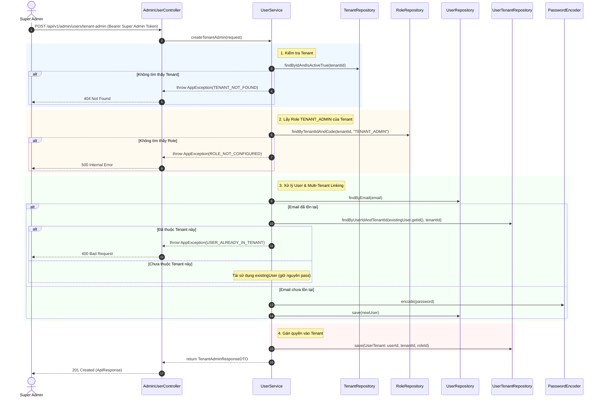

# Design Spec: Super Admin Tạo Tài Khoản Cho Tenant Admin (Super Admin Onboard Tenant Admin)

**Ngày tạo:** 2026-10-06  
**Trạng thái:** DRAFT / APPROVED  
**Tác giả:** Dev Team & AI Assistant  
**Module:** `account-management`  

---

## 1. Tổng Quan (Overview)

Trong mô hình **SaaS Multi-Tenant** của hệ thống Car Rental, luồng cấp phát tài khoản được chia làm 2 giai đoạn:
1. **Giai đoạn Onboarding Doanh nghiệp:** Quản trị viên nền tảng SaaS (`SUPER_ADMIN`) sau khi duyệt và tạo mới một Nhà xe (`tenants`), sẽ tiến hành tạo tài khoản Quản trị viên đầu tiên (`TENANT_ADMIN`) cho nhà xe đó.
2. **Giai đoạn Vận hành Nội bộ:** Chủ nhà xe (`TENANT_ADMIN`) sau khi nhận tài khoản sẽ tự đăng nhập để tạo các chi nhánh (`branches`), cấu hình xe (`vehicles`), và tạo tài khoản nhân viên (`STAFF`, `SALE`).

Tài liệu này đặc tả chi tiết tính năng: **`SUPER_ADMIN` tạo tài khoản `TENANT_ADMIN` cho một Tenant cụ thể**.

---

## 2. Yêu Cầu Nghiệp Vụ (Requirements)

### 2.1 Yêu cầu Chức năng (Functional Requirements)
1. **Phân quyền truy cập (Endpoint Authorization):** 
   - Chỉ tài khoản có cờ `is_super_admin = true` (vai trò `ROLE_SUPER_ADMIN`) mới có quyền gọi các API trong tài liệu này. Mọi vai trò khác (`TENANT_ADMIN`, `STAFF`, `SALE`) hoặc người dùng chưa xác thực đều bị từ chối (`403 Forbidden` / `401 Unauthorized`).
2. **Chọn Nhà xe đích (Target Tenant Selection):**
   - Hỗ trợ API cho `SUPER_ADMIN` lấy danh sách các Tenant đang hoạt động (`GET /api/v1/admin/tenants`) để chọn `tenantId` cần cấp tài khoản.
3. **Quy tắc gán quyền mặc định (Default Role Assignment):**
   - Tài khoản được tạo qua luồng này luôn có vai trò mặc định là **`TENANT_ADMIN`** (quyền cao nhất trong phạm vi Tenant đó). Client không cần và không được phép tự do chỉ định role khác.
   - Hệ thống tự động truy vấn bảng `roles` theo `tenant_id` và `code = 'TENANT_ADMIN'` để lấy ra `role_id` tương ứng.
4. **Xử lý tài khoản đa nhà xe (Cross-Tenant Account Linking):**
   - **Trường hợp 1 (Email chưa tồn tại):** Tạo mới bản ghi trong bảng `users` với mật khẩu được mã hóa BCrypt (`is_active = true`, `is_super_admin = false`).
   - **Trường hợp 2 (Email đã tồn tại nhưng chưa thuộc Tenant này):** Tái sử dụng `id` của User đó, **giữ nguyên mật khẩu cũ** (không cập nhật `password_hash` để không ảnh hưởng đến các nhà xe khác mà họ đang tham gia).
   - **Trường hợp 3 (Email đã thuộc chính Tenant này):** Ném lỗi `400 Bad Request` (`USER_ALREADY_IN_TENANT`).
5. **Gán liên kết Doanh nghiệp (`user_tenants`):**
   - Sau khi xác định được `userId`, `tenantId`, và `roleId`, tạo một bản ghi mới trong bảng `user_tenants` với `joined_at = NOW()`.
   - Vì là `TENANT_ADMIN`, tài khoản mặc định có quyền trên toàn bộ các chi nhánh của nhà xe đó, không cần gán bảng `user_branches`.

### 2.2 Ràng buộc Dữ liệu Đầu vào (Input Validations)
- **`tenantId`**: Bắt buộc (`@NotNull`), phải là UUID hợp lệ của một Tenant đang tồn tại và hoạt động (`is_active = true`).
- **`email`**: Bắt buộc (`@NotBlank`), đúng định dạng email RFC (`@Email`), tự động `trim()` và chuyển thành chữ thường (`lowercase`).
- **`password`**: Bắt buộc (`@NotBlank`), độ dài tối thiểu 8 ký tự, phải bao gồm cả chữ và số (Regex: `^(?=.*[a-zA-Z])(?=.*\\d).{8,}$`).
- **`fullname`**: Bắt buộc (`@NotBlank`), độ dài tối đa 255 ký tự.
- **`phone`**: Bắt buộc (`@NotBlank`), đúng định dạng số điện thoại Việt Nam (10–11 số, bắt đầu bằng 0, Regex: `^0[35789]\\d{8}$`).

---

## 3. Thiết Kế Kỹ Thuật (Technical Design)

### 3.1 Giao Ước API (API Contracts)

#### API 1: Lấy danh sách Tenant cho Super Admin lựa chọn
* **Phương thức:** `GET`
* **Đường dẫn:** `/api/v1/admin/tenants`
* **Quyền yêu cầu:** `@PreAuthorize("hasRole('SUPER_ADMIN')")`
* **Response:**
  ```json
  {
    "success": true,
    "data": [
      {
        "id": "e41492d0-67ee-4699-b311-fee98cb37781",
        "name": "RentCar Hà Nội",
        "domain": "hanoi.carrental.local",
        "planTier": 2,
        "contactEmail": "contact@rentcarhanoi.vn",
        "contactPhone": "0901000001",
        "isActive": true
      }
    ],
    "message": "Success"
  }
  ```

#### API 2: Tạo tài khoản Tenant Admin
* **Phương thức:** `POST`
* **Đường dẫn:** `/api/v1/admin/users/tenant-admin`
* **Quyền yêu cầu:** `@PreAuthorize("hasRole('SUPER_ADMIN')")`
* **Request DTO (`CreateTenantAdminRequestDTO`):**
  ```json
  {
    "tenantId": "e41492d0-67ee-4699-b311-fee98cb37781",
    "email": "admin.hanoi@gmail.com",
    "password": "Password123!",
    "fullname": "Nguyễn Văn Minh",
    "phone": "0909770487"
  }
  ```
* **Response DTO (`ApiResponse<TenantAdminResponseDTO>`):**
  ```json
  {
    "success": true,
    "data": {
      "userId": "c8df7bb9-20f8-485b-972f-2ddac689b1db",
      "email": "admin.hanoi@gmail.com",
      "fullname": "Nguyễn Văn Minh",
      "phone": "0909770487",
      "tenantId": "e41492d0-67ee-4699-b311-fee98cb37781",
      "role": "TENANT_ADMIN",
      "isActive": true,
      "joinedAt": "2026-10-06T11:20:00Z"
    },
    "message": "Tạo tài khoản Quản trị viên nhà xe thành công"
  }
  ```

---

### 3.2 Sơ Đồ Trình Tự Nghiệp Vụ (Sequence Diagram)



---

## 4. Chi Tiết Thực Thi Code (Implementation Details)

### 4.1 Cấu Trúc DTO
```java
package com.carrental.car_rental_backend.account.dto;

import java.util.UUID;
import jakarta.validation.constraints.Email;
import jakarta.validation.constraints.NotBlank;
import jakarta.validation.constraints.NotNull;
import jakarta.validation.constraints.Pattern;
import jakarta.validation.constraints.Size;
import lombok.Data;

@Data
public class CreateTenantAdminRequestDTO {
    @NotNull(message = "Mã nhà xe (tenantId) không được để trống")
    private UUID tenantId;

    @NotBlank(message = "Email không được để trống")
    @Email(message = "Email không đúng định dạng")
    private String email;

    @NotBlank(message = "Mật khẩu không được để trống")
    @Pattern(
        regexp = "^(?=.*[a-zA-Z])(?=.*\\d).{8,}$",
        message = "Mật khẩu tối thiểu 8 ký tự, phải bao gồm cả chữ và số"
    )
    private String password;

    @NotBlank(message = "Họ và tên không được để trống")
    @Size(max = 255, message = "Họ và tên tối đa 255 ký tự")
    private String fullname;

    @NotBlank(message = "Số điện thoại không được để trống")
    @Pattern(regexp = "^0[35789]\\d{8}$", message = "Số điện thoại không đúng định dạng Việt Nam")
    private String phone;
}
```

### 4.2 Bổ sung Phương thức Repository

1. **`RoleRepository.java`**:
   ```java
   Optional<Role> findByTenantIdAndCode(UUID tenantId, String code);
   ```
2. **`TenantRepository.java`**:
   ```java
   Optional<Tenant> findByIdAndIsActiveTrue(UUID id);
   ```

### 4.3 Logic Xử Lý tại Service Layer (`UserService.java`)
```java
@Transactional
public TenantAdminResponseDTO createTenantAdmin(CreateTenantAdminRequestDTO request) {
    // 1. Kiểm tra Tenant có tồn tại và đang hoạt động không
    Tenant tenant = tenantRepository.findByIdAndIsActiveTrue(request.getTenantId())
        .orElseThrow(() -> new AppException(ErrorCode.TENANT_NOT_FOUND));

    // 2. Lấy role TENANT_ADMIN của Tenant này
    Role tenantAdminRole = roleRepository.findByTenantIdAndCode(tenant.getId(), "TENANT_ADMIN")
        .orElseThrow(() -> new AppException(ErrorCode.ROLE_NOT_CONFIGURED));

    // 3. Chuẩn hóa Email
    String normalizedEmail = request.getEmail().trim().toLowerCase();

    // 4. Kiểm tra User tồn tại
    Optional<User> existingUserOpt = userRepository.findByEmail(normalizedEmail);
    User targetUser;

    if (existingUserOpt.isPresent()) {
        targetUser = existingUserOpt.get();

        // Kiểm tra xem đã là thành viên của Tenant này chưa
        boolean alreadyInTenant = userTenantRepository.findByUserIdAndTenantId(targetUser.getId(), tenant.getId()).isPresent();
        if (alreadyInTenant) {
            throw new AppException(ErrorCode.USER_ALREADY_IN_TENANT);
        }
    } else {
        // Tạo User mới
        User newUser = User.builder()
            .email(normalizedEmail)
            .passwordHash(passwordEncoder.encode(request.getPassword()))
            .fullname(request.getFullname())
            .phone(request.getPhone())
            .isActive(true)
            .isSuperAdmin(false)
            .build();
        targetUser = userRepository.save(newUser);
    }

    // 5. Gán User vào Tenant với role TENANT_ADMIN
    UserTenant userTenant = UserTenant.builder()
        .userId(targetUser.getId())
        .tenantId(tenant.getId())
        .roleId(tenantAdminRole.getId())
        .joinedAt(Instant.now())
        .build();
    userTenantRepository.save(userTenant);

    // 6. Trả về kết quả
    return TenantAdminResponseDTO.builder()
        .userId(targetUser.getId())
        .email(targetUser.getEmail())
        .fullname(targetUser.getFullname())
        .phone(targetUser.getPhone())
        .tenantId(tenant.getId())
        .role("TENANT_ADMIN")
        .isActive(targetUser.getIsActive())
        .joinedAt(userTenant.getJoinedAt())
        .build();
}
```

---

## 5. Danh Mục Mã Lỗi Nghiệp Vụ (Error Codes)

| HTTP Status | Mã Lỗi (`ErrorCode`) | Mô tả chi tiết |
| :--- | :--- | :--- |
| **401** | `UNAUTHORIZED` | Token không hợp lệ hoặc đã hết hạn. |
| **403** | `ACCESS_DENIED` | Người dùng không có quyền `SUPER_ADMIN`. |
| **404** | `TENANT_NOT_FOUND` | Nhà xe với `tenantId` truyền lên không tồn tại hoặc đã ngừng hoạt động. |
| **400** | `USER_ALREADY_IN_TENANT` | Tài khoản với email này đã là thành viên của nhà xe. |
| **400** | `INVALID_INPUT` | Vi phạm ràng buộc định dạng (Email sai, pass yếu, phone sai). |
| **500** | `ROLE_NOT_CONFIGURED` | Không tìm thấy cấu hình vai trò `TENANT_ADMIN` của Tenant trong CSDL. |

---

## 6. Tiêu Chí Nghiệm Thu & Kịch Bản Kiểm Thử (Acceptance Criteria)

1. **TC-SA-01 (Happy Path - Tạo mới hoàn toàn):**
   - Super Admin truyền tenantId hợp lệ và email mới toanh.
   - Kết quả: HTTP 201/200. User mới được tạo, mật khẩu được băm, bản ghi `user_tenants` được tạo với `roleId` của `TENANT_ADMIN`.
2. **TC-SA-02 (Happy Path - Gán User có sẵn làm Admin Tenant mới):**
   - Super Admin truyền email đã có trên hệ thống (ở Tenant A).
   - Kết quả: HTTP 201/200. Không tạo User mới, mật khẩu không bị đổi. Thêm liên kết `user_tenants` vào Tenant B.
3. **TC-SA-03 (Phân quyền):**
   - Dùng token của `TENANT_ADMIN` hoặc `STAFF` gọi API này.
   - Kết quả: Bị chặn ngay với HTTP 403 Forbidden.
4. **TC-SA-04 (Bảo vệ trùng lặp):**
   - Cố tình gọi API 2 lần với cùng một email và cùng một `tenantId`.
   - Kết quả: Lần 1 thành công, lần 2 trả về `400 USER_ALREADY_IN_TENANT`.
5. **TC-SA-05 (Tenant không tồn tại):**
   - Truyền UUID ngẫu nhiên không có trong bảng `tenants`.
   - Kết quả: HTTP 404 `TENANT_NOT_FOUND`.

