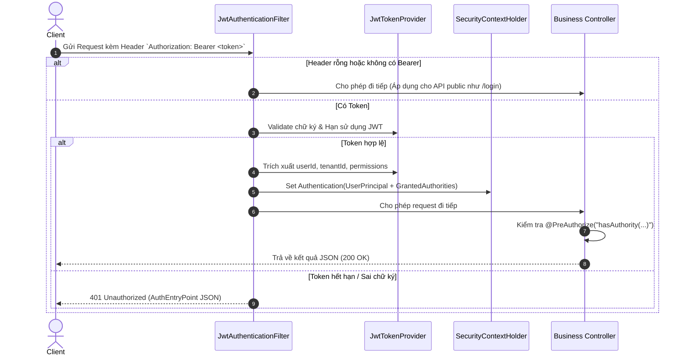

# Feature Specification: Xác thực & Phân quyền (Authentication & Authorization)

**Ngày cập nhật:** 16/08/2026  
**Dự án:** Car Rental SaaS  
**Tác giả:** Core Development Team  

---

## 1. Tổng quan Kiến trúc (Overview)

Module Auth chịu trách nhiệm bảo vệ toàn bộ API của hệ thống Car Rental SaaS theo mô hình **Stateless JWT** kết hợp **Dynamic RBAC (Role-Based Access Control)** và **Multi-Tenant Scoping**.

### Các mục tiêu cốt lõi:
1. **Đăng nhập & Cấp phát Token**: Xác thực tài khoản, kiểm tra trạng thái hoạt động của User và Tenant, sinh cặp `Access Token` (15 phút) và `Refresh Token` (7 ngày).
2. **Bộ lọc Xác thực (JwtAuthenticationFilter)**: Chặn mọi HTTP Request, giải mã JWT, nạp định danh người dùng và danh sách `Permissions` vào `SecurityContextHolder`.
3. **Phân quyền tại Controller (Method Security)**: Sử dụng cú pháp `@PreAuthorize("hasAuthority('booking:create')")` để kiểm soát quyền truy cập nguyên tử trên từng API.
4. **Xử lý Ngoại lệ Bảo mật**: Trả về cấu trúc JSON đồng nhất khi gặp lỗi `401 Unauthorized` và `403 Forbidden`.

---

## 2. Luồng Xử lý Chi tiết (Sequence Flow)



---

## 3. Cấu trúc Payload của JWT Token

### Access Token Claims (Thời hạn: 15 phút):
```json
{
  "sub": "c8df7bb9-20f8-485b-972f-2ddac689b1db",     // user_id (Subject)
  "tenant_id": "e41492d0-67ee-4699-b311-fee98cb37781", // ID nhà xe đang làm việc
  "email": "minh.admin@rentcarhanoi.vn",
  "role": "TENANT_ADMIN",                             // Mã nhóm quyền
  "iss": "car-rental-saas",
  "iat": 1755314000,
  "exp": 1755314900
}
```

---

## 4. Danh mục API Xác thực

| HTTP Method | Endpoint | Quyền | Mô tả |
| :--- | :--- | :--- | :--- |
| `POST` | `/api/v1/auth/login` | Public | Đăng nhập bằng email/password, trả về Access Token + Refresh Token |
| `POST` | `/api/v1/auth/refresh-token` | Public | Đổi Refresh Token lấy Access Token mới |
| `GET` | `/api/v1/auth/me` | Authenticated | Lấy thông tin cá nhân, quyền hạn và danh sách chi nhánh phụ trách |
| `POST` | `/api/v1/auth/logout` | Authenticated | Đăng xuất (xóa token ở client / thu hồi refresh token) |

---

## 5. Cơ chế Kiểm soát Quyền tại Controller

```java
// Ví dụ kiểm soát quyền trên Controller
@RestController
@RequestMapping("/api/v1/bookings")
public class BookingController {

    @PostMapping
    @PreAuthorize("hasAuthority('booking:create')")
    public ApiResponse<BookingResponse> createBooking(@RequestBody CreateBookingRequest request) {
        ...
    }

    @PostMapping("/{id}/handover")
    @PreAuthorize("hasAuthority('booking:handover')")
    public ApiResponse<Void> handoverVehicle(@PathVariable UUID id) {
        ...
    }
}
```

// Data chat với agent ai để nạp lại
Hãy viết lại cho tôi toàn bộ hướng dân code một cách chi tiết, chỉ có text hướng dân chứ khong có code
5:28 PM
Dưới đây là Toàn bộ Tài liệu Hướng dẫn Code Chi tiết từng bước cho Module Xác thực & Phân quyền (Auth / JWT / Dynamic RBAC / Multi-Tenant).

Tài liệu được thiết kế 100% bằng văn bản hướng dẫn logic, tên class, thuộc tính, method và annotation, hoàn toàn không chứa code mẫu sẵn để bạn tự tay thực hành viết từng dòng code.

MỤC LỤC LỘ TRÌNH THỰC HIỆN
Giai đoạn 1: Xây dựng các DTO nhận/trả dữ liệu (auth/dto/)
Giai đoạn 2: Xây dựng các Entity & Repository cho Phân quyền (account/)
Giai đoạn 3: Xây dựng Mô hình Định danh (UserPrincipal) & Hạ tầng Security (security/)
Giai đoạn 4: Xây dựng Logic Nghiệp vụ Xác thực (auth/service/)
Giai đoạn 5: Xây dựng API Controller (auth/controller/)
GIAI ĐOẠN 1: XÂY DỰNG CÁC DTO (auth/dto/)
1. File LoginRequestDTO.java
Đường dẫn: auth/dto/request/LoginRequestDTO.java
Annotations cho Class: @Data, @NoArgsConstructor, @AllArgsConstructor, @Builder
Các Thuộc tính cần khai báo:
email (kiểu String): Gắn annotation @NotBlank(message = "...") và @Email(message = "...").
password (kiểu String): Gắn annotation @NotBlank(message = "...").
2. File SelectTenantRequestDTO.java
Đường dẫn: auth/dto/request/SelectTenantRequestDTO.java
Mục đích: Dùng khi người dùng chọn Nhà xe và Chi nhánh muốn làm việc sau khi đã đăng nhập thành công.
Annotations cho Class: @Data, @NoArgsConstructor, @AllArgsConstructor, @Builder
Các Thuộc tính cần khai báo:
tenantId (kiểu UUID): Gắn annotation @NotNull(message = "...").
activeBranchId (kiểu UUID): Không bắt buộc (dành cho nhân viên trực ca chọn chi nhánh).
3. File RefreshTokenRequestDTO.java
Đường dẫn: auth/dto/request/RefreshTokenRequestDTO.java
Annotations cho Class: @Data, @NoArgsConstructor, @AllArgsConstructor, @Builder
Các Thuộc tính cần khai báo:
refreshToken (kiểu String): Gắn annotation @NotBlank(message = "...").
4. File AuthResponseDTO.java
Đường dẫn: auth/dto/response/AuthResponseDTO.java
Annotations cho Class: @Data, @NoArgsConstructor, @AllArgsConstructor, @Builder
Các Thuộc tính cần khai báo:
accessToken (kiểu String): Chuỗi JWT mang token truy cập (chỉ có khi đã chọn xong Tenant).
refreshToken (kiểu String): Chuỗi JWT làm mới token dài hạn.
tokenType (kiểu String): Khởi tạo giá trị mặc định là "Bearer".
expiresIn (kiểu long): Số giây tồn tại của access token.
user (kiểu UserInfoResponseDTO): Thông tin chi tiết của người dùng.
availableTenants (kiểu List<TenantSummaryDTO>): Danh sách các nhà xe mà người này tham gia.
5. File UserInfoResponseDTO.java
Đường dẫn: auth/dto/response/UserInfoResponseDTO.java
Annotations cho Class: @Data, @NoArgsConstructor, @AllArgsConstructor, @Builder
Các Thuộc tính cần khai báo:
id (kiểu UUID): Mã định danh user.
email (kiểu String)
fullName (kiểu String)
phone (kiểu String)
tenantId (kiểu UUID): Nhà xe hiện đang đăng nhập (có thể null nếu chưa chọn).
tenantName (kiểu String)
role (kiểu String): Tên mã nhóm quyền (VD: TENANT_ADMIN, STAFF, SALE).
permissions (kiểu List<String>): Mảng chứa các chuỗi mã quyền (VD: booking:create, vehicle:read...).
activeBranchId (kiểu UUID): Chi nhánh hiện đang làm việc.
assignedBranches (kiểu List<BranchSummaryDTO>): Danh sách các chi nhánh được phân công.
6. File TenantSummaryDTO.java & BranchSummaryDTO.java
Đường dẫn: auth/dto/response/TenantSummaryDTO.java
Thuộc tính: tenantId (UUID), tenantName (String), domain (String), role (String), isActive (Boolean).
Đường dẫn: auth/dto/response/BranchSummaryDTO.java
Thuộc tính: branchId (UUID), branchName (String), branchCode (String), isCentral (Boolean).
GIAI ĐOẠN 2: XÂY DỰNG ENTITY & REPOSITORY (account/)
1. Entity User.java
Đường dẫn: account/entity/User.java
Annotations cho Class: @Entity, @Table(name = "users"), @Getter, @Setter, @NoArgsConstructor, @AllArgsConstructor, @Builder
Các Cột / Thuộc tính cần ánh xạ:
id (UUID): @Id, @GeneratedValue(strategy = GenerationType.UUID).
email (String): @Column(nullable = false, unique = true).
passwordHash (String): @Column(name = "password_hash", nullable = false).
fullName (String): @Column(name = "full_name").
phone (String)
avatarUrl (String): @Column(name = "avatar_url").
isActive (Boolean): @Column(name = "is_active").
isSuperAdmin (Boolean): @Column(name = "is_super_admin").
createdAt, updatedAt (Instant hoặc ZonedDateTime): @CreationTimestamp, @UpdateTimestamp.
2. Entity Role.java
Đường dẫn: account/entity/Role.java
Annotations cho Class: @Entity, @Table(name = "roles"), @Getter, @Setter, @NoArgsConstructor, @AllArgsConstructor, @Builder
Các Cột: id (UUID), tenantId (UUID), name (String), code (String), description (String), isSystemDefault (Boolean).
3. Entity Permission.java
Đường dẫn: account/entity/Permission.java
Annotations cho Class: @Entity, @Table(name = "permissions"), @Getter, @Setter, @NoArgsConstructor, @AllArgsConstructor, @Builder
Các Cột: id (UUID), code (String), name (String), category (String), description (String).
4. Entity UserTenant.java
Đường dẫn: account/entity/UserTenant.java
Mục đích: Ánh xạ bảng user_tenants (Khóa chính liên hợp (userId, tenantId)).
Annotations cho Class: @Entity, @Table(name = "user_tenants"), @IdClass(UserTenantId.class) (hoặc dùng @EmbeddedId).
Các Cột:
userId (UUID): @Id, @Column(name = "user_id").
tenantId (UUID): @Id, @Column(name = "tenant_id").
roleId (UUID): @Column(name = "role_id", nullable = false).
joinedAt (Instant): @Column(name = "joined_at").
5. Xây dựng các Repository Interface (account/repository/)
a. UserRepository.java
Kế thừa: JpaRepository<User, UUID>
Annotation: @Repository
Các Method cần khai báo:
Optional<User> findByEmail(String email)
Optional<User> findByIdAndIsActiveTrue(UUID id)
boolean existsByEmail(String email)
b. UserTenantRepository.java
Kế thừa: JpaRepository<UserTenant, UserTenantId>
Annotation: @Repository
Các Method cần khai báo:
Optional<UserTenant> findByUserIdAndTenantId(UUID userId, UUID tenantId)
List<UserTenant> findByUserId(UUID userId): Dùng để lấy toàn bộ các Tenant mà một User đang tham gia sau khi họ nhập email/password.
c. PermissionRepository.java
Kế thừa: JpaRepository<Permission, UUID>
Annotation: @Repository
Method quan trọng cần viết @Query:
Tên Method: List<String> findPermissionCodesByRoleId(@Param("roleId") UUID roleId)
Logic câu query SQL/HQL: SELECT p.code FROM Permission p JOIN role_permissions rp ON p.id = rp.permission_id WHERE rp.role_id = :roleId (Hoặc dùng Native Query nối 2 bảng permissions và role_permissions).
d. RoleRepository.java
Kế thừa: JpaRepository<Role, UUID>
Annotation: @Repository
Method: Optional<Role> findByIdAndTenantId(UUID id, UUID tenantId)
GIAI ĐOẠN 3: HẠ TẦNG BẢO MẬT (security/)
1. Lớp UserPrincipal.java
Đường dẫn: security/principal/UserPrincipal.java
Implement: org.springframework.security.core.userdetails.UserDetails
Annotations: @Getter, @AllArgsConstructor, @Builder
Các thuộc tính private:
id (UUID)
tenantId (UUID)
email (String)
password (String)
roleCode (String)
authorities (Collection<? extends GrantedAuthority>)
isActive (boolean)
Method Static Factory create(...):
Tên hàm: public static UserPrincipal create(User user, UUID tenantId, String roleCode, List<String> permissions)
Các bước xử lý bên trong hàm create:
Chuyển đổi danh sách chuỗi permissions thành danh sách SimpleGrantedAuthority (mỗi mã quyền tạo ra 1 new SimpleGrantedAuthority(code)).
Nếu có roleCode, có thể thêm 1 authority nữa có tiền tố ROLE_ (VD: new SimpleGrantedAuthority("ROLE_" + roleCode)).
Dùng Builder tạo mới đối tượng UserPrincipal với đầy đủ các thông tin: id, tenantId, email, password (lấy từ passwordHash của User), roleCode, authorities, isActive.
Override các phương thức của UserDetails:
getAuthorities(): Trả về trường this.authorities.
getPassword(): Trả về this.password.
getUsername(): Trả về this.email (hoặc this.id.toString()).
isAccountNonExpired(), isAccountNonLocked(), isCredentialsNonExpired(): Trả về true.
isEnabled(): Trả về this.isActive.
2. Cập nhật JwtProvider.java
Đường dẫn: security/jwt/JwtProvider.java
Bổ sung các thuộc tính & method:
Đọc thêm cấu hình refreshExpirationMs từ file yml (@Value("${jwt.refresh-token-expiration-ms:604800000}")).
Method generateAccessToken(UUID userId, String email, String role, UUID tenantId, UUID activeBranchId):
Giữ nguyên logic đang có: Tạo JWT builder với sub = userId, các custom claims email, role, tenant_id, active_branch_id, ký bằng SecretKey.
Method generateRefreshToken(UUID userId):
Tạo JWT chỉ có sub = userId.toString(), thời gian hết hạn = now + refreshExpirationMs.
Method getUserIdFromToken(String token):
Gọi parseClaims(token) $\rightarrow$ Lấy getSubject() $\rightarrow$ Ép kiểu sang UUID.fromString(...).
Method getTenantIdFromToken(String token):
Gọi parseClaims(token) $\rightarrow$ Đọc claim "tenant_id" dạng String $\rightarrow$ Nếu khác null thì trả về UUID.fromString(...).
3. Cập nhật JwtAuthenticationFilter.java
Đường dẫn: security/jwt/JwtAuthenticationFilter.java
Inject thêm Dependency: CustomUserDetailsService
Logic trong phương thức doFilterInternal:
Gọi hàm parseBearerToken(request) để lấy chuỗi token.
Nếu token có giá trị và jwtProvider.validateToken(token) trả về true:
Lấy Claims claims = jwtProvider.parseClaims(token).
Trích xuất: userIdStr, tenantIdStr, activeBranchIdStr, role.
Thiết lập TenantContext: Nạp tenantId, activeBranchId, role vào TenantContext (để các Service phía sau lấy dùng).
Thiết lập SecurityContext:
Nếu có cả userIdStr và tenantIdStr: Gọi customUserDetailsService.loadUserByIdAndTenantId(userId, tenantId) để lấy đối tượng UserPrincipal (đã có đầy đủ danh sách Permissions thực tế từ DB).
Tạo đối tượng UsernamePasswordAuthenticationToken authentication = new UsernamePasswordAuthenticationToken(userPrincipal, null, userPrincipal.getAuthorities()).
Gán details: authentication.setDetails(new WebAuthenticationDetailsSource().buildDetails(request)).
Lưu vào: SecurityContextHolder.getContext().setAuthentication(authentication).
Cuối cùng, gọi filterChain.doFilter(request, response).
Trong khối finally: Luôn gọi TenantContext.clear() để tránh rò rỉ bộ nhớ giữa các Thread.
4. Xử lý Lỗi Ngoại Lệ Bảo Mật (security/exception/)
a. JwtAuthenticationEntryPoint.java (Bắt lỗi 401)
Implement: AuthenticationEntryPoint
Annotation: @Component
Method commence:
Set status HTTP: HttpServletResponse.SC_UNAUTHORIZED (401).
Set Header: Content-Type: application/json;charset=UTF-8.
Khởi tạo đối tượng ApiResponse.error(401, "UNAUTHORIZED", "Bạn cần đăng nhập để thực hiện thao tác này hoặc Token đã hết hạn").
Dùng ObjectMapper ghi chuỗi JSON này ra response.getOutputStream().
b. CustomAccessDeniedHandler.java (Bắt lỗi 403)
Implement: AccessDeniedHandler
Annotation: @Component
Method handle:
Set status HTTP: HttpServletResponse.SC_FORBIDDEN (403).
Set Header: Content-Type: application/json;charset=UTF-8.
Khởi tạo đối tượng ApiResponse.error(403, "FORBIDDEN", "Bạn không có quyền thực hiện chức năng này").
Dùng ObjectMapper ghi chuỗi JSON ra response.getOutputStream().
5. Cập nhật SecurityConfig.java
Đường dẫn: security/config/SecurityConfig.java
Inject Dependencies: JwtAuthenticationFilter, JwtAuthenticationEntryPoint, CustomAccessDeniedHandler.
Cấu hình trong filterChain(HttpSecurity http):
Tắt CSRF: .csrf(AbstractHttpConfigurer::disable).
Session STATELESS: .sessionManagement(s -> s.sessionCreationPolicy(SessionCreationPolicy.STATELESS)).
Đăng ký Exception Handlers:
.exceptionHandling(e -> e.authenticationEntryPoint(jwtAuthenticationEntryPoint).accessDeniedHandler(customAccessDeniedHandler)).
Cấu hình Endpoints cho phép qua (Permit All):
.requestMatchers("/api/v1/auth/**").permitAll()
.requestMatchers("/v3/api-docs/**", "/swagger-ui/**", "/swagger-ui.html").permitAll()
.anyRequest().authenticated()
Đặt Filter: .addFilterBefore(jwtAuthenticationFilter, UsernamePasswordAuthenticationFilter.class).
GIAI ĐOẠN 4: LOGIC NGHIỆP VỤ XÁC THỰC (auth/service/)
1. CustomUserDetailsService.java
Đường dẫn: auth/service/CustomUserDetailsService.java
Annotation: @Service, @RequiredArgsConstructor
Inject: UserRepository, UserTenantRepository, RoleRepository, PermissionRepository.
Method loadUserByIdAndTenantId(UUID userId, UUID tenantId):
Tìm User qua userRepository.findById(userId). Nếu không thấy hoặc isActive == false $\rightarrow$ ném AppException(ErrorCode.USER_NOT_FOUND).
Tìm UserTenant qua userTenantRepository.findByUserIdAndTenantId(userId, tenantId). Nếu không thấy $\rightarrow$ ném AppException(ErrorCode.UNAUTHORIZED).
Tìm Role qua roleRepository.findById(userTenant.getRoleId()).
Lấy danh sách mã quyền qua permissionRepository.findPermissionCodesByRoleId(userTenant.getRoleId()).
Gọi hàm UserPrincipal.create(user, tenantId, role.getCode(), permissionCodes) và trả về.
2. Interface AuthService.java
Đường dẫn: auth/service/AuthService.java
Các Method cần khai báo:
AuthResponseDTO login(LoginRequestDTO request)
AuthResponseDTO selectTenant(UUID currentUserId, SelectTenantRequestDTO request)
AuthResponseDTO refreshToken(RefreshTokenRequestDTO request)
UserInfoResponseDTO getMe()
3. Lớp Triển Khai AuthServiceImpl.java
Đường dẫn: auth/service/impl/AuthServiceImpl.java
Annotation: @Service, @RequiredArgsConstructor, @Transactional
Inject: UserRepository, UserTenantRepository, TenantRepository, BranchRepository, CustomUserDetailsService, JwtProvider, PasswordEncoder.
Logic chi tiết cho từng hàm:
🔹 Hàm login(LoginRequestDTO request):
Tìm User trong database theo request.getEmail(). Nếu không tìm thấy $\rightarrow$ ném lỗi AppException(ErrorCode.INVALID_CREDENTIALS).
Kiểm tra mật khẩu bằng passwordEncoder.matches(request.getPassword(), user.getPasswordHash()). Nếu không khớp $\rightarrow$ ném lỗi AppException(ErrorCode.INVALID_CREDENTIALS).
Kiểm tra tài khoản user.getIsActive(). Nếu bị khóa $\rightarrow$ ném lỗi AppException(ErrorCode.USER_LOCKED).
Tìm danh sách tất cả các Tenant mà User đang tham gia qua userTenantRepository.findByUserId(user.getId()).
Nếu danh sách Tenant rỗng $\rightarrow$ ném lỗi AppException ("Tài khoản chưa được gán vào bất kỳ nhà xe nào").
Map danh sách UserTenant sang List<TenantSummaryDTO> (chứa tenantId, tenantName, domain, role).
Xử lý tình huống:
Nếu User chỉ có đúng 1 Tenant: Tự động gọi logic nạp Tenant đó, nạp permissions, sinh cặp accessToken + refreshToken hoàn chỉnh và trả về AuthResponseDTO.
Nếu User có nhiều hơn 1 Tenant: Sinh refreshToken, tạo đối tượng UserInfoResponseDTO cơ bản, trả về AuthResponseDTO kèm availableTenants để Frontend hiển thị màn hình chọn Nhà xe.
🔹 Hàm selectTenant(UUID userId, SelectTenantRequestDTO request):
Gọi customUserDetailsService.loadUserByIdAndTenantId(userId, request.getTenantId()) để xác thực mối quan hệ và nạp danh sách permissions.
Sinh accessToken qua jwtProvider.generateAccessToken(userId, userPrincipal.getEmail(), userPrincipal.getRoleCode(), request.getTenantId(), request.getActiveBranchId()).
Sinh refreshToken qua jwtProvider.generateRefreshToken(userId).
Lấy danh sách các chi nhánh được phân công của user tại tenant này từ bảng user_branches (map sang List<BranchSummaryDTO>).
Build đối tượng UserInfoResponseDTO (chứa id, email, fullName, tenantId, role, permissions, activeBranchId, assignedBranches).
Build và trả về AuthResponseDTO.
🔹 Hàm refreshToken(RefreshTokenRequestDTO request):
Gọi jwtProvider.validateToken(request.getRefreshToken()). Nếu sai/hết hạn $\rightarrow$ ném lỗi AppException(ErrorCode.UNAUTHORIZED).
Lấy userId = jwtProvider.getUserIdFromToken(request.getRefreshToken()).
Tìm lại User theo userId.
Sinh accessToken mới (hoặc cặp access + refresh token mới theo cơ chế xoay vòng token).
Trả về AuthResponseDTO.
🔹 Hàm getMe():
Lấy Authentication từ SecurityContextHolder.getContext().getAuthentication().
Kiểm tra nếu chưa đăng nhập hoặc principal không phải là UserPrincipal $\rightarrow$ ném lỗi UNAUTHORIZED.
Ép kiểu sang UserPrincipal.
Lấy thông tin chi tiết và map sang UserInfoResponseDTO trả về.
GIAI ĐOẠN 5: XÂY DỰNG CONTROLLER (auth/controller/)
File AuthController.java
Đường dẫn: auth/controller/AuthController.java
Annotations: @RestController, @RequestMapping("/api/v1/auth"), @RequiredArgsConstructor, @Tag(name = "Authentication")
Inject: AuthService
Các Endpoint cần viết:
@PostMapping("/login"):
Nhận @Valid @RequestBody LoginRequestDTO request.
Gọi authService.login(request).
Trả về ApiResponse.success("Đăng nhập thành công", responseDTO).
@PostMapping("/select-tenant"):
Nhận @Valid @RequestBody SelectTenantRequestDTO request.
Lấy userId từ token hiện tại (hoặc từ SecurityContext).
Gọi authService.selectTenant(userId, request).
Trả về ApiResponse.success("Chọn nhà xe làm việc thành công", responseDTO).
@PostMapping("/refresh-token"):
Nhận @Valid @RequestBody RefreshTokenRequestDTO request.
Gọi authService.refreshToken(request).
Trả về ApiResponse.success("Làm mới token thành công", responseDTO).
@GetMapping("/me"):
Gọi authService.getMe().
Trả về ApiResponse.success("Lấy thông tin tài khoản thành công", userInfoDTO).
🎯 Tóm tắt Trình tự Thực hiện Khuyên dùng cho bạn:
Hoàn thiện toàn bộ các file trong Giai đoạn 1 (DTO).
Hoàn thiện các file trong Giai đoạn 2 (Entity & Repository).
Hoàn thiện các file trong Giai đoạn 3 (UserPrincipal, Exception, Filter, SecurityConfig).
Hoàn thiện các file trong Giai đoạn 4 (CustomUserDetailsService, AuthService, AuthServiceImpl).
Hoàn thiện Giai đoạn 5 (AuthController) và chạy thử trên Swagger UI!
5:28 PM
@IdClass(UserTenantId.class) cái này là sao nhỉ, có phải là coi cặp khóa tenant và user là khóa chính không, và UserTenantId tạo ở đâu
6:05 PM
Bạn hiểu đúng 100% rồi đấy!

1. @IdClass(UserTenantId.class) là gì?
Trong database, bảng user_tenants có khóa chính gồm 2 cột ghép lại:

sql
PRIMARY KEY (user_id, tenant_id)
Đây được gọi là Khóa chính liên hợp (Composite Primary Key).

Trong JPA / Hibernate:

Một Entity thông thường chỉ có 1 trường @Id.
Khi một bảng có từ 2 trường @Id trở lên, JPA bắt buộc bạn phải tạo một class riêng (ở đây đặt tên là UserTenantId) để đại diện cho bộ khóa này. Class này giúp JPA biết cách tìm kiếm findById(...), so sánh equals() và tính hashCode() cho các bản ghi.
2. Tạo UserTenantId.java ở đâu?
Vị trí tạo: Đặt ngay cùng thư mục với Entity UserTenant:
👉 account/entity/UserTenantId.java
3. Hướng dẫn các thuộc tính của UserTenantId.java
Class này rất đơn giản, nó chỉ đóng vai trò là một khuôn chứa 2 trường khóa:

Tên Class: public class UserTenantId implements Serializable (Bắt buộc phải implements Serializable theo chuẩn JPA).
Annotations của Lombok: @Data, @NoArgsConstructor, @AllArgsConstructor
Các thuộc tính cần khai báo:
tenantId (kiểu UUID): Trùng tên và kiểu dữ liệu với @Id tenantId bên UserTenant.
userId (kiểu UUID): Trùng tên và kiểu dữ liệu với @Id userId bên UserTenant.
💡 2 Lưu ý quan trọng khi bạn vừa viết code DTO & Entity:
⚠️ Lưu ý 1: Tránh dùng @NotBlank cho kiểu dữ liệu UUID
Trong file SelectTenantRequestDTO.java bạn vừa viết:

Annotation @NotBlank chỉ áp dụng cho kiểu chuỗi (String).
Nếu gắn @NotBlank lên kiểu UUID, khi chạy app Spring Boot sẽ bị văng lỗi: UnexpectedTypeException: No validator could be found for constraint NotBlank validating type java.util.UUID.
👉 Cách sửa: Đổi @NotBlank thành @NotNull(message = "...") cho các trường kiểu UUID nhé.
⚠️ Lưu ý 2: Bổ sung Lombok cho các Entity
Bên các file Entity (User.java, Role.java, Permission.java, UserTenant.java):

Đừng quên gắn thêm các annotation của Lombok trên đầu class:
@Getter, @Setter
@NoArgsConstructor, @AllArgsConstructor
@Builder
Điều này giúp sau này ở tầng Service, bạn có thể dễ dàng gọi user.getEmail(), user.setPasswordHash(...) hoặc User.builder()...build().