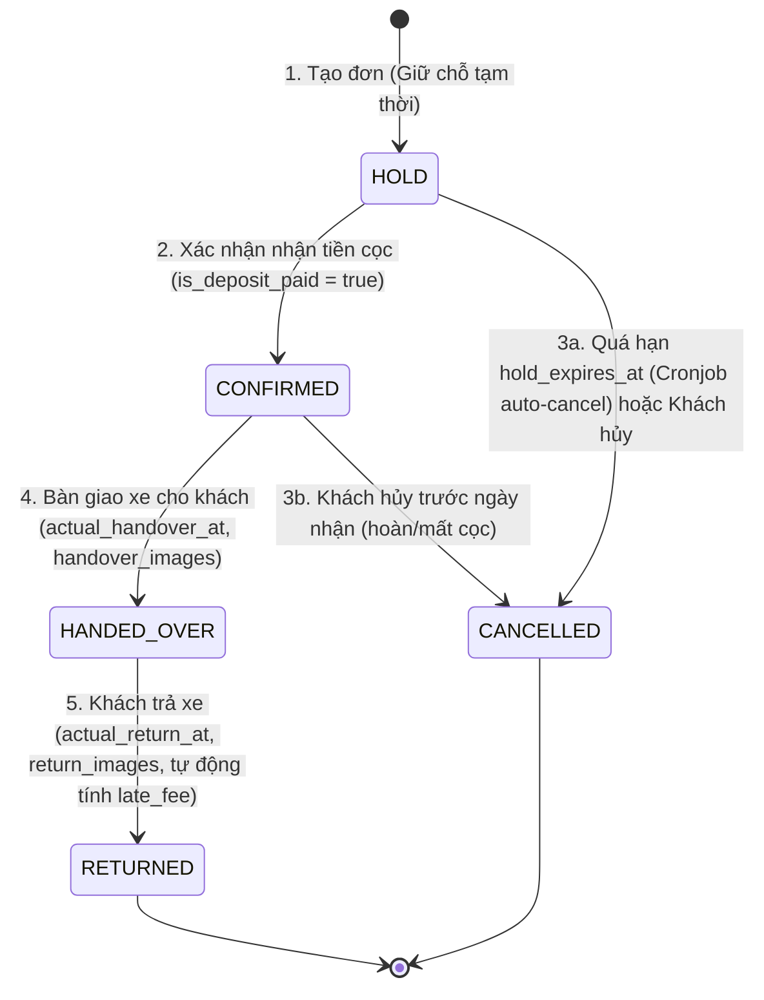

# Feature Specification: Quản lý Đơn Đặt Xe (Booking Management)

**Ngày cập nhật:** 15/08/2026  
**Dự án:** Car Rental SaaS  
**Tác giả:** Core Development Team  

---

## 1. Tổng quan (Overview)

Module **Quản lý Đơn Đặt Xe (Booking Management)** là "trái tim" vận hành của hệ thống Car Rental SaaS. Module này chịu trách nhiệm quản lý toàn bộ vòng đời của một giao dịch cho thuê xe tự lái: từ lúc tra cứu lịch xe rảnh, tạo đơn giữ chỗ tạm thời (`HOLD`), xác nhận đặt cọc (`CONFIRMED`), bàn giao chìa khóa (`HANDED_OVER`), nhận lại xe & quyết toán phạt trễ giờ (`RETURNED`), đến tự động hủy đơn quá hạn (`CANCELLED`).

Hệ thống được thiết kế theo kiến trúc **Multi-tenant**, đảm bảo tính toàn vẹn dữ liệu ở cấp Database, chống xung đột lịch xe (Concurrency/Race condition), phân quyền dữ liệu theo phạm vi chi nhánh/CTV, và tuân thủ các quy định bảo mật thông tin khách hàng.

---

## 2. Phân quyền & Phạm vi Dữ liệu (RBAC & Data Scoping)

Phân quyền trong module Booking được kiểm soát chặt chẽ dựa trên **Role** (cấp Tenant) kết hợp với **Data Scope** (cấp Chi nhánh / Người tạo):

| Mã Định Danh Role | Tên Vai Trò | Phạm Vi Dữ Liệu (Data Scope) | Hành Động Được Phép Thực Hiện |
| :--- | :--- | :--- | :--- |
| **`TENANT_ADMIN`** | Chủ nhà xe / Admin | **Toàn bộ Tenant** *(Tất cả chi nhánh)* | - Xem, lọc, xuất báo cáo tất cả booking của toàn công ty.<br>- Tạo mới, chỉnh sửa, xác nhận cọc, duyệt hủy bất kỳ booking nào.<br>- Cấu hình tham số: `hold_timeout_minutes`, `late_hourly_price`, `% hoa hồng`. |
| **`STAFF`** | Nhân viên điều hành / Giao nhận bãi | **Chi nhánh được phân công** (`user_branches`) | - Xem danh sách xe & booking thuộc chi nhánh phụ trách.<br>- Tạo booking cho khách tại quầy.<br>- Xác nhận nhận tiền cọc (`CONFIRMED`).<br>- **Bàn giao xe (`HANDED_OVER`):** Chụp ảnh hiện trạng xe, xác nhận giao chìa khóa.<br>- **Nhận xe (`RETURNED`):** Chụp ảnh xe lúc trả, hệ thống tự tính phí phạt trễ giờ (`late_fee`). |
| **`SALE`** | Cộng tác viên / Môi giới tự do | **Đơn của chính mình** (`created_by = user_id`) | - Tra cứu danh mục xe đang trống lịch.<br>- Tạo booking cho khách của mình.<br>- Theo dõi tiến độ đơn hàng và tiền hoa hồng (`commission_amount`) tích lũy.<br>- *Tuyệt đối không thấy doanh thu tổng, không thấy đơn của CTV khác, không can thiệp giao/nhận xe.* |

---

## 3. Vòng đời Trạng thái Booking (Booking State Machine)

Một đơn Booking trải qua 5 trạng thái với luồng chuyển đổi nghiêm ngặt:



### Ý nghĩa các trạng thái (`status` trong DB):
* **`1: HOLD` (Giữ chỗ tạm thời):** Khóa tạm chiếc xe trong khoảng thời gian `hold_timeout_minutes` (mặc định 30 phút). Nếu quá hạn mà chưa nhận được tiền cọc $\rightarrow$ Tự động hủy.
* **`2: CONFIRMED` (Đã đặt cọc thành công):** Khách đã chuyển khoản/nộp tiền cọc giữ xe. Xe chính thức được chốt lịch thuê.
* **`3: HANDED_OVER` (Đã bàn giao xe):** Khách đã nhận chìa khóa, xe đang trong hành trình di chuyển.
* **`4: RETURNED` (Đã hoàn tất trả xe):** Khách đã trả xe về bãi, nhân viên nghiệm thu ngoại quan, chốt số giờ trễ (nếu có) và tất toán tiền thuê.
* **`5: CANCELLED` (Đã hủy):** Đơn bị hủy do quá hạn giữ cọc hoặc khách chủ động hủy đơn.

---

## 4. Chi tiết Các Luồng Nghiệp vụ & API Specifications

### 4.1 Tra cứu Xe rảnh & Báo giá Tạm tính (Check Availability & Quote)
* **API**: `GET /api/v1/bookings/available-vehicles`
* **Mục đích**: Tìm danh sách xe sẵn sàng phục vụ trong khung giờ khách yêu cầu (`pickup_time` $\rightarrow$ `return_time`) tại chi nhánh chỉ định.
* **Logic kiểm tra xe bận (Overlapping Check)**:
  Một chiếc xe bị coi là **KHÔNG KHẢ DỤNG** nếu tồn tại đơn booking ở trạng thái `HOLD`, `CONFIRMED`, hoặc `HANDED_OVER` thỏa mãn điều kiện giao thoa thời gian:
  $$\text{booking.pickup\_time} < \text{requested\_return\_time} \quad \text{AND} \quad \text{booking.return\_time} > \text{requested\_pickup\_time}$$
* **Tự động tính giá**:
  * Đơn giá ngày thường (`price_per_day`) vs Đơn giá cuối tuần (`weekend_price_per_day`).
  * Tính tổng tiền dự kiến (`total_amount`) và tiền cọc yêu cầu (`deposit_amount` thường là 30% giá trị hợp đồng hoặc số tiền cố định).

---

### 4.2 Tạo Đơn Đặt Xe Mới (Create Booking - Trạng thái `HOLD`)
* **API**: `POST /api/v1/bookings`
* **Quyền**: `TENANT_ADMIN`, `STAFF`, `SALE`
* **Quy trình xử lý Backend**:
  1. **Validate đầu vào**:
     * `pickup_time` phải trước `return_time`.
     * `customer_id` phải tồn tại trong tenant, kiểm tra `is_risk` (nếu `is_risk = true` $\rightarrow$ Hiển thị cảnh báo rủi ro kèm `risk_reason` để nhân viên xem xét trước khi duyệt đơn).
     * `branch_id` phải hợp lệ và thuộc tenant của user.
  2. **Khóa chống đặt trùng (Pessimistic Locking)**:
     * Dùng `SELECT ... FOR UPDATE` trên bảng `vehicles` hoặc kiểm tra điều kiện trùng lịch ngay trong transaction để đảm bảo 2 user không thể cùng đặt 1 xe tại cùng 1 giây.
  3. **Lấy Cấu hình Tenant (`tenant_configs`)**:
     * Đọc `hold_timeout_minutes` (VD: 30 phút) $\rightarrow$ Gán `hold_expires_at = NOW() + INTERVAL '30 minutes'`.
     * Nếu người tạo là `SALE` $\rightarrow$ Đọc `default_commission_rate` (VD: 5%) để tự động tính `commission_amount = total_amount * 5 / 100`.
  4. **Sinh mã `booking_code` chuẩn**:
     * Format: `BK_[TENANT_CODE]_[YYMMDD]_[RANDOM_4_CHAR]` (VD: `BK_ANR_260815_8F2D`).
  5. **Lưu bản ghi vào Database** với trạng thái `status = 1 (HOLD)`.

---

### 4.3 Xác nhận Nhận Cọc (Confirm Booking Deposit)
* **API**: `POST /api/v1/bookings/{id}/confirm-deposit`
* **Quyền**: `TENANT_ADMIN`, `STAFF`
* **Request Body**:
  * `payment_method` (1: Tiền mặt, 2: Chuyển khoản ngân hàng)
  * `deposit_amount` (Số tiền cọc thực tế nhận được)
  * `transfer_reference` (Mã giao dịch ngân hàng / Bill chuyển khoản)
  * `bank_name`, `bank_account_number` (Tài khoản nhận của nhà xe)
* **Xử lý Backend**:
  * Kiểm tra đơn phải đang ở trạng thái `1: HOLD` và chưa hết hạn `hold_expires_at`.
  * Cập nhật `is_deposit_paid = true`, `payment_status = 2 (DEPOSIT_PAID)`.
  * Chuyển trạng thái `status = 2 (CONFIRMED)`.

---

### 4.4 Bàn Giao Xe Cho Khách (Vehicle Handover / Check-out)
* **API**: `POST /api/v1/bookings/{id}/handover`
* **Quyền**: `TENANT_ADMIN`, `STAFF`
* **Request Body**:
  * `handover_images` (Mảng URL ảnh chụp hiện trạng xe 4 góc, vết xước cũ)
  * `collateral_type` (1: Xe máy + Cavet, 2: Tiền mặt, 3: Giấy tờ khác)
  * `collateral_notes` (Mô tả tài sản thế chấp)
  * `notes` (Ghi chú thêm)
* **Xử lý Backend**:
  * Kiểm tra đơn phải đang ở trạng thái `2: CONFIRMED`.
  * Gán `actual_handover_at = CURRENT_TIMESTAMP`.
  * Gán `handover_by = current_user_id`.
  * Cập nhật `vehicles.status = 2 (RENTED)`.
  * Chuyển trạng thái đơn `status = 3 (HANDED_OVER)`.

---

### 4.5 Nhận Lại Xe & Quyết Toán Phạt Trễ Giờ (Vehicle Return / Check-in)
* **API**: `POST /api/v1/bookings/{id}/return`
* **Quyền**: `TENANT_ADMIN`, `STAFF`
* **Request Body**:
  * `return_images` (Mảng URL ảnh chụp hiện trạng xe lúc trả)
  * `payment_method` (Thanh toán phần tiền còn lại)
  * `notes` (Ghi chú bàn giao)
* **Xử lý Tính Phạt Trễ Giờ Tự Động**:
  1. Gán `actual_return_at = CURRENT_TIMESTAMP`.
  2. So sánh `actual_return_at` với `return_time` (hẹn trả):
     $$\text{late\_duration} = \text{actual\_return\_at} - \text{return\_time}$$
  3. Nếu $\text{late\_duration} > 0$:
     * Lấy số giờ trễ (làm tròn lên theo block giờ, ví dụ trễ 1h15p tính là 2 giờ): $\text{late\_hours} = \lceil \text{late\_duration in hours} \rceil$.
     * Lấy `late_hourly_price` từ `tenant_configs` (VD: 100.000đ/h).
     * Tính: $\text{late\_fee} = \text{late\_hours} \times \text{late\_hourly\_price}$.
  4. Quyết toán tài chính:
     $$\text{final\_total} = \text{total\_amount} + \text{late\_fee}$$
     $$\text{amount\_due} = \text{final\_total} - \text{deposit\_amount}$$
  5. Cập nhật `vehicles.status = 1 (AVAILABLE)`.
  6. Gán `returned_by = current_user_id`.
  7. Chuyển trạng thái đơn `status = 4 (RETURNED)`, `payment_status = 3 (FULLY_PAID)`.

---

### 4.6 Tự Động Hủy Đơn Quá Hạn Giữ Chỗ (Auto-Expire Task)
* **Cơ chế**: Background Cronjob chạy định kỳ mỗi 1 phút một lần (`@Scheduled(cron = "0 */1 * * * *")`).
* **Logic xử lý**:
  ```sql
  UPDATE bookings
  SET status = 5, -- CANCELLED
      cancellation_reason = 'Hệ thống tự động hủy do quá thời gian giữ chỗ (Hết hạn chờ cọc)'
  WHERE status = 1 -- HOLD
    AND hold_expires_at < CURRENT_TIMESTAMP;
  ```

---

## 5. Bảng Tổng Hợp API Endpoints

| Method | Endpoint | Quyền hạn | Mô tả chức năng |
| :--- | :--- | :--- | :--- |
| `GET` | `/api/v1/bookings/available-vehicles` | Admin, Staff, Sale | Kiểm tra danh sách xe trống & tính giá tạm tính |
| `POST` | `/api/v1/bookings` | Admin, Staff, Sale | Tạo đơn đặt xe mới (Trạng thái `HOLD`) |
| `GET` | `/api/v1/bookings` | Admin, Staff, Sale | Danh sách booking (Lọc tự động theo Data Scope) |
| `GET` | `/api/v1/bookings/{id}` | Admin, Staff, Sale | Chi tiết booking |
| `POST` | `/api/v1/bookings/{id}/confirm-deposit` | Admin, Staff | Xác nhận đã nhận tiền cọc $\rightarrow$ `CONFIRMED` |
| `POST` | `/api/v1/bookings/{id}/handover` | Admin, Staff | Bàn giao chìa khóa & ảnh xe $\rightarrow$ `HANDED_OVER` |
| `POST` | `/api/v1/bookings/{id}/return` | Admin, Staff | Nhận lại xe & tự động tính phạt trễ $\rightarrow$ `RETURNED` |
| `POST` | `/api/v1/bookings/{id}/cancel` | Admin, Staff, Sale | Hủy đơn thủ công kèm lý do $\rightarrow$ `CANCELLED` |

---

## 6. Các Điểm Kỹ Thuật Cần Lưu Ý Khi Code Backend (Spring Boot)

1. **Transaction Isolation & Concurrency**:
   * Khi tạo booking, phải bọc trong `@Transactional(isolation = Isolation.READ_COMMITTED)`.
   * Sử dụng câu lệnh kiểm tra trùng lặp thời gian hoặc PostgreSQL Exclusion Constraint để ngăn chặn triệt để tình trạng 2 luồng cùng ghi nhận 1 xe.
2. **DTO & Validation**:
   * Dùng `@NotNull`, `@Future` cho `pickup_time` và `return_time`.
   * Tạo custom validator `@AssertTrue` để đảm bảo `return_time.isAfter(pickup_time)`.
3. **Data Scoping tại Service / Repository Layer**:
   * Tuyệt đối không tin tưởng client gửi `tenant_id` lên. Lấy `tenant_id` từ `SecurityContext` / `TenantContext`.
   * Nếu user có role `STAFF` $\rightarrow$ Thêm điều kiện `AND branch_id IN (:userAssignedBranches)`.
   * Nếu user có role `SALE` $\rightarrow$ Thêm điều kiện `AND created_by = :currentUserId`.
4. **Bảo mật Dữ liệu Khách hàng**:
   * Khi trả về thông tin khách hàng trong DTO chi tiết Booking, CCCD (`id_card`) và GPLX (`driver_license`) phải được che mờ (`001099******`) trừ khi caller có quyền Admin đặc biệt.
